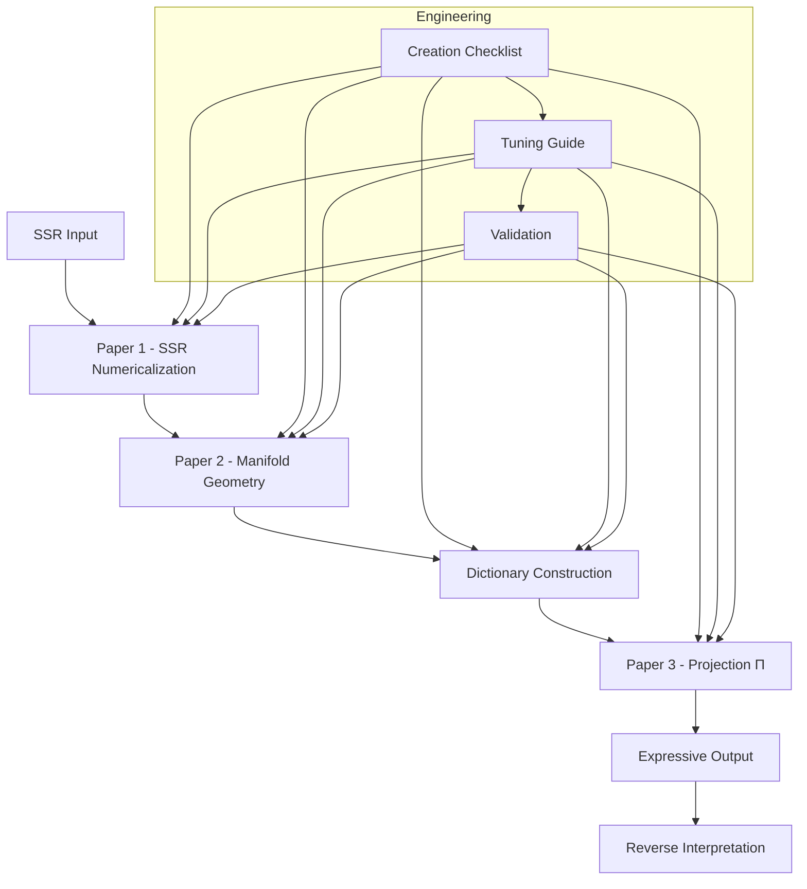

# The Pre-Work Manifold and Back: A Practical Engineering Guide to TS Latent Space

**Version**: 0.6 (High-Level Overview)  
**Date**: 2026-07-04  
**Author**: Generated for CuriousOne23 / WhenMathPrays Thought Simulator (TS) Project  
**Repository**: CuriousOne23/WhenMathPrays  

**Core Architecture Papers** (same directory):  
[ssr_numericalization_guide.md, paper 1](ssr_numericalization_guide.md) | [manifold_geometry_spec.md, paper 2](manifold_geometry_spec.md) | [dictionary_projection_spec.md & glossary, paper 3](dictionary_projection_spec.md)

**Companion Documents**:  
[manifold_creation_checklist.md](manifold_creation_checklist.md) | [manifold_tuning_guide.md](manifold_tuning_guide.md)

## 1. Introduction

The Thought Simulator (TS) separates pre-work (manifold construction) from runtime routing. This document provides the high-level architectural overview. For detailed guidance on each layer, see the specialized papers listed above.

**Pre-work** converts symbolic SSR into a visible, navigable, deterministic manifold. Runtime then routes over this manifold to produce expressive, traceable outputs.

## 2. Overall TS Pipeline

**Caption**: End-to-end TS process showing the three core layers and supporting documents.

## 3. Why This Architecture Matters

- **Inspectable & Engineerable** latent space
- **Deterministic** behavior with full traceability
- **Lower cost** pre-work compared to traditional training
- **Reusable** manifold + dictionary
- **Debuggable** via reverse interpretation

## 4. How to Use These Documents

- **New Manifold**: Start with [manifold_creation_checklist.md](manifold_creation_checklist.md)
- **Troubleshooting / Tuning**: Use [manifold_tuning_guide.md](manifold_tuning_guide.md)
- **Deep Dive**:
  - Symbolic → Numeric → [ssr_numericalization_guide.md, paper 1](ssr_numericalization_guide.md)
  - Numeric → Geometry → [manifold_geometry_spec.md, paper 2](manifold_geometry_spec.md)
  - Geometry → Text + Reverse → [dictionary_projection_spec.md, paper 3](dictionary_projection_spec.md)

**Hardware Note**: Pre-work runs efficiently on standard CPU hardware (no GPU required for typical use).

---
