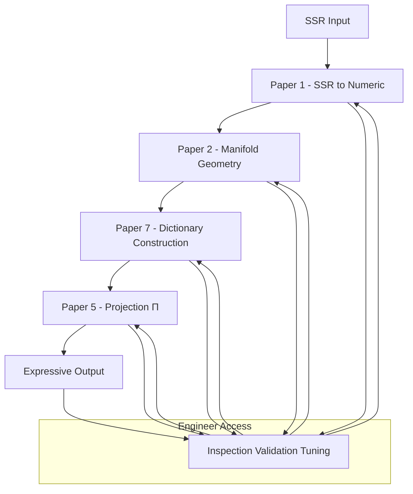

# The Pre-Work Manifold and Back: A Practical Engineering Guide to TS Latent Space  
**Version**: 0.7 (Unified Ontology Edition)  
**Date**: 2026-07-05  
**Author**: Generated for CuriousOne23 / WhenMathPrays Thought Simulator (TS) Project  
**Repository**: CuriousOne23/WhenMathPrays  

**Core Architecture Papers** (same directory):

- [1. SSR to Manifold Transfer Guide](./ssr_to_manifold_transfer_guide.md)  
- [2. Manifold Geometry & Shapes Specification](./manifold_geometry_shapes_spec.md)  
- [3. Shapes Meanings — SSR, OuBB, and Mapping](./shapes_meanings_ssr_oubb_mapping.md)  
- [4. Working Inside the Manifold — Routing & Projection](./manifold_routing_projection.md)  
- [5. Manifold to OuBB / RG Projection & Reverse](./manifold_to_oubb_projection_reverse.md)  
- [6. Pre-work Checklist, Tuning & Validation](./prework_checklist_tuning_validation.md)  
- [7. Dictionary Projection Specification](dictionary_projection_spec.md)  

**Canonical Glossary**: See Paper 7 (or a dedicated glossary file once finalized). All terminology in this document is defined there.

---

## 1. Introduction

The Thought Simulator (TS) separates pre-work (manifold construction) from runtime routing. This document provides the high-level architectural overview.  

**Pre-work** converts symbolic SSR into a visible, navigable, deterministic **state-space constraint surface** (the manifold). Runtime then routes over this surface to produce expressive, traceable OuBB / RG outputs.

The manifold is **not a literal geometric model**. It is a constraint surface shaped by SSR dynamics and OuBB interpretability requirements.

## 2. Overall TS Pipeline



**Caption**: Full TS engineering flow. Engineers have direct access to inspect, validate, and tune any layer at any time.

## 3. Why This Architecture Matters

- **Inspectable & Engineerable** latent space (constraint surface)  
- **Deterministic** behavior with full traceability  
- **Lower cost** pre-work compared to traditional training  
- **Reusable** manifold + dictionary  
- **Debuggable** via reverse interpretation (Paper 5)  

## 4. How to Use These Documents

- **New Manifold**: Start with Paper 6 (checklist) and follow Papers 1–5 in order.  
- **Troubleshooting / Tuning**: Use Paper 6.  
- **Deep Dive**:
  - Paper 1: SSR → numeric transfer  
  - Paper 2: Numeric → manifold geometry & shapes  
  - Paper 3: Shape meanings across SSR, manifold, and OuBB  
  - Paper 4: Routing and internal projection  
  - Paper 5: Forward & reverse projection (Π)  
  - Paper 6: Validation, tuning, and glossary
  - Paper 7: Dictionary, specifies how manifold coordinates become text.

**Hardware Note**: Pre-work runs efficiently on standard CPU hardware (no GPU required for typical use).

## 5. Research and Contribution Opportunities

The modular, inspectable, and reusable nature of the TS pre-work architecture makes it well-suited for community-driven advancement.

## 6. Conclusion

This 7-paper suite provides a complete, engineer-actionable foundation for building, understanding, and extending the TS manifold. The process is deterministic, traceable, and grounded in the TS ontology of a state-space constraint surface derived from SSR dynamics and OuBB interpretability.

Future work will focus on validation at scale, richer expression, specialized domain manifolds, and continued refinement of the suite.

---

**End of Updated `prework_manifold_and_back.md`**
```
