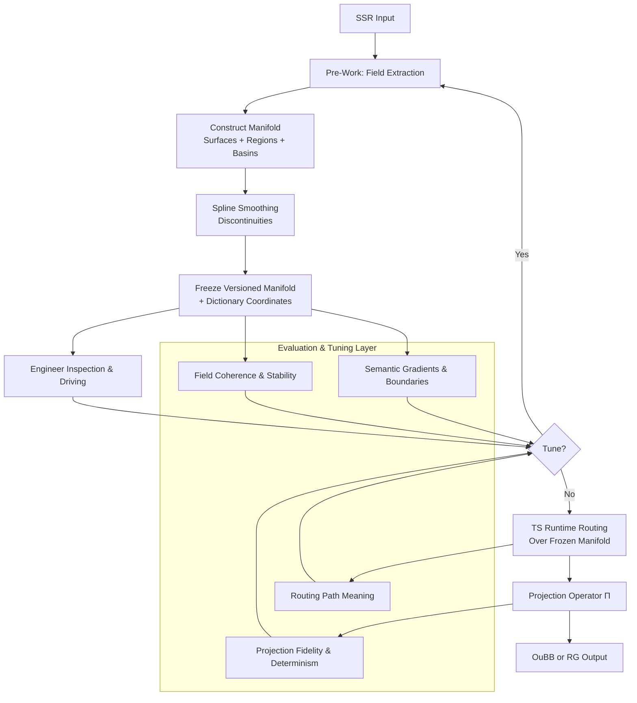

# The Pre-Work Manifold and Back: A Practical Engineering Guide to TS Latent Space

**Version**: 0.5 (Added SSR numericalization guidance)  
**Date**: 2026-07-04  
**Author**: Generated for CuriousOne23 / WhenMathPrays Thought Simulator (TS) Project  
**Repository**: CuriousOne23/WhenMathPrays  

## 1. Introduction

The Thought Simulator (TS) is a deterministic, fixed-time-step state machine designed for reproducible cognitive modeling. Unlike traditional neural architectures with opaque latent spaces, TS separates **pre-work** (manifold construction) from **runtime routing** (consumption of the manifold).

This transforms latent space from an emergent statistical artifact into a controllable engineering substrate. The **pre-work manifold** serves as an explicit, engineerable latent space. It is constructed during pre-work from Symbolic-Semantic Representations (SSR) and provides visible, navigable, characterizable, nameable, testable, refinable, and shareable geometry.

Engineers can see the manifold, freeze it, drive around it, inspect boundaries, smooth discontinuities, refine mappings, re-run pre-work, project SSR → manifold, and project manifold → OuBB (or RG). This makes the latent space a scientific instrument rather than a mystery.

## 2. What the Manifold Is

The manifold $\mathcal{M}$ is a collection of surfaces embedded in a coordinate space derived from SSR field extractions. Key definitions:

- **Surfaces**: Continuous regions of related semantic or relational structure. Surfaces and regions are symbolic constructs, not neural embeddings.
- **Regions**: Named partitions within or across surfaces, bounded by transition thresholds.
- **Basins**: Areas of attraction or stability within the manifold (e.g., object basins for entity persistence, relational basins for dynamic associations).
- **Dictionary numeric coordinates**: Discrete integer or tuple identifiers mapped to manifold locations, e.g., $(s_i, r_j)$ for surface $s_i$ and region $r_j$.
- **Symbolic continuity**: Preservation of relational meaning across projections.
- **Projection operators**: Functions mapping between SSR, manifold, and output spaces (OuBB or Relational Geometry (RG)).

**Coordinate charts** and transitions use standard differential geometry adapted for engineering:

Inline example: $f: \text{SSR} \rightarrow \mathcal{M}$

Block math:

$$
x_{\text{manifold}} = P(f_{\text{SSR}})
$$

where $P$ is the projection operator constructing numeric coordinates from SSR features.

Region boundaries are defined by similarity or distance thresholds in the extracted feature space. Surface transitions occur at spline-interpolated junctions.

## 3. Continuity Requirements

TS routing operates on discrete fixed-time steps and requires only $C^0$ (positional) continuity for basic deterministic routing. Continuity is required only to the order of differentiation used by TS routing. Higher-order continuity ($C^1$ for velocity, $C^2$ for acceleration) is optional for gradient-informed or smoother future routing variants.

$$
\text{Routing requires } C^0 \text{ continuity at minimum.}
$$

Cubic spline smoothing is sufficient and computationally lightweight for most engineering needs.

## 4. Spline-Smoothing Discontinuities

Pre-work extraction from SSR can produce discontinuities at region or surface boundaries due to abrupt feature shifts or incomplete mappings.

Engineers smooth these using cubic splines. Cubic splines are ideal because they are piecewise cubic polynomials, $C^2$ continuous, locally controllable, and efficient to evaluate. Spline smoothing occurs entirely in pre-work; TS never performs smoothing at runtime.

**Cubic spline segment**:

$$
S_i(x) = a_i + b_i(x - x_i) + c_i(x - x_i)^2 + d_i(x - x_i)^3
$$

for $x \in [x_i, x_{i+1}]$.

## 5. Engineerability: Seeing and Driving the Manifold

The core value of the pre-work manifold is practical engineering control:

- Freeze the manifold (serialize to disk).
- Visualize surfaces and basins.
- Inspect region boundaries.
- Drive routing paths through dictionary coordinates.
- Test paths for stability.
- Identify attractors and insufficiency regions.
- Refine transitions and re-run targeted pre-work.

This workflow is unique: TS is the first architecture where latent space is explicitly navigable and version-controlled.

## 6. Transfer Function: SSR → Manifold

$$
\mathcal{M} = T_{\text{SSR}\rightarrow\mathcal{M}}(\text{SSR})
$$

### 6.1 What Engineers Look For Between SSR and the Manifold

Engineers evaluate the transfer by examining:

- **Field coherence**: Fields extracted from SSR should form consistent clusters that align with expected symbolic meaning.
- **Field distinguishability**: Distinct SSR concepts must map to separable dictionary coordinates or regions (measurable via distance metrics).
- **Field interaction structure**: Relational fields should produce expected basin formations and surface adjacencies. Field interactions should produce predictable geometric effects (e.g., relational strength tightening basins, ambiguity widening transition zones).
- **Semantic gradients**: Smooth changes in SSR features should yield smooth manifold trajectories rather than abrupt jumps.
- **Meaningful boundaries**: Boundaries must correspond to real semantic distinctions, not artifacts.
- **Field stability**: Repeated pre-work runs on equivalent SSR must yield consistent coordinates (low variance).
- **Coordinate meaning**: Each $(s_i, r_j)$ tuple should have interpretable symbolic grounding traceable back to SSR.
- **Projection fidelity**: The manifold should preserve essential SSR relations without excessive distortion.

**Good manifold geometry**: Clean surfaces with well-defined basins, gradual semantic gradients, stable coordinates across runs, and boundaries that align with domain knowledge.

**Bad manifold geometry**: Fragmented surfaces, overlapping regions with no semantic basis, high sensitivity to small SSR changes, or coordinates that lack traceable meaning.

**Tuning manifold geometry**:
- Adjust field extraction weights.
- Tighten/loosen clustering thresholds.
- Add explicit mapping constraints.
- Re-run pre-work on refined SSR subsets.
- Apply targeted spline smoothing only where semantic continuity is violated.

### 6.2 Assigning Numerical Values to SSR Fields — Practical Guidance

This is the critical bridge from symbolic SSR to the numeric manifold.

**Step 1: Define the Numeric Domain**
- Use bounded, interpretable ranges (recommended: 0.0 to 1.0 for normalized features; or small integers for discrete categories).
- Avoid unbounded or extremely large ranges unless justified by the physics of the domain.
- For relational strength: 0.0 = no relation, 1.0 = maximum relation.
- For presence/activation: 0.0 = absent, 1.0 = fully present.
- For ambiguity/uncertainty: 0.0 = certain, 1.0 = maximum ambiguity.

**Step 2: Criteria for Assigning a Specific Numerical Value**
- **Traceability**: The number must be derivable from observable SSR attributes via a documented rule.
- **Monotonicity**: Higher/stronger semantic meaning should map to higher/lower numeric value consistently (choose direction and document it).
- **Normalization**: Scale raw values (counts, intensities, frequencies) to the chosen domain using min-max, z-score, or domain-specific normalization.
- **Semantic anchoring**: Choose values that make intuitive sense when inspected (e.g., "this field = 0.85" should correspond to "very strong relation" in human review).

**Step 3: Correlation Between Fields**
- Compute or define correlation explicitly during pre-work (Pearson, Spearman, or custom semantic similarity).
- Strong positive correlation between two fields should produce geometrically consistent effects (e.g., both high values reinforcing the same basin or surface region).
- Weak or negative correlation should be reflected in orthogonal or opposing manifold directions.
- Document expected correlation structure before assigning numbers.

**Step 4: Criteria for Knowing the Numerical Value Has Meaning**
- **Traceability test**: Can you start from the numeric value and reconstruct the original SSR attribute(s) with acceptable fidelity?
- **Stability test**: Repeated extraction on equivalent SSR yields the same (or very close) numeric value.
- **Discriminability test**: Different SSR concepts produce statistically separable numeric values.
- **Behavioral test**: When used in routing/projection, the numeric values produce outputs that align with expected semantic behavior.
- **Human review**: Engineers can look at a coordinate or field value and roughly predict what kind of SSR content it came from.

**Step 5: Validating Meaning**
- Run small controlled SSR examples through the full pipeline.
- Compare numeric field values against human judgment of the original SSR.
- Check that correlation structure produces expected manifold geometry.
- Use the Manifold Creation Checklist and Tuning Guide to systematically validate.

This process turns SSR from symbolic descriptions into a numeric substrate that the manifold can use while preserving meaning.

### **5.1 Visualizing the Manifold Pipeline**

> **Figure 1: TS Pre-Work Manifold Pipeline.** SSR inputs feed pre-work construction of the manifold. Engineers inspect, evaluate (field coherence, semantic gradients, routing meaning, projection fidelity), tune, and freeze the manifold before deterministic runtime routing and projection to OuBB/RG. Versioned snapshots enable regression testing and iterative refinement.

## 7. Projection: Manifold → OuBB (or RG)

$$
\text{OuBB} = \Pi(\mathcal{M})
$$

### 7.1 What Engineers Look For in Projection

Engineers judge projection quality by:

- **Meaningful output differences**: Small manifold movements in semantically important directions produce correspondingly meaningful OuBB/RG changes.
- **Smooth output transitions**: Spline-smoothed manifold paths yield gradual, interpretable output evolution.
- **Semantic fidelity**: Projected outputs preserve the intent and relations present in the originating SSR.
- **No semantic drift**: Repeated routing over the same path stays stable without unintended shifts.
- **Routing path meaning**: Paths through dictionary coordinates must correspond to coherent cognitive or relational sequences.
- **Projection stability**: Same input coordinate → same output (deterministic). Projection tuning should preserve determinism; adjustments must not introduce stochastic behavior.
- **Interpretability**: Engineers can trace back from OuBB/RG to specific manifold surfaces/regions.

**Good projection**: Outputs vary meaningfully with manifold position, transitions feel natural, routing paths produce expected semantic progression, and reversal (manifold → OuBB/RG) is traceable.

**Bad projection**: Outputs jump illogically, minor coordinate changes cause large semantic shifts (or none at all), drift appears over repeated routing, or outputs lose connection to originating SSR meaning.

**How to tune and vary projection**:
- Modify region-to-output mapping tables.
- Adjust interpolation weights or spline parameters.
- Add/relax stability constraints around key basins.
- Introduce conditional routing rules based on surface/region context.
- Re-project and compare outputs against ground-truth expectations.

**Going back from manifold → OuBB/RG**: Use the deterministic projection operator $\Pi$. For debugging, store intermediate dictionary coordinates and surface activations alongside outputs. This enables full traceability and regression testing.

## 8. Engineering Workflow

1. Run pre-work on SSR inputs.
2. Construct and evaluate the manifold.
3. Smooth discontinuities.
4. Freeze versioned snapshot.
5. Inspect, drive, and test paths.
6. Tune geometry and mappings.
7. Re-run pre-work as needed.
8. Route over the improved manifold.
9. Project to OuBB/RG and validate outputs.

Each iteration produces a versioned manifold snapshot for scientific comparison and regression testing.

## 9. Examples

**Discontinuity** (unsmoothed jump):

$$
y(x) = \begin{cases} 
x & x < 0 \\
x + 2 & x \geq 0 
\end{cases}
$$

**Spline smoothing** (cubic segment bridging the jump).

**Region boundary**:
Boundary defined by $d(\mathbf{v}_1, \mathbf{v}_2) > \theta$ where $\mathbf{v}$ are feature vectors.

**Surface transition**:

$$
x_{\text{manifold}}(t) = (1-t) \cdot x_s + t \cdot x_{s+1}, \quad t \in [0,1]
$$
with spline interpolation on $t$.

**Dictionary numeric coordinate projection**:
Input SSR → coordinate $(s_3, r_7)$ → manifold point → OuBB output.

**Routing path**:
Sequence of coordinates: $(s_1,r_2) \to (s_1,r_5) \to (s_2,r_1)$ with spline-smoothed transitions, verified for stability.

**Basin visualization**: A simple numeric depth map or stability gradient (e.g., higher values indicate stronger attraction in object/relational basins).

## 10. Conclusion

The pre-work manifold establishes latent space as a first-class engineering artifact within TS. Engineers now have concrete criteria for judging quality, tuning geometry, evaluating meaning at every layer (including numericalization of SSR), and ensuring deterministic, traceable projection back to OuBB/RG.

TS is the first architecture where the latent space is explicitly a map — visible, navigable, tunable, and scientific. This shifts cognitive modeling from alchemy to reliable systems engineering.

**Next steps**: Integrate with TS 20-series requirements, implement visualization and validation scripts, and validate via mapping simulation tests.
