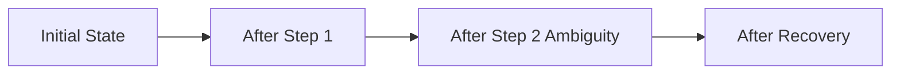

# **ts_dynamics_pathAB_verif.md**

### *Path A/B Logic Simulation for TS Dynamical Law Verification*

**System Simulation Document — Exploratory / Verification**

---

## **1. Purpose & Rationale**

This document defines and describes the Path A/B logic simulation used to verify the TS dynamical law introduced in `ts_dynamics_from_phiG_embedding.md`.

Path A validates nominal governed behavior; Path B validates robustness under ambiguity, perturbation, and independence stress.

The goal is to empirically test that the embedded $\phi(G)$ structure produces predictable, stable, and independence-preserving dynamics on the TS manifold, while maintaining core TS invariants (determinism, replayability, bounded drift, and governance compliance).

This simulation serves as the “wind tunnel test” for the dynamics engine before advancing to inference and learning papers.

---

## **2. Scope & Relation to Prior Papers**

This verification focuses exclusively on the **dynamical law** and its immediate consequences:
- Update rule: $s_{t+1} = s_t + \Delta_t$
- $\Delta_t = -\eta \nabla \Phi(s_t) + \Gamma(s_t) + \Xi_t$
- Basin navigation and transitions
- Independence enforcement via $\Gamma$
- Stability and bounded drift

It directly tests outputs of:
- `phi_g_schema.md`
- `ts_embedding_constraints.md`
- `ts_manifold_embedding_E_phiG.md`
- `ts_dynamics_from_phiG_embedding.md`

It does **not** yet address full inference, learning, or large-scale benchmarks.

---

## **3. TS Core Invariants Under Test**

- Determinism and replayability from observable state + $\phi(G)$
- Independence preservation (no collapse or entanglement)
- Bounded curvature and $\Delta H\%$ drift
- Correct basin behavior and transitions
- Governance compliance (GBMn influence on $\Delta_t$)
- Observable, inspectable trajectories

---

## **4. Test Objectives**

1. Verify deterministic execution of the update rule.
2. Confirm proper gradient flow and attractor convergence within basins.
3. Validate independence-aware corrections ($\Gamma$ term).
4. Test basin transitions under ambiguity/perturbation (Path B).
5. Confirm replay fidelity from logs.
6. Measure stability and recovery under controlled perturbations.
7. Verify governance curvature modulates dynamics as expected.

---

## **5. Methodology**

### **5.1 Simulation Inputs Table** (Example Scenarios)

| Scenario | Path | $\phi(G)$ Highlights | Expected Behavior |
|----------|------|----------------------|-------------------|
| Nominal Coherent | A | Strong structural + ChBMn blocks, low uncertainty | Smooth gradient flow to ChBMn/CBMn attractor |
| Ambiguity Injection | B | IBMn activation + conflicting roles | Trajectory bend, $\Gamma$ correction, possible GBMn escalation |
| Independence Stress | B | Orthogonal independence blocks with forced proximity (stress test for $\Gamma$) | $\Gamma$ projection prevents collapse |
| Perturbed Governance | B | Added noise + GBMn activation | Recovery to governed basin with bounded drift |

### **5.2 Execution**
Construct minimal $\phi(G)$ vectors per scenario (512-dim block-structured, with explicit activation of only the blocks relevant to the test). Embed into manifold point $s_t \in \mathcal{M}_{TS}$. Run fixed-timestep updates for N steps (e.g., 50–200). Log full state, $\Delta_t$ components, basin type, $\Delta H\%$, curvature at each step. Replay from logs and compare.

### **5.3 Determinism & Replay Procedure**

Replay is performed by re-executing the update rule using only logged observable state and embedded $\phi(G)$, verifying bit-exact reproduction of all $s_t$ and $\Delta_t$ values. Determinism assumes fixed-precision arithmetic and stable ordering of operations.


---

## **6. Metrics & Numerical Reporting**

| Metric | Definition / Formula | Pass Threshold (Path A) | Fail Threshold | Notes |
|--------|----------------------|--------------------------|----------------|-------|
| Replay Fidelity | Exact state match after full replay | 100% | < 100% | Bit-exact |
| Max $\|\Delta H\%\|$ Drift | Max absolute change over window | $\leq 0.05$ | $> 0.08$ | Per 50 steps |
| Independence Violations | Count of detected entanglement events (projection error) | 0 | $\geq 1$ | - |
| Attractor Convergence Steps | Steps to enter stable basin | $\leq 15$ | $> 30$ | - |
| Perturbation Recovery | Steps to return to original basin type + final $\|\Delta H\%\|$ | $\leq 20$ steps & within 0.05 of start | $> 40$ or drift $>0.1$ | Path B only |
| Basin Transition Correctness | % match to expected mode activation | 100% | $< 100\%$ | - |
| Curvature Bound Adherence | % steps where curvature stays within governance limits | $\geq 98\%$ | $< 95\%$ | - |
| Governance Intervention Rate | % steps where GBMn significantly shapes $\Delta_t$ | Expected range per scenario | Outside expected range | - |

---

## **7. Minimal Example (3-Step Walkthrough)**

**Initial State**: Concept + CBMn basin, low $\Delta H\%$.

**Step 1 (Nominal)**: Coherent input → dominant structural blocks.  
$\Delta_t \approx -\eta \cdot \nabla \Phi$ (smooth gradient).  
New state: closer to attractor.

**Step 2 (Ambiguity)**: Conflicting follow-up.  
IBMn activates → curvature change + large $\Gamma(s_t)$ (orthogonal correction).  
Trajectory bends; entanglement prevented. Modified $\nabla \Phi(s_t)$ due to the new dominant uncertainty mode.

**Step 3**: Recovery via governance.  
GBMn strengthens → state settles in governed basin with low final drift.

(Full numerical traces will be generated during runs and attached to logs.)

---

## **8. Expected Results**

- **Path A**: Near-perfect replay fidelity, minimal drift, smooth convergence, zero independence violations.
- **Path B**: Controlled trajectory bends, successful recovery within thresholds, governance effectively limits damage.
- All core invariants satisfied with clear numerical evidence.

---

## **9. Interpretation Guidelines & Failure Mode Taxonomy**

**Success**: All primary metrics pass → dynamical law and embedding behave as specified.

**Failure Modes**:
- **Independence Collapse**: High projection error / entanglement → revisit $\Gamma$ definition or $\phi(G)$ independence blocks.
- **Oscillatory Dynamics**: Persistent high curvature without convergence → tune $\eta$ or basin boundaries.
- **Runaway Drift**: $\|\Delta H\%\|$ exceeds bounds → strengthen governance curvature or embedding constraints.
- **Attractor Misalignment**: Wrong basin → review $\phi(G) \to$ manifold mapping.
- **Replay Mismatch**: Non-determinism → inspect state observability or floating-point handling.

---

## **10. Comparison to Today’s AI Systems**

Current LLMs often exhibit high context drift, non-reproducible behavior, poor independence of representations, and limited explainability. This simulation aims to demonstrate measurable advantages in:
- Deterministic replay
- Bounded drift / coherence
- Explicit independence enforcement
- Geometric governance

Quantitative results will provide concrete differentiation.

---

## **11. Implications for TS**

Passing this verification strengthens confidence in the manifold + dynamics foundation. It directly supports:
- Long-term coherence and identity stability (Manifold Architecture).
- Observable, governable behavior suitable for HSAI.
- A solid base for inference and learning extensions.

Failure in specific areas will drive targeted refinements while preserving the overall relational/verb-oriented design.

---

## **12. Simulation Output Format (Required Schema)**

All simulation runs **must** produce standardized, reproducible outputs to enable automated validation, cross-run comparison, and future integration with inference tests.

### **12.1 Directory & Naming Conventions**
- Root: `results/pathA_nominal_run1/` or `results/pathB_ambiguity_run2/`
- Files:
  - `run_metadata.json` — scenario description and parameters
  - `timestep_logs.json` — full per-timestep records (array)
  - `summary.json` — aggregated metrics
  - `report.md` — human-readable Markdown summary (required)

### **12.2 Timestep Record Schema** (JSON)
Each entry in `timestep_logs.json`:

```json
{
  "t": 12,
  "state_vector": [0.12, -0.34, ...],
  "delta_t": {
    "grad": [0.01, -0.02, ...],
    "gamma": [0.0, 0.0, ...],
    "xi": [0.001, -0.0005, ...],
    "eta": 0.12,
    "total_delta": [0.011, -0.0205, ...]
  },
  "basin_type": "CBMn",
  "curvature": 0.0041,
  "delta_H_percent": 0.002,
  "governance_mode": "none",
  "notes": "optional string"
}
```

### **12.3 Summary Record Schema** (`summary.json`)

```json
{
  "scenario": "Ambiguity Injection - Path B",
  "purpose": "Test basin transition and independence enforcement under conflicting roles",
  "metrics": {
    "replay_fidelity": 1.0,
    "max_delta_H_percent": 0.031,
    "independence_violations": 0,
    "attractor_convergence_steps": 11,
    "perturbation_recovery_steps": 17,
    "basin_transition_correctness": 1.0,
    "curvature_bound_adherence": 0.99,
    "governance_intervention_rate": 0.07
  },
  "pass_fail": {
    "overall": "PASS",
    "details": [
      {"metric": "replay_fidelity", "value": 1.0, "threshold": 1.0, "margin": "exact", "result": "PASS"},
      {"metric": "max_delta_H_percent", "value": 0.031, "threshold": 0.05, "margin": "+0.019", "result": "PASS"}
    ]
  }
}
```

### **12.4 Required Markdown Report Layout** (`report.md`)

```markdown
# Simulation Report: [Scenario Name] - [Path A/B]

**Purpose**: [One-sentence purpose of this test]

**Run Date**: [timestamp]
**Duration**: [N steps]

## Metrics Summary

[Insert full Metrics Table with added columns: Actual Value | Threshold | Margin/Deficit | Pass/Fail]

## TS vs Today's AI Performance (Best-Guess Estimate)

| Metric | TS Result | Today's AI Estimate | Who Performs Better | Why |
|--------|-----------|---------------------|---------------------|-----|
| Replay Fidelity | 100% | ~0% (non-deterministic) | TS | Deterministic by design vs stochastic sampling |
| Max ΔH% Drift | 0.031 | High (frequent coherence loss) | TS | Bounded geometry vs emergent drift |
| Independence Preservation | 0 violations | Frequent entanglement | TS | Explicit Γ projection vs implicit representations |
| ... | ... | ... | ... | ... |

## Overall Pass/Fail Summary
**Overall**: PASS / FAIL  
**Key Strengths**: ...  
**Areas for Improvement**: ...  
**Notes**: ...
```

### **12.5 TS vs Today's AI Comparison Notes**
- Use best available public data or reasoned estimates for “Today’s AI”.
- Column “Who Performs Better” → “TS significantly better” / “Today’s AI better” / “About the same”.
- Keep “Why” column short and evidence-based.

## **13. Conclusion & Next Steps**

This Path A/B simulation provides the first empirical validation of TS dynamics. Results (with full logs and traces) will be documented in companion artifacts.

**Next**: 
- Execute and report numerical results.
- Advance to TS inference paper.
- Expand simulation scope as needed.

---
