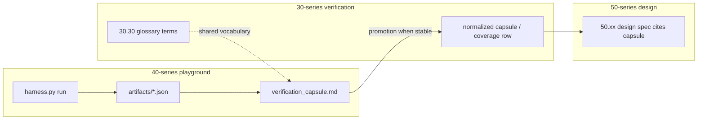

# 40.20 Master Program Guide for Thought Simulator Playground

**Document ID:** 40.20  
**Version:** 0.11  
**Date:** 2026-06-08  
**Status:** Active Guidance — reviewer refinements per CP evaluation (v0.11)

## Role in the Development Flow

This document serves as the **master guide** for all work in the 40-series playground. It defines how the three core flows interact to keep the project aligned, evidence-driven, and progressive.

### Active coordination program

Module-level refactor inventory, phase order, and reviewer sign-off for the Track H / dual-pipeline alignment pass live in **[40.510_refactor.md](40.510_refactor.md)** (playground successor to closed [20.510](../20_requirements/20.510_refactoring_for_input_correction_track_h.md)).

| Document | Owns |
|----------|------|
| **40.20** (this guide) | Process — flows, capsule structure, evidence standards, promotion criteria |
| **[40.510](40.510_refactor.md)** | Program — which `40.xx` modules to create, redo, or extend; status and GATE approvals |

Use 40.510 for *what to work on*; use this guide for *how to work on it*.

## The Three Core Flows

### 1. Forward Flow
20-series (Guidance & Intent) → 40-series (Exploration & Evidence) → 50-series (Design Decisions) → 10-series (Canonical Requirements)

### 2. Backward Flow
Evidence and discoveries from the 40-series flow backward to refine the 50-series and 10-series.
(Future high-fidelity test benches will also feed 30-series verification evidence via the 30.tb/ structure. Only normalized text records are stored in the repo; raw outputs, logs, artifacts, etc. from test benches are excluded via .gitignore.)

### 3. Iterative Design Flow
When the 50-series makes significant design decisions, it drives **targeted iterations** back into the 40-series playground for validation.

**This iterative loop between 40 and 50 is expected and encouraged.**

### Evidence pathways (40 → 30 → 50)

Playground modules produce **raw, module-local evidence** first. Promotion layers consume **normalized, auditable records** — not ad hoc notes.



1. **40-series** — `harness.py` runs scenarios; JSON artifacts land in `artifacts/`; `verification_capsule.md` and `requirements_delta.md` summarize outcomes and HLR mapping.
2. **30-series** — When runs stabilize, evidence is normalized per [30.00](../30_verification/30.00_verification_user_guide.md) promotion standards (coverage audit; shared terms from [30.30](../30_verification/30.30_verification_glossary.md)).
3. **50-series** — Design documents cite playground capsules as released evidence for a design version; material capsule changes require a design version bump.

Future high-fidelity benches may additionally feed `30.tb/` structures; only normalized text records are stored in-repo (raw bench outputs excluded via `.gitignore`).

---

## Standard File Structure per 40.xx Module

Every 40.xx module (e.g., 40.36_gb_prototypes) **SHALL** follow this standard structure:

| File                              | Purpose | Why It Exists |
|-----------------------------------|---------|---------------|
| `software_description.md`         | High-level description of what the prototype should do, including three-flow alignment statement | Defines intent and maintains breadcrumb trail |
| `prototype.py`                    | Main implementation of the prototype (core logic) | Contains the actual experimental code |
| `harness.py`                      | Test runner with various scenarios and input snapshots | Allows easy, repeatable testing of the prototype |
| `verification_capsule.md`         | Summary of test results, evidence, and observations | Records verification outcomes with three-flow breakdown |
| `requirements_delta.md`           | Mapping of 20-series HLRs to what was implemented/explored | Provides traceability and gap analysis |
| Optional: JSON run artifacts      | Raw output from verification runs | Preserves raw data for reproducibility |

This structure ensures every prototype is self-documenting, testable, and traceable.

---

## Documentation Requirement During Iteration

When performing an **Iterative Design Flow** update, the following documents **SHALL** explicitly record the contribution of each flow:

- `software_description.md`
- `requirements_delta.md`
- `verification_capsule.md`

Each must include a **Flows Alignment Statement** and an **Agreement Statement** (normative templates in **Appendix A**).

**Please refer to [30.00_verification_user_guide.md](../30_verification/30.00_verification_user_guide.md)** for detailed verification procedures, required files, three-flow requirements, and promotion standards.

---

## Evidence (definitions)

**Evidence** means persisted, replayable proof that a prototype behaved as claimed. Every major 40.xx experiment **SHALL** classify its capsule artifacts using one or more types below.

| Type | What it proves | Typical source | Example |
|------|----------------|----------------|---------|
| **Behavioral** | Correct outputs for given inputs | `harness.py` positive scenarios | Deterministic replay PASS; identical digests across runs |
| **Structural** | Schema, envelope, or IO contract stability | Serialization / round-trip tests | `UspSnapshot` golden JSON; envelope partition guards |
| **Negative** | Deterministic rejection of invalid states | `harness.py` negative scenarios | `FAIL_ENVELOPE`; oversize payload reject with fixed reason code |
| **Golden diff** | Byte- or field-stable comparison against a reference | Canonical serialization policy | Sorted-key JSON diff per [20.95](../20_requirements/20.95_ts_numeric_policy.md) / struct golden files |
| **Replay** | End-to-end or strip replay equivalence | Multi-stage or Class 1–7 harness | Class 7 C7-A..E; strip `exec_plan`+`exec_trace` → A-only equivalence |

Shared vocabulary for capsule fields and artifact naming: [30.30_verification_glossary.md](../30_verification/30.30_verification_glossary.md).

---

## Purpose

The 40_thought_simulator_playground is an **experimental environment** where we test ideas, discover practical challenges, generate evidence, and validate architectural intent from the 20-series.

## Key Principles for 40-series Work

- All prototypes must respect the architectural principles in **20.10**.
- Exploration is primarily driven by 20-series guidance.
- Every major experiment should produce **verifiable evidence**.
- The 40-series remains exploratory — nothing here is final.

## Current Priorities (June 2026)

> **Descriptive only — not authoritative.** Module scheduling, status, and reviewer sign-off live exclusively in **[40.510_refactor.md](40.510_refactor.md)** §5. Update 40.510 when priorities change; treat this section as onboarding context that may drift.

**Module inventory:** See **[40.510_refactor.md](40.510_refactor.md)** §5 (master tracking table, 42 rows). The list below is a process-level summary only — not a second source of truth.

1. Execute [40.510](40.510_refactor.md) Phase 1 — Track H intake (`40.101_*`, Class 7 replay harness).
2. Execute 40.510 Phase 2 — conversation layer + structs (USP, UPI, CIL/COB/GB redos).
3. Iterate on 40.36 Governing Basin prototype (3-tier hierarchy per 50.36; details in 40.510-206).
4. Gather evidence for 10-series refinement via standard verification capsules.

### Track H Input Correction — suggested priorities (post-[20.510](../20_requirements/20.510_refactoring_for_input_correction_track_h.md))

**Ownership:** 40.20 governs playground *process* (capsule structure, evidence, promotion). **[40.510](40.510_refactor.md)** governs refactor *scheduling and row sign-off*. [20.510](../20_requirements/20.510_refactoring_for_input_correction_track_h.md) tracks 20-series requirements only and has **no authority** over 40-series work.

| Priority | Suggested module / focus | 20-series inputs | Evidence target |
|----------|--------------------------|------------------|-----------------|
| P1 | `40.101_*` IIInB intake prototype — `profile_enabled` gate, read-only USP apply, TP intake-bound writes only | [20.101](../20_requirements/20.101_iiinb_requirements.md), [20.38](../20_requirements/20.38_ts_implementation_guidelines.md) §6 | `verification_capsule.md` + `requirements_delta.md` |
| P1 | Track H replay harness — runnable `REPLAY_CLASS_7` C7-A..E per fixture contract | [20.36](../20_requirements/20.36_canonical_end_to_end_trace.md) §9 | Harness pass/fail + strip diff artifacts |
| P2 | Intake struct alignment — `UspSnapshot`, `InputRepairTag`, `ConversationLayerState` | [20.39](../20_requirements/20.39_ts_core_data_structures.md) §3.1–3.2 | Struct serialization golden diffs |
| P2 | Clarification → UPI → USP cross-turn path — CIL FIFO, GB veto, COB pin | [20.33](../20_requirements/20.33_cil_requirements.md), [20.103](../20_requirements/20.103_upi_requirements.md), [20.80](../20_requirements/20.80_gb_requirements.md) §10 | Multi-turn harness scenarios |
| P3 | Envelope write-guard negative tests — IIInB must not touch `semantic_core` / `TP.TR` | [20.38](../20_requirements/20.38_ts_implementation_guidelines.md) §8 | `FAIL_ENVELOPE` replay verdict fixtures |
| P3 | 30-series evidence promotion — normalized verification capsules when runs stabilize | [30.00](../30_verification/30.00_verification_user_guide.md) | `30_verification/` capsule per promotion standards |

## Promotion Criteria to 50-series

- Clear evidence of success or well-understood failure modes (see **Evidence** section)
- Traceability back to specific 20-series HLRs
- Documented trade-offs and performance characteristics
- Verification capsules demonstrating behavior
- 30-series normalization complete when promotion-grade audit is required

---

## Appendix A — Required statement templates (normative)

Use these templates in `software_description.md`, `requirements_delta.md`, and `verification_capsule.md` whenever an **Iterative Design Flow** update occurs. Copy the headings verbatim; replace bracketed placeholders. Target length: **3–6 bullets per flow** plus **1–3 sentences** for Agreement — enough for audit, not a narrative essay.

### Flows Alignment Statement

```markdown
## Flows Alignment Statement

- **Forward Flow (20-series)**: [Which 20.xx docs/HLRs drive this module's intent and boundaries.]
- **Backward Flow (40-series evidence)**: [What this prototype proved, disproved, or surfaced — cite harness scenarios or artifacts.]
- **Iterative Design Flow (50-series influence)**: [Which 50.xx decisions shaped this iteration, or "none yet" if not applicable.]
```

### Agreement Statement

```markdown
**Agreement Statement**: [One to three sentences stating whether the three flows are aligned, provisionally aligned, or blocked — and why. Name open items explicitly if blocked.]
```

**Status words:**

| Term | Meaning |
|------|---------|
| **aligned** | Evidence supports forward intent; backward findings incorporated; iterative inputs respected |
| **provisionally aligned** | Scaffold or partial Phase B — gaps named, no false sign-off |
| **blocked** | Conflict between flows — do not promote until resolved |

---

## Appendix B — Playground glossary (onboarding)

Authoritative primitive definitions: [20.190_glossary.md](../20_requirements/20.190_glossary.md) (Primitive Intent Catalog). Verification terms: [30.30_verification_glossary.md](../30_verification/30.30_verification_glossary.md).

| Term | One-line meaning | Primary 20 doc |
|------|------------------|----------------|
| **IIInB** | Optional pre–Pipeline A semantic repair; read-only USP apply; escalates unknowns to CIL | [20.101](../20_requirements/20.101_iiinb_requirements.md) |
| **USP** | Conversation-layer shorthand rule store; read-only to IIInB; written by UPI only | [20.102](../20_requirements/20.102_usp_requirements.md) |
| **UPI** | Clarification-to-USP commit integrator; GB-gated sole USP writer | [20.103](../20_requirements/20.103_upi_requirements.md) |
| **CIL** | Clarification FIFO; emits `clarification_event` toward UPI | [20.33](../20_requirements/20.33_cil_requirements.md) |
| **COB** | Conversation object promotion; USP snapshot version pins | [20.32](../20_requirements/20.32_cob_requirements.md) |
| **GB** | Governing Basin — supervisory caps and gates; no meaning authority | [20.80](../20_requirements/20.80_gb_requirements.md) |
| **InB** | Surface intake normalization only; closed non-inferential scope | [20.100](../20_requirements/20.100_inb_requirements.md) |
| **Pipeline A / B** | A = meaning construction (lane-parallel); B = one realization per `commit_id` | [20.30](../20_requirements/20.30_ts_functional_model.md) |
| **`semantic_core`** | Frozen meaning envelope at `mtp_update`; read-only to Pipeline B | [20.206](../20_requirements/20.206_pipeline_a_b_synchronization_contract.md) |
| **Replay Class 7** | Track H end-to-end fixture family (C7-A..E) per [20.36](../20_requirements/20.36_canonical_end_to_end_trace.md) §9 | [20.36](../20_requirements/20.36_canonical_end_to_end_trace.md) |
| **40.510** | Playground refactor program inventory (successor to closed 20.510) | [40.510_refactor.md](40.510_refactor.md) |

---

## Changelog

| Version | Date | Author | Summary |
|---------|------|--------|---------|
| 0.10 | 2026-06-08 | Grok | Cross-link 40.510; priority ownership split |
| 0.11 | 2026-06-08 | Grok | CP reviewer refinements — evidence definitions, 40→30→50 pathway, statement templates (Appendix A), glossary (Appendix B), priorities banner |

---