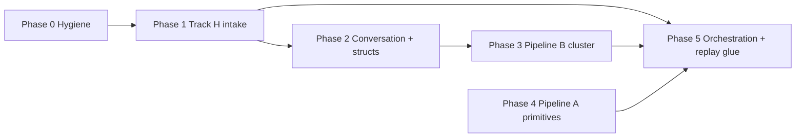
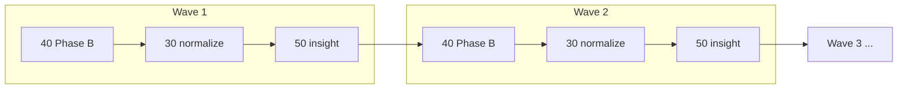
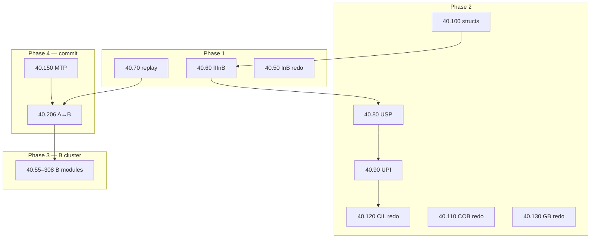

# 40.510 Playground Refactor (Track H Downstream)

**Document ID:** 40.510  
**Version:** 0.8.30
**Date:** 2026-06-08  
**Status:** **Active** — **W1 exit complete** 2026-06-08; **W2 exit complete** 2026-06-08 (30 normalize + 50 insight); **GATE-B closed** (201+202). Program doc **approved** v0.8.12.

### Program rules (summary)

> **40.510** is the **authoritative inventory** for *what* to build or redo and *in what order* during the Track H / dual-pipeline alignment pass.  
> **40.05** governs *how* to build and document it (capsules, evidence, flows).  
> This document **does not** introduce normative runtime HLRs and **does not** override closed 20-series programs.  
> Every module add/remove/status change **SHALL** update §5 in the same change set.  
> Execution follows **§4.2 Promotion waves** — batch 40 Phase B per wave, then 30 normalization, then 50 insight pass before the next wave.  
> Rows marked **GATE** require ☑ from **CuriousOne23, CP, and Grok** before `Status` → `approved`.  
> **Renumbering** existing `40.xx` folders is prohibited unless a GATE row explicitly authorizes it (see §3).

**Wave quickstart:** W1 intake (100, 101, 207) → W2 conversation (USP/UPI/CIL/COB/GB) → W3 Pipeline A primitives → W4 Pipeline B cluster → W5 orchestration/replay. Each wave: 40 Phase B `approved` → 30 normalize → 50 insight → log §4.2.4.

## Purpose

This document is the **single coordination hub** for refactoring `40_thought_simulator_playground/` to align with the closed **20-series Track H program** ([20.510](../20_requirements/20.510_refactoring_for_input_correction_track_h.md)) and the runtime-pipeline map in [20.01](../20_requirements/20.01_architecture_map.md).

**40.510 is the playground-side successor to 20.510.** Where 20.510 tracked **what changed in 20-series requirements**, 40.510 tracks **what must change in 40-series prototypes, harnesses, and evidence** so the playground reflects:

- Dual-pipeline partition ([20.500](../20_requirements/20.500_refactoring_for_dual_TS_pipeline.md) — closed)
- Track H intake correction ([20.510](../20_requirements/20.510_refactoring_for_input_correction_track_h.md) — closed)
- Runtime pipeline order (Option A blocks B0–B8 in [20.01](../20_requirements/20.01_architecture_map.md))

**This document is NOT normative TS runtime requirements.** It does not override [20.12](../20_requirements/20.12_ts_invariants.md), module HLRs, or CP-approved 20.xx documents. It tracks **what to build or redo, in what order, with what evidence, and with what reviewer sign-off** — for **40-series playground modules only**.

**Reviewers:** CuriousOne23, CP, Grok — three-way consensus required on rows marked **GATE** before status moves to `approved`.

**Owner guide:** Scheduling and capsule standards remain under [40.05_master_program_guide.md](40.05_master_program_guide.md). 40.510 does not replace 40.05; it is the **refactor program inventory** for the Track H / dual-pipeline alignment pass.

**How to use this document:**

1. Read §2 for program boundaries and naming rules.
2. Execute the active **promotion wave** (§4.2) — phases in §4 define dependency order within and across waves.
3. On each wave closure: update **§4.2.4 Wave diagnostic log**, then begin the next wave.
4. Update the **Master tracking table** (§5) on every row status change; record artifact paths in Notes.
5. Record wave-level decisions (30/50 outcomes) in §4.2.4 — this is the audit trail for promotion.

---

## 1. Program context

### 1.1 Why 40.510 exists

[20.510](../20_requirements/20.510_refactoring_for_input_correction_track_h.md) closed 2026-06-07 with normative 20-series Track H requirements approved. Its §Scope boundary explicitly deferred playground sign-off to [40.05](40.05_master_program_guide.md). A modularity check noted that **primitive boundaries survived** the 20-series refactor, but **integration debt** in the playground clusters in three predictable seams:

| Seam | Nature | 40.510 primary phases |
|------|--------|------------------------|
| Track H intake path | `InB → IIInB → RB`; USP/UPI/CIL wiring | Phase 1–2 |
| Pipeline B cluster | Singular B pass per `commit_id`; no `lane_id` in B envelopes | Phase 3 |
| Unified replay harness | 20.36 classes 1–7; strip replay; Class 7 Track H | Phase 1, 5 |

### 1.2 Authoritative runtime order (reference)

Normative Pipeline A stage order for fixtures and orchestration glue:

```text
InB → [IIInB when profile_enabled] → RB → splitting → OB → DCB → TR → TB
  → ΔH% → merging → truth_done → mtp_update
  → Pipeline B: TrigRB → SRP → exec_plan → OuB → IMR
```

Conversation layer (durable, outside four runtime envelopes): CIL, COB, USP, UPI.

### 1.3 Predecessors and inputs

| Input | Role |
|-------|------|
| [20.510](../20_requirements/20.510_refactoring_for_input_correction_track_h.md) | **Primary trigger** — Track H requirements closed; informational handoff § suggested 40.xx priorities |
| [20.500](../20_requirements/20.500_refactoring_for_dual_TS_pipeline.md) | Dual-pipeline envelope partition; Pipeline B singular per `commit_id` |
| [20.01](../20_requirements/20.01_architecture_map.md) | Runtime block map B0–B8; reading order for cross-module edits |
| [20.38](../20_requirements/20.38_ts_implementation_guidelines.md) | Implementation bridge — envelope guards, intake path, Class 7 checklist |
| [20.39](../20_requirements/20.39_ts_core_data_structures.md) | Struct sketches — `UspSnapshot`, `ConversationLayerState`, envelope partition |
| [20.36](../20_requirements/20.36_canonical_end_to_end_trace.md) | Fixture shape; replay classes 1–7 (Class 7 = Track H) |
| [40.05](40.05_master_program_guide.md) | Playground process owner — capsule structure, P1–P3 priorities |

---

## 2. Scope boundary

**40.510 governs *what to build and in what order*; [40.05](40.05_master_program_guide.md) governs *how to build and document it*.**

**This document is NOT normative TS runtime requirements.** It does not introduce normative HLRs and does not override closed 20-series programs or CP-approved 20.xx documents. It tracks playground inventory, wave scheduling, evidence, and reviewer sign-off only. Normative requirements remain in 20.xx; coverage audit remains in 30.xx.

| In scope | Out of scope |
|----------|--------------|
| 40.xx module create / redo / extend | 20-series HLR edits (closed programs) |
| `software_description.md`, `prototype.py`, `harness.py`, capsules, artifacts | 10-series promotion gates |
| **Promotion waves** (§4.2): per-wave 40 Phase B → 30 normalize → 50 insight pass | Ad hoc module-by-module 30/50 without wave closure |
| Playground README / directory map hygiene | Normative 50-series requirements (50 cites evidence; does not override 20.xx) |
| Legacy 40.xx numbering collision notes | |
| Wave diagnostic log (§4.2.4) | |

**Sign-off authority:** Rows in §5 marked **GATE** require ☑ from CuriousOne23, CP, and Grok before `Status` becomes `approved`.

**Completion criteria per module row:**

- Standard capsule files per [40.05](40.05_master_program_guide.md)
- `harness.py` PASS with JSON artifact under `artifacts/`
- `requirements_delta.md` maps to specific 20.xx HLRs
- Three-way approval recorded in §5

---

## 3. Legacy numbering collisions

The playground predates strict 20.xx number alignment. **Renumbering is prohibited during this program** unless a GATE row explicitly authorizes a rename. Do not renumber existing folders in Phase 0–3 by default. New modules use 20-aligned IDs where free; otherwise use the **suffix convention** below.

| Existing 40 path | Conflicts with 20.xx | New-module convention |
|------------------|----------------------|------------------------|
| `40.160_tp_lifecycle/` + `40.05_master_program_guide.md` | 20.20 primitives (file vs folder) | Keep both; disambiguate explicitly in module `software_description.md` |
| `40.270_scheduler_prototypes/` | 20.40 OB | New OB module → `40.200_ob_prototypes/` |
| `40.320_regulator_prototypes/` | 20.50 RB | New RB module → `40.190_rb_prototypes/` |
| `40.280_tick_cycle_skeleton/` | 20.60 TB | New TB module → `40.230_tb_prototypes/` |
| `40.350_mb_prototypes/` | 20.39 core structs | New struct module → `40.100_core_data_structs_prototypes/` |

---

## 4. Phase plan (execution order)

Phases are **ordered by dependency**, not folder number. Complete earlier phases before marking downstream rows `wip` unless explicitly parallelized in Notes.



| Phase | Goal | Entry criterion | Exit criterion |
|-------|------|-----------------|----------------|
| **0** | Program hygiene | 40.510 opened | README map updated; collision table acknowledged |
| **1** | Track H intake path | Phase 0 done | 40.60 + Class 7 harness rows `approved` |
| **2** | Conversation layer + structs | Phase 1 wip or done | USP/UPI modules + CIL/COB/GB targeted redos `approved` |
| **3** | Pipeline B cluster | Phase 2 underway | B4 module set harnessed; no `lane_id` in B fixtures |
| **4** | Pipeline A primitive gaps | Phase 1 done | RB/OB/DCB/TB/MTP/split-merge/truth modules exist with evidence |
| **5** | Orchestration + replay glue | Phases 1–4 underway | Scheduler/tick/snapshot/event-log/experiment-runner redos + 40.206 sync `approved` |

### 4.1 Phase readiness checklists

Self-certify **entry** before marking any phase row `wip`; self-certify **exit** before claiming a phase complete. All boxes must be ☑ for the phase boundary.

**Phase 0 — Hygiene**

- [ ] §3 collision table read; renumbering prohibition acknowledged
- [ ] [40.05](40.05_master_program_guide.md) v0.11+ read (process + evidence types)
- [ ] Row 40.510-001 `done` or `approved`

**Phase 1 — Track H intake**

- [ ] Phase 0 exit met
- [ ] [20.101](../20_requirements/20.101_iiinb_requirements.md) + [20.38](../20_requirements/20.38_ts_implementation_guidelines.md) §6 read
- [ ] `40.60_*` folder scaffolded per 40.05 capsule structure
- [ ] Class 7 harness plan mapped to [20.36](../20_requirements/20.36_canonical_end_to_end_trace.md) §9 C7-A..E

**Phase 2 — Conversation + structs**

- [x] GATE-A rows (40.510-101, 40.510-102) `approved` — **GATE-A closed 2026-06-08**
- [x] USP/UPI/struct rows (201–203) Phase A `software_description.md` drafted 2026-06-08
- [ ] Appendix A.2 conversation-layer boundary understood

**Phase 3 — Pipeline B cluster**

- [x] GATE-B closed (40.510-201, 40.510-202 `approved`) — **2026-06-08**
- [ ] Row 40.510-401 (MTP/`commit_id`) at `wip` or beyond
- [ ] B fixture template enforces no `lane_id` / `tp_id`

**Phase 4 — Pipeline A primitives**

- [x] Phase 1 exit met (GATE-A `approved` — closed 2026-06-08)
- [x] Normative A-chain order ([20.36](../20_requirements/20.36_canonical_end_to_end_trace.md) §2.1) posted in module `software_description.md` files — **W3 Phase A 2026-06-08** (rows 401–412)
- [x] W3 rows (401–412) Phase A `software_description.md` drafted and CP-approved 2026-06-08

**Phase 5 — Orchestration + replay glue**

- [ ] GATE-D row (40.510-501) at `done` minimum
- [ ] GATE-C collective evidence available for review
- [ ] Strip-replay scenario drafted for GATE-E

### 4.2 Promotion waves (40 → 30 → 50 hybrid)

Phases (§4) define **dependency order**. Waves define **promotion checkpoints** — batched 40-series Phase B closure, then intentional 30-series normalization and 50-series insight review, before the next batch begins.

#### 4.2.0 Why this process

| Question | Answer |
|----------|--------|
| **Why hybrid (not pure batch or pure serial)?** | Pure batch (all 40 → all 30 → 50) delays integration discovery until late GATE-E rework. Pure serial (module → 30 → 50) repeats ceremony on isolated primitives with low marginal insight. Waves batch work **inside** integration seams and pause **at** seams for audit. |
| **Why five waves?** | Maps 1:1 to the three integration debts in §1.1 plus Pipeline A primitives and orchestration glue. Each wave ends at a natural **GATE** boundary (A, B, C, D/E). Fewer waves (3) = late discovery; more (7) = excess ceremony without proportional insight. |
| **Why now?** | [20.510](../20_requirements/20.510_refactoring_for_input_correction_track_h.md) closed 2026-06-07; 20-series Track H requirements are stable. The 40→30→50 **process** was validated serially on early modules (e.g. 40.50 Phase B approved). Remaining work is **execution** against a known inventory — waves preserve audit without re-proving the pipeline per module. |
| **What we expect to find** | Integration contract gaps (handoff shapes, envelope guards, replay fixtures), missing observability (reason codes, digests, replay verdicts), and design-metric questions at A↔B freeze and strip-replay — not wholesale HLR rewrites. Findings land in wave log (§4.2.4) as 40-only, 50-note, or rare 20-escalation. |
| **Advantages** | Batch efficiency within waves; serial insight at seams; diagnostic trail per wave; 30 promotion only on stable wave slices; 50 reads bounded evidence packages; GATE closure aligned to wave exit. |



**Wave vs phase:** Wave numbers (W1–W5) are promotion units. Phase numbers (0–5) remain dependency labels in §5. W3 runs Phase 4 rows; W4 runs Phase 3 rows — phase order and wave order differ by design (A primitives before B cluster closure).

#### 4.2.1 Wave map

| Wave | Name | §5 rows | 40 modules (paths) | Phase deps | GATE at exit |
|------|------|---------|-------------------|------------|--------------|
| **W1** | Track H intake | 101–103 | `40.50`, `40.60`, `40.70` | Phase 0 complete | **GATE-A** (101, 102) |
| **W2** | Conversation layer + structs | 201–207 | `40.80`, `40.90`, `40.100`, `40.110`, `40.120`, `40.130`, IIInB guards | W1 exit | **GATE-B** (201, 202) |
| **W3** | Pipeline A primitives | 401–412 | `40.150`, `40.160_tp`, split/merge, truth/done, `40.190`, `40.200`, DCB, TB, TR, IB, basin | W1 exit (GATE-A) | A-chain collective review |
| **W4** | Pipeline B cluster | 301–308 | `40.180`, `40.55`, `40.57`, `40.41`–`43`, `40.205`, `40.45` | W2 GATE-B; 401 ≥ `wip` | **GATE-C** |
| **W5** | Orchestration + replay glue | 501–507 | `40.206`, scheduler, tick, snapshot, event-log, experiment-runner, regulator | W3–W4 underway; 501 `done` min | **GATE-D**, **GATE-E** |

**Note:** Wave order (W1→W5) does not strictly follow Phase numbering (e.g. W3 = Phase 4 rows, W4 = Phase 3 rows). Phase numbers label dependency order in §5; wave numbers label promotion checkpoints. See §4 phase plan for dependency graph.

**Outside waves:** Phase 0 (000–001) = program setup. Rows 601–603 = keep/light (examine when convenient). Rows 701–702 = deferred (explicit prerequisites).

#### 4.2.2 Per-wave protocol

Each wave **SHALL** complete these steps in order. Do not start wave *N+1* 40 work until wave *N* step 3 decision is recorded in §4.2.4.

| Step | Action | Deliverable | Owner |
|------|--------|-------------|-------|
| **1 — 40 Phase B** | All wave rows → `approved` (§7.1 for GATE rows) | Per-module: `harness.py` PASS, `artifacts/*.json`, `verification_capsule.md`, `requirements_delta.md` | Implementer |
| **2 — 30 normalize** | Promote wave evidence per [30.00](../30_verification/30.00_verification_user_guide.md) | Wave coverage note: HLR mapping, glossary alignment ([30.30](../30_verification/30.30_verification_glossary.md)), open gaps | Reviewers |
| **3 — 50 insight** | Structured design read-through (not full redesign) | Wave insight memo in §4.2.4: contracts OK / 40 extension / 50 note / 20 escalation | CuriousOne23 + CP |
| **4 — Decide** | Record outcome; unblock next wave | Log entry with date, decision, any new §5 Notes | Grok updates §4.2.4 + §5 |

**50 insight pass checklist (per wave):**

1. Evidence bind — 50.xx cites wave 30-normalized capsules where they exist.
2. Contract check — handoffs, envelopes, replay classes match 20.xx for this wave.
3. Metric audit — reason codes, digests, replay verdicts, fixture shapes sufficient?
4. Delta decision — document in §4.2.4 (continue | 40-only | 50-note | 20-escalation).

#### 4.2.3 What each wave is expected to surface

| Wave | Primary insight targets | Low-risk if clean |
|------|-------------------------|-------------------|
| **W1** | `InB → IIInB` handoff contract; Class 7 C7-A..E fixture shape; intake envelope guards; deterministic replay at intake | Phase 2 USP/UPI wiring |
| **W2** | USP read-only apply; UPI→GB→USP commit; CIL `clarification_event` wire; conversation layer vs four runtime envelopes | CIL/COB/GB redo extensions |
| **W3** | Normative A-chain ([20.36](../20_requirements/20.36_canonical_end_to_end_trace.md) §2.1); `commit_id` boundary; ΔH% placement; RB after IIInB only | Pipeline B entry preconditions |
| **W4** | `semantic_core` read-only in B; no `lane_id`/`tp_id` in B fixtures; singular B pass per `commit_id`; XP trace shape | Orchestration glue inputs |
| **W5** | Full stage order; A freeze before B; strip-replay equivalence; Class 1–7 end-to-end; event-log replay host | Program closure; 30 full audit |

#### 4.2.4 Wave diagnostic log

**Authoritative promotion audit trail.** Append one row per wave closure. Link artifacts; do not delete prior entries.

| Wave | 40 Phase B closed | 30 normalized | 50 insight date | Decision | Notes / artifact links |
|------|-------------------|---------------|-----------------|----------|------------------------|
| W1 | 101–103 `approved`; **GATE-A closed 2026-06-08** | **2026-06-08** | **2026-06-08** | **`continue`** (+ **`50-note`**) | 30.100/101/207 promoted; [W1 wave note](../30_verification/W1_track_h_wave_coverage_note.md); W1 insight `continue` (no blockers). **50-note follow-up 2026-06-08:** [50.100](../50_thought_simulator_design/50.100_inb_design_spec.md), [50.101](../50_thought_simulator_design/50.101_iiinb_design_spec.md), [50.207](../50_thought_simulator_design/50.207_replay_design_spec.md) per 50.05 from 10.50.100/101/207 + 30 evidence; CP GATE-A design-clean — W1 50 loop closed |
| W2 | 201–207 Phase B harness PASS | **2026-06-08** | **2026-06-08** | **`continue`** (+ **`50-note`**) | **W2 exit 2026-06-08** — [W2 wave note](../30_verification/W2_conversation_layer_wave_coverage_note.md); GATE-B 30+50 CP-complete (392/102/103); 50.32/33/36 + 50.101 insight; 30.207 live-compose refresh deferred W5 |
| W3 | Phase A closed 2026-06-08 | pending | pending | — | Rows 401–412 `software_description.md` CP-approved; Phase B open; entry: GATE-A met |
| W4 | pending | pending | pending | — | Entry: GATE-B + 401 ≥ `wip` |
| W5 | pending | pending | pending | — | Entry: W3–W4 evidence; GATE-D/E |

**Decision vocabulary:** `continue` (no blockers) | `40-extend` (add scenarios/rows in wave) | `50-note` (design doc update) | `20-escalate` (normative gap — rare) | `blocked` (wave held; record in Notes).

---

## 5. Master tracking table

### 5.0 How to update this table safely

§5 is the **authoritative inventory**. Edit only as follows:

1. **One row per commit** — change `Status`, reviewer ☑, or `Notes` for a single ID per change set when possible.
2. **Never reorder rows** — phase group headers and IDs are stable keys; append new rows at the bottom of their phase group.
3. **Never renumber IDs** — `40.510-NNN` is permanent for the program; mark removed work `cancelled` in Notes instead of deleting rows.
4. **Status transitions** — `todo` → `wip` → `done` → `approved` only; skip only with explicit Note explaining why.
5. **Same change set** — row updates that add/remove modules **SHALL** include [README.md](README.md) map update (row 40.510-000) when paths change.
6. **Evidence first** — do not move to `done` until §8 artifacts exist; do not move to `approved` until §7.1 GATE protocol complete.

**Status legend:** `todo` = not started | `wip` = in progress | `done` = evidence complete, awaiting approval | `approved` = GATE sign-off recorded

**Approval legend:** ☐ = pending | ☑ = signed

| ID | Module / path | Action | 20 block | Phase | Wave | Status | CuriousOne23 | CP | Grok | Primary 20 inputs | Notes |
|----|---------------|--------|----------|-------|------|--------|--------------|----|----|-------------------|-------|
| **Phase 0 — Hygiene (pre-wave)** |
| 40.510-000 | `README.md` directory map | Update stale map; link 40.510 | Meta | 0 | — | done | ☐ | ☐ | ☐ | 40.05, 40.510 | Full map + governance section + §3 collision notes 2026-06-08 |
| 40.510-001 | `40.05_master_program_guide.md` | Cross-link 40.510 as refactor owner | Meta | 0 | — | approved | ☑ | ☑ | ☑ | 40.05, 20.510 | v0.12 approved 2026-06-08; paired with 40.510 program sign-off |
| **Phase 1 — Track H intake — Wave 1 (W1)** |
| 40.510-101 | **`40.60_iiinb_prototypes/`** *(new)* | Create — `profile_enabled` gate; `input_semantic_repair`; read-only USP; intake-bound TP writes only | B2 | 1 | W1 | approved | ☑ | ☑ | ☑ | 20.101, 20.38 §6 | **GATE-A + [50.101](../50_thought_simulator_design/50.101_iiinb_design_spec.md) CP W1+W2 insight** — 24/24 W2 total |
| 40.510-102 | **`40.70_replay_prototypes/`** *(new)* | Create — runnable REPLAY_CLASS_7 C7-A..E; classes 1–6; strip/diff artifacts | B5 | 1 | W1 | approved | ☑ | ☑ | ☑ | 20.36 §9, 20.207 | **GATE-A closed 2026-06-08** — Phase B approved (CP); 18/18 PASS `replay_class7_verification_run_2026-06-08.json`; W5 feeder via 505–506 |
| 40.510-103 | `40.50_inb_prototypes/` | Targeted redo — handoff `InB → IIInB` (not direct RB); tick-boundary tests | B2 | 1 | W1 | approved | ☑ | ☑ | ☑ | 20.100 | Phase B approved 2026-06-08 — 16/16 PASS; CP Phase B review; full test matrix |
| **Phase 2 — Conversation layer + structs — Wave 2 (W2)** |
| 40.510-201 | **`40.80_usp_prototypes/`** *(new)* | Create — versioned shorthand rule store; read-only to IIInB | B3 | 2 | W2 | approved | ☑ | ☑ | ☑ | 20.102 | **50.102 CP design-clean 2026-06-08** — 10.50.102 + 30.102 + [50.102](../50_thought_simulator_design/50.102_usp_design_spec.md); GATE-B; 8/8 PASS |
| 40.510-202 | **`40.90_upi_prototypes/`** *(new)* | Create — `clarification_event` → GB gate → USP commit | B3 | 2 | W2 | approved | ☑ | ☑ | ☑ | 20.103, 20.80 §10 | **50.103 CP design-clean 2026-06-08** — 10.50.103 + 30.103 + [50.103](../50_thought_simulator_design/50.103_upi_design_spec.md); GATE-B; 8/8 PASS |
| 40.510-203 | **`40.100_core_data_structs_prototypes/`** *(new)* | Create — `UspSnapshot`, `InputRepairTag`, `ConversationLayerState`; envelope separation | B8 | 2 | W2 | approved | ☑ | ☑ | ☑ | 20.39 §3.1–3.2 | **50.392 CP design-clean 2026-06-08** — 10.50.392 + 30.392 + [50.392](../50_thought_simulator_design/50.392_core_data_structs_design_spec.md); 8/8 PASS |
| 40.510-204 | `40.110_cob_prototypes/` | Targeted redo — USP snapshot version pins | B3 | 2 | W2 | wip | ☐ | ☐ | ☐ | 20.32 | W2 Phase B 4/4 PASS `cob_w2_verification_run_2026-06-08.json`; base 2026-06-03 |
| 40.510-205 | `40.120_cil_prototypes/` | Targeted redo — `clarification_event` wire to UPI | B3 | 2 | W2 | wip | ☐ | ☐ | ☐ | 20.33 | W2 Phase B 4/4 PASS `cil_w2_verification_run_2026-06-08.json`; base 2026-06-03 |
| 40.510-206 | `40.130_gb_prototypes/` | Targeted redo — UPI commit governance; GB veto path | B6 | 2 | W2 | wip | ☐ | ☐ | ☐ | 20.80 §10, 20.16 | W2 Phase B 4/4 PASS `gb_w2_verification_run_2026-06-08.json` |
| 40.510-207 | `40.60_iiinb_prototypes/` | Envelope write-guard negative tests — no `semantic_core` / `TP.TR` writes | B2/B8 | 2 | W2 | wip | ☐ | ☐ | ☐ | 20.38 §2, §8 | W2 extension 5/5 PASS in `iiinb_verification_run_2026-06-08_w2.json` (24/24 total) |
| **Phase 3 — Pipeline B cluster — Wave 4 (W4)** |
| 40.510-301 | `40.140_oub_prototypes/` | Implement — read-only `semantic_core`; output realization | B4 | 3 | W4 | todo | ☐ | ☐ | ☐ | 20.110, 20.58 | B-side output manifold; meaning frozen before expression |
| 40.510-302 | **`40.55_srp_prototypes/`** *(new)* | Create — SRP cold/hot path; epoch routing tables | B4 | 3 | W4 | todo | ☐ | ☐ | ☐ | 20.55, 20.56 | B4 cold/hot path under dual-pipeline; epoch tables per `commit_id` |
| 40.510-303 | **`40.57_trig_rb_prototypes/`** *(new)* | Create — TrigRB semantic trigger detection | B4 | 3 | W4 | todo | ☐ | ☐ | ☐ | 20.57 | B-entry trigger after A freeze; no lane semantics in B |
| 40.510-304 | **`40.41_opbeh_prototypes/`** *(new)* | Create — OpBeh registry and planning | B4 | 3 | W4 | todo | ☐ | ☐ | ☐ | 20.41 | Execution planning separate from Pipeline A OB primitive |
| 40.510-305 | **`40.42_obg_prototypes/`** *(new)* | Create — OBG voice identity | B4 | 3 | W4 | todo | ☐ | ☐ | ☐ | 20.42 | Style/voice layer; must not mutate `semantic_core` |
| 40.510-306 | **`40.43_xlater_prototypes/`** *(new)* | Create — XlateR expression mapping | B4 | 3 | W4 | todo | ☐ | ☐ | ☐ | 20.43 | Maps frozen meaning to surface wording only |
| 40.510-307 | **`40.205_xp_prototypes/`** *(new)* | Create — `exec_plan` + `exec_trace` per `commit_id` | B4 | 3 | W4 | todo | ☐ | ☐ | ☐ | 20.205 | One XP per `commit_id`; no `lane_id` / `tp_id` in fixtures |
| 40.510-308 | **`40.45_imr_prototypes/`** *(new)* | Create — IMR Types A/B/C; `CorrectionTrigger` into A only | B4/B6 | 3 | W4 | todo | ☐ | ☐ | ☐ | 20.45 | Post-output correction; Type C supervisory only |
| **Phase 4 — Pipeline A primitive gaps — Wave 3 (W3)** |
| 40.510-401 | **`40.150_mtp_prototypes/`** *(new)* | Create — MTP lifecycle; `commit_id`; snapshot refs | B1 | 4 | W3 | wip | ☐ | ☑ | ☑ | 20.115, 20.120 | **W3 Phase A CP-approved 2026-06-08** — no blockers; Phase B cleared (`commit_id` anchor; joint 130/140); W4/W5 hard dep |
| 40.510-402 | `40.160_tp_lifecycle/` | Targeted redo — intake repair fields; `commit_id` boundary | B1 | 4 | W3 | wip | ☐ | ☑ | ☑ | 20.105 | **W3 Phase A CP-approved 2026-06-08** — no blockers; Phase B cleared (20.105 §3.4 + 20.101 handoff); schema v1 retained |
| 40.510-403 | **`40.170_split_merge_prototypes/`** *(new)* | Create — split/merge; `lineage_delta`; ΔH% accounting | B1 | 4 | W3 | wip | ☐ | ☑ | ☑ | 20.130 | **W3 Phase A CP-approved 2026-06-08** — no blockers; Phase B cleared (joint 402/501/115) |
| 40.510-404 | **`40.180_truth_done_prototypes/`** *(new)* | Create — truth/done terminal evaluation | B1 | 4 | W3 | wip | ☐ | ☑ | ☑ | 20.140 | **W3 Phase A CP-approved 2026-06-08** — no blockers; Phase B cleared (joint 601/130/115) |
| 40.510-405 | **`40.190_rb_prototypes/`** *(new)* | Create — RB routing; `InB → IIInB → RB` handoff | B2 | 4 | W3 | wip | ☐ | ☑ | ☑ | 20.50 | **W3 Phase A CP-approved 2026-06-08** — no blockers; Phase B cleared (joint 100/101/37/130) |
| 40.510-406 | **`40.200_ob_prototypes/`** *(new)* | Create — OB lane-local evidence extraction | B2 | 4 | W3 | wip | ☐ | ☑ | ☑ | 20.40 | **W3 Phase A CP-approved 2026-06-08** — no blockers; Phase B cleared (joint 501/37/106/601) |
| 40.510-407 | **`40.210_dcb_prototypes/`** *(new)* | Create — DCB trajectory observation | B2 | 4 | W3 | wip | ☐ | ☑ | ☑ | 20.106 | **W3 Phase A CP-approved 2026-06-08** — no blockers; Phase B cleared (joint 401/37/165) |
| 40.510-408 | `40.220_dcb_stability_prototypes/` | Implement — qualitative stability per 20.165 | B2 | 4 | W3 | wip | ☐ | ☑ | ☑ | 20.165, 20.106 | **W3 Phase A CP-approved 2026-06-08** — no blockers; Phase B cleared (qualitative observer; joint 40.210) |
| 40.510-409 | **`40.230_tb_prototypes/`** *(new)* | Create — TB interpretation (pre–Truth/Done) | B2 | 4 | W3 | wip | ☐ | ☑ | ☑ | 20.60 | **W3 Phase A approved 2026-06-08** — scaffold created; Phase B pending |
| 40.510-410 | `40.240_tr_router_prototypes/` | Extend — DCB ephemeral TR events; `tr_needs_update` gating | B2 | 4 | W3 | wip | ☐ | ☑ | ☑ | 20.37, 20.106 | **W3 Phase A CP-approved 2026-06-08** — no blockers; Phase B cleared (on-TP 20.37; joint 40.210/40.200); proxy regression retained |
| 40.510-411 | `40.250_ib_prototypes/` | Extend — IIInB vs IB vs IMR escalation routing | B2/B6 | 4 | W3 | wip | ☐ | ☑ | ☑ | 20.90, 20.17 | **W3 Phase A CP-approved 2026-06-08** — no blockers; Phase B cleared (IIInB/IB/IMR seam; joint 40.60) |
| 40.510-412 | `40.260_basin_prototypes/` | Full redo — decompose or realign to normative A basins | B2 | 4 | W3 | wip | ☐ | ☑ | ☑ | 20.01 B2 | **W3 Phase A CP-approved 2026-06-08** — no blockers; Phase B cleared (20.01 B2 decomposition; joint 405–411) |
| **Phase 5 — Orchestration + replay glue — Wave 5 (W5)** |
| 40.510-501 | **`40.206_ab_sync_prototypes/`** *(new)* | Create — `mtp_update` freeze → `commit_id` → Pipeline B handoff | B5 | 5 | W5 | todo | ☐ | ☐ | ☐ | 20.206 | **GATE-D** — proves A freeze before B; blocks orchestration glue |
| 40.510-502 | `40.270_scheduler_prototypes/` | Full redo — 20.36 stage order; A/B phase partition | B2 glue | 5 | W5 | todo | ☐ | ☐ | ☐ | 20.30, 20.36 | Replace lane scheduler with normative stage orchestration |
| 40.510-503 | `40.280_tick_cycle_skeleton/` | Full redo — replace generic phases with normative A→B orchestration | B5 glue | 5 | W5 | todo | ☐ | ☐ | ☐ | 20.36 §2.1 | Inner tick mechanics must reflect 20.36 §2.1 order |
| 40.510-504 | `40.290_snapshot_prototypes/` | Full redo — `commit_id` / `semantic_core` freeze snapshots | B5 | 5 | W5 | todo | ☐ | ☐ | ☐ | 20.206 | Snapshots scoped to commit boundary, not generic state |
| 40.510-505 | `40.300_event_log_prototypes/` | Full redo — replay classes 1–7; strip-replay invariant | B5 | 5 | W5 | todo | ☐ | ☐ | ☐ | 20.36, 20.207 | Event log must support falsifiable replay classes |
| 40.510-506 | `40.310_experiment_runner/` | Targeted redo — unified replay orchestration host | B5 glue | 5 | W5 | todo | ☐ | ☐ | ☐ | 20.36 | Batch runner hosts Class 1–7 suites; may subsume 40.70 |
| 40.510-507 | `40.320_regulator_prototypes/` | Targeted redo — ΔH% stage placement in A pipeline | B2/B7 | 5 | W5 | todo | ☐ | ☐ | ☐ | 20.130, 20.150 | ΔH% belongs post-merge in A chain, not ad hoc |
| **Keep / light touch (outside waves)** |
| 40.510-601 | `40.330_math_prototypes/` | Keep — optional 20.95 alignment when promoted | B7 | — | — | todo | ☐ | ☐ | ☐ | 20.35, 20.95 | README exception policy |
| 40.510-602 | `40.340_cop_prototypes/` | Keep — verify propose-only boundary | B3 | — | — | todo | ☐ | ☐ | ☐ | 20.34 | |
| 40.510-603 | `40.350_mb_prototypes/` | Light extend — fixture-grade basin audit traces | B6 | — | — | todo | ☐ | ☐ | ☐ | 20.70, 20.36 | |
| **Optional / deferred (outside waves)** |
| 40.510-701 | **`40.150_tcu_prototypes/`** *(new)* | Deferred — global TCU across IIInB + A + B | B7 | — | — | todo | ☐ | ☐ | ☐ | 20.150 | After 40.510-101, 507 |
| 40.510-702 | **`40.180_conversational_relevance_prototypes/`** *(new)* | Deferred — multi-turn relevance | B3 | — | — | todo | ☐ | ☐ | ☐ | 20.180 | After Wave 2 |

### 5.1 Summary counts

| Category | Count |
|----------|------:|
| Promotion wave rows (W1–W5) | 37 |
| Pre-wave / adjunct / deferred | 7 |
| New subdirectories to create | 20 |
| Existing modules — full redo | 5 |
| Existing modules — targeted redo | 8 |
| Existing modules — implement (scaffold) | 2 |
| Existing modules — extend / keep | 5 |
| Optional / deferred | 2 |
| **Total tracked rows** | **44** |

### 5.2 Wave quick reference

| Wave | Rows | GATE | 40 → 30 → 50 log |
|------|------|------|------------------|
| W1 | 101–103 | GATE-A | §4.2.4 row W1 |
| W2 | 201–207 | GATE-B | §4.2.4 row W2 |
| W3 | 401–412 | A-chain review | §4.2.4 row W3 |
| W4 | 301–308 | GATE-C | §4.2.4 row W4 |
| W5 | 501–507 | GATE-D, GATE-E | §4.2.4 row W5 |

---

## 6. Module action definitions

| Action | Meaning |
|--------|---------|
| **Create** | New `40.xx_*` folder with full capsule structure per 40.05 |
| **Full redo** | Replace orchestration model; preserve prior artifacts as historical evidence only |
| **Targeted redo** | Keep core prototype; update contracts, harness, and deltas for post-20.510 requirements |
| **Implement** | Scaffold exists (`NotImplementedError` or Phase A only) — deliver Phase B |
| **Extend** | Add scenarios/fields without restructuring module purpose |
| **Keep** | No refactor required unless promotion forces alignment |

---

## 7. Approval gates

Gates align to **promotion wave exits** (§4.2). Closing a GATE satisfies step 1 of the wave protocol; steps 2–4 (30/50/decision) still **SHALL** complete before the next wave begins.

| Gate | Wave | Rows | Requirement |
|------|------|------|-------------|
| **GATE-A** | W1 | 40.510-101, 40.510-102 | Track H intake + Class 7 replay runnable before W2 |
| **GATE-B** | W2 | 40.510-201, 40.510-202 | USP/UPI modules approved before CIL/COB/GB redo sign-off |
| **GATE-C** | W4 | 40.510-301–308 | Pipeline B cluster — collective sign-off that no B fixture carries `lane_id` / `tp_id` |
| **GATE-D** | W5 | 40.510-501 | A↔B sync approved before orchestration glue rows close |
| **GATE-E** | W5 | 40.510-502–506 | End-to-end replay glue — Class 1–7 harness PASS with strip diff |

### 7.1 GATE closure protocol

Three reviewers (**CuriousOne23, CP, Grok**) must sign before any **GATE** row or gate-dependent bundle moves to `approved`.

**Steps:**

1. **Evidence package** — Author sets row(s) to `done` and links `verification_capsule.md` + artifact path in Notes.
2. **Review request** — Author notifies reviewers (PR description, issue comment, or chat) citing row ID(s) and GATE letter (e.g. `GATE-A: 40.510-101, 40.510-102`).
3. **Reviewer sign-off** — Each reviewer verifies §8 artifacts and Appendix A deps; on approval, sets their column to ☑ **in this file** (same commit as consensus, or follow-up commit within 48h).
4. **Close** — When all three ☑ for all rows in the gate, author sets `Status` → `approved` and adds Note: `GATE-X closed YYYY-MM-DD`.

**Disagreement:** Leave `Status` at `done`; record blocker in Notes. Do not partial-close a GATE with two of three signs.

**Non-GATE rows:** Single reviewer may move to `approved` only when explicitly delegated; default remains three-way for all Phase 1–5 module rows.

---

## 8. Evidence requirements (per row)

Every row moving to `done` **SHALL** have:

1. `verification_capsule.md` — command, exit code, scenario ledger, artifact path
2. `requirements_delta.md` — HLR mapping and open gaps
3. `artifacts/*_verification_run_YYYY-MM-DD.json` — deterministic replay output
4. Flows Alignment Statement in `software_description.md` (per 40.05)

Rows moving to `approved` **SHALL additionally** have ☑ ☑ ☑ in the reviewer columns.

---

## 9. Suggested read paths

| Audience | Path | Est. time |
|----------|------|-----------|
| **New contributor** | [20.01](../20_requirements/20.01_architecture_map.md) B0 → B2 flow → §4.2 Wave 1 → 40.60 | ~45 min |
| **Active wave implementer** | §4.2.4 (current wave) → §5 rows for that wave → [40.05](40.05_master_program_guide.md) Phase B standard | ~30 min |
| **Track H implementer** | [20.510](../20_requirements/20.510_refactoring_for_input_correction_track_h.md) §1.2 → W1 rows → [20.38](../20_requirements/20.38_ts_implementation_guidelines.md) §6 | ~60 min |
| **Pipeline B implementer** | [20.01](../20_requirements/20.01_architecture_map.md) B4 → W4 rows → [20.206](../20_requirements/20.206_pipeline_a_b_synchronization_contract.md) handoff | ~50 min |
| **Integration / replay** | [20.36](../20_requirements/20.36_canonical_end_to_end_trace.md) classes → W5 rows → 40.70 | ~40 min |
| **30 / 50 wave reviewer** | §4.2.2 steps 2–4 → [30.00](../30_verification/30.00_verification_user_guide.md) → wave insight memo in §4.2.4 | ~45 min |
| **Process + program together** | [40.05](40.05_master_program_guide.md) (how) → §4.2 waves (when) → §5 (what) → [20.190](../20_requirements/20.190_glossary.md) (terms) | ~35 min |

---

## 10. Rules

1. **REFACTOR-40.510-001:** This document SHALL remain the authoritative inventory for the 40-series Track H / dual-pipeline alignment pass until closed.
2. **REFACTOR-40.510-002:** When modules are added, removed, or repartitioned, this table and [README.md](README.md) SHALL be updated in the same change set.
3. **REFACTOR-40.510-003:** 40.510 SHALL NOT introduce normative runtime HLRs — requirement changes flow backward through `requirements_delta.md` into 20-series via the normal three-flow process.
4. **REFACTOR-40.510-004:** Execution SHALL follow §4.2 promotion waves — no wave *N+1* 40 Phase B work until wave *N* is logged in §4.2.4 with a `continue`, `40-extend`, `50-note`, or resolved `20-escalate` decision.

---

## Appendix A — Cross-module dependencies

Use this appendix with §4 phase order. **Hard deps** block `wip` on downstream rows; **soft deps** allow parallel scaffold, not GATE sign-off.

### A.1 Hard sequencing (must complete first)

| Prerequisite row | Blocks (cannot GATE-close until prereq `approved`) |
|------------------|--------------------------------------------------|
| 40.510-101 (IIInB) | 40.510-103, 40.510-405, 40.510-207 |
| 40.510-102 (replay harness) | 40.510-505, 40.510-506, GATE-E |
| 40.510-201 (USP) | 40.510-101 apply path, 40.510-204, 40.510-202 |
| 40.510-202 (UPI) | 40.510-205, 40.510-206, 40.510-204 |
| 40.510-203 (structs) | 40.510-101, 40.510-201, 40.510-102 fixtures |
| 40.510-401 (MTP / `commit_id`) | 40.510-501, 40.510-307, Phase 3 B cluster |
| 40.510-501 (A↔B sync) | 40.510-502–506, GATE-E |

### A.2 Shared envelope boundaries (test together)

| Boundary | Modules that must agree | Shared invariant |
|----------|-------------------------|------------------|
| Intake / Track H | 40.60, 40.50, 40.80, 40.100 | IIInB writes intake-bound TP only; no `semantic_core` |
| Conversation layer | 40.120, 40.110, 40.90, 40.80, 40.130 | USP/UPI outside four runtime envelopes |
| A meaning freeze | 40.150, 40.200, 40.170, 40.180, 40.190 | `mtp_update` before any B module runs |
| Pipeline B | 40.55, 40.57, 40.41–43, 40.205, 40.180, 40.45 | No `lane_id` / `tp_id` in B fixtures |
| Replay | 40.70, 40.80, 40.90, 40.70 | Strip `exec_plan`+`exec_trace` → A-only equivalence |

### A.3 Recommended integration test bundles

| Bundle | Rows | When |
|--------|------|------|
| **Track H turn-1→2** | 101, 201, 202, 205, 206, 204 | After GATE-B |
| **Pipeline A slice** | 405, 406, 407, 410, 409, 403, 404, 401 | After Phase 4 entry |
| **Pipeline B slice** | 301–308 | After GATE-C prereqs (401, 501) |
| **Full cycle replay** | 102, 501, 502–506 | GATE-E |



---

## Appendix B — Glossary (program terms)

**Authoritative catalogs** (do not duplicate here):

- Runtime primitives and intent → [20.190_glossary.md](../20_requirements/20.190_glossary.md) (Primitive Intent Catalog)
- Playground onboarding subset → [40.05 Appendix B](40.05_master_program_guide.md#appendix-b--playground-glossary-onboarding)
- Verification vocabulary → [30.30_verification_glossary.md](../30_verification/30.30_verification_glossary.md)

Terms appearing frequently in §5 but not covered above:

| Term | One-line meaning | 20 anchor |
|------|------------------|-----------|
| **SRP** | Execution routing planner; cold/hot path; epoch tables per `commit_id` | [20.55](../20_requirements/20.55_srp_requirements.md) |
| **TrigRB** | Semantic trigger that starts Pipeline B after A freeze | [20.57](../20_requirements/20.57_trig_rb_semantic_trigger_requirements.md) |
| **OpBeh** | Operational behavior registry — B-side planning, not Pipeline A OB | [20.41](../20_requirements/20.41_opbeh_requirements.md) |
| **OBG** | Output voice / identity register for expression layer | [20.42](../20_requirements/20.42_obg_requirements.md) |
| **XlateR** | Expression mapper — wording from frozen meaning | [20.43](../20_requirements/20.43_xlater_requirements.md) |
| **IMR** | Introspective mismatch resolver; Types A/B/C; Type C supervisory only | [20.45](../20_requirements/20.45_imr_requirements.md) |
| **ΔH%** | Missing-information mass accounting across split/merge | [20.130](../20_requirements/20.130_splitting_and_merging_requirements.md) |
| **`lineage_delta`** | Append-only audit of TP split/merge provenance | [20.130](../20_requirements/20.130_splitting_and_merging_requirements.md) |
| **`commit_id`** | Immutable handle for one frozen meaning snapshot per cycle | [20.120](../20_requirements/20.120_mtp_schema_requirements.md) |
| **Strip replay** | Remove B envelopes; `semantic_core` must match A-only replay | [20.36](../20_requirements/20.36_canonical_end_to_end_trace.md), [20.12](../20_requirements/20.12_ts_invariants.md) |

---

## Program document sign-off

| Reviewer | Role | Sign-off | Date |
|----------|------|----------|------|
| CuriousOne23 | Architecture owner | ☑ | 2026-06-08 |
| CP | Process / program review | ☑ | 2026-06-08 |
| Grok | Drafting / alignment | ☑ | 2026-06-08 |

**Scope of this sign-off:** Approves **40.510 v0.4** and **[40.05](40.05_master_program_guide.md) v0.12** as the governing process + program pair. Does **not** approve individual §5 module rows or GATE-A–E bundles.

---

## Changelog

| Version | Date | Author | Summary |
|---------|------|--------|---------|
| 0.1 | 2026-06-08 | Grok | Initial program — inventory, phase plan, master tracking table (42 rows); opened as 20.510 downstream |
| 0.2 | 2026-06-08 | Grok | CP reviewer refinements — program rules summary, scope sentence, renumbering prohibition, row rationales, Appendix A dependencies, Appendix B glossary, read-path times; 40.510-001 → done |
| 0.3 | 2026-06-08 | Grok | CP governance pass — §4.1 phase readiness checklists, §5.0 safe table editing, §7.1 GATE closure protocol |
| 0.4 | 2026-06-08 | CuriousOne23, CP, Grok | **Program document approved** — § Program sign-off; 40.510-001 → approved; execution open on §5 rows |
| 0.5 | 2026-06-08 | Grok | **Phase 1 executed** — 40.60 + 40.70 created; 40.50 handoff; rows 101–103 → `done` (GATE-A pending reviewer ☑) |
| 0.6 | 2026-06-08 | Grok | **Phase 0 executed** — README directory map + governance; row 000 → `done` |
| 0.7 | 2026-06-08 | CuriousOne23, CP, Grok | **40.510-103 approved** — 40.50 Phase B closure (16/16 PASS, CP review) |
| 0.8 | 2026-06-08 | Grok | **§4.2 Promotion waves** — 5-wave 40→30→50 hybrid; Wave column in §5; §4.2.4 diagnostic log; REFACTOR-40.510-004 |
| 0.8.1 | 2026-06-08 | CP, Grok | CP review polish — wave/phase clarifier, W1 log sync, 40.70 W1+W5 note, §2 non-normative restatement, wave quickstart |
| 0.8.2 | 2026-06-08 | CuriousOne23, CP, Grok | **GATE-A closed** — 40.510-101, 40.510-102 → `approved`; W1 rows 101–103 complete; §4.2.4 updated |
| 0.8.3 | 2026-06-08 | Grok | **W1 exit** — 30.100/101/207 normalize; [W1 wave note](../30_verification/W1_track_h_wave_coverage_note.md); §4.2.4 `continue`; 00.00.41 tier/CI governance |
| 0.8.4 | 2026-06-08 | Grok | **W1 50 loop closed** — §4.2.4 `50-note` follow-up: 50.100/101/207 CP GATE-A design-clean; links to design specs |
| 0.8.5 | 2026-06-08 | Grok | **W2 Phase A started** — rows 201–207 `software_description.md` drafts; §4.2.4 W2 log updated |
| 0.8.6 | 2026-06-08 | Grok | **W2 Phase A complete** — rows 201–207 CP-approved (incl. 204–207 extensions); §4.2.4 W2 log closed for Phase A |
| 0.8.7 | 2026-06-08 | Grok | **W2 Phase B complete** — 392/102/103 harness PASS; GATE-B closed (201+202); W2 extensions 204–207 + 101 024b evidenced |
| 0.8.8 | 2026-06-08 | Grok | **W2 30 normalize complete** — 30.392/102/103 + 10.50 peers; 32/33/36 W2 promoted; 101 024b; [W2 wave note](../30_verification/W2_conversation_layer_wave_coverage_note.md) |
| 0.8.9 | 2026-06-08 | CP | **30.392 30.00 CP approved** — 10.50.392 + 30.392 W2 promotion sign-off (8/8; cross-module 102/103/101 consistent) |
| 0.8.10 | 2026-06-08 | CP | **30.102 30.00 CP approved** — 10.50.102 + 30.102 W2 GATE-B sign-off (8/8; struct import from 30.392; COB pin cross-evidence 30.32) |
| 0.8.11 | 2026-06-08 | CP | **30.103 30.00 CP approved** — 10.50.103 + 30.103 W2 GATE-B sign-off (8/8; USP via 30.102; GB live path 30.36; CIL wire 30.33) — **GATE-B 30-layer complete (392+102+103)** |
| 0.8.12 | 2026-06-08 | Grok | **W2 50 insight complete** — 50.392/102/103 design specs; 50.32/33/36 + 50.101 W2 notes; §4.2.4 `continue` + `50-note`; W2 exit |
| 0.8.13 | 2026-06-08 | CP | **50.392 CP design-clean** — W2 GATE-B struct-anchor sign-off; 20.039/10.50.392/30.392/40.100 aligned; cross-module 102/103/101 consistent |
| 0.8.14 | 2026-06-08 | CP | **50.101 CP sign-off** — W1 GATE-A + W2 insight (not standalone GATE-B anchor); 024b split: module 30.101 W2 + compose 30.207/W5; residuals 013/023/025 tracked |
| 0.8.15 | 2026-06-08 | CP | **50.102 CP design-clean** — W2 GATE-B USP anchor; 20.102/10.50.102/30.102/40.80 aligned; UPI-only write + IIInB read-only; COB pin 30.32 cross-evidence |
| 0.8.16 | 2026-06-08 | CP | **50.101 CP final review confirmed** — post-Grok update accepted; W1 GATE-A + W2 insight; 024a/024b three-layer split; no further corrections |
| 0.8.17 | 2026-06-08 | CP | **50.103 CP design-clean** — W2 GATE-B UPI anchor; 20.103/10.50.103/30.103/40.90 aligned; **GATE-B 50-layer complete (392+102+103)** |
| 0.8.18 | 2026-06-08 | Grok | **W3 Phase A started** — rows 401–412 `software_description.md` drafts; 7 new module scaffolds (115, 130, 140, 501, 401, 106, 601); §4.2.4 W3 log updated |
| 0.8.19 | 2026-06-08 | Grok | **W3 Phase A complete** — rows 401–412 CP-approved; A-chain order in all W3 `software_description.md`; §4.1 Phase 4 checklist updated; Phase B open |
| 0.8.20 | 2026-06-08 | CP | **40.510-402 W3 Phase A CP review recorded** — `40.160_tp_lifecycle` targeted redo: no blockers; Phase B cleared; `tp_lifecycle_io_schema_v1` retained |
| 0.8.21 | 2026-06-08 | CP | **40.510-408 W3 Phase A CP review recorded** — `40.220_dcb_stability_prototypes`: no blockers; Phase B cleared; qualitative-only; joint 40.210 |
| 0.8.22 | 2026-06-08 | CP | **40.510-410 W3 Phase A CP review recorded** — `40.240_tr_router_prototypes`: no blockers; Phase B cleared; `tr_needs_update` + DCB ephemeral TR; proxy regression retained |
| 0.8.23 | 2026-06-08 | CP | **40.510-411 W3 Phase A CP review recorded** — `40.250_ib_prototypes`: no blockers; Phase B cleared; IIInB/IB/IMR escalation seam; joint 40.60 |
| 0.8.24 | 2026-06-08 | CP | **40.510-412 W3 Phase A CP review recorded** — `40.260_basin_prototypes`: no blockers; Phase B cleared; 20.01 B2 A-basin decomposition; joint 405–411 |
| 0.8.25 | 2026-06-08 | CP | **40.510-401 W3 Phase A CP review recorded** — `40.150_mtp_prototypes`: no blockers; Phase B cleared; `commit_id`/`mtp_update` A-chain anchor; W4/W5 hard dep |
| 0.8.26 | 2026-06-08 | CP | **40.510-403 W3 Phase A CP review recorded** — `40.170_split_merge_prototypes`: no blockers; Phase B cleared; `lineage_delta`/ΔH%; joint 402/501/115 |
| 0.8.27 | 2026-06-08 | CP | **40.510-404 W3 Phase A CP review recorded** — `40.180_truth_done_prototypes`: no blockers; Phase B cleared; truth/done gate; joint 601/130/115 |
| 0.8.28 | 2026-06-08 | CP | **40.510-405 W3 Phase A CP review recorded** — `40.190_rb_prototypes`: no blockers; Phase B cleared; `InB→IIInB→RB`; joint 100/101/37/130 |
| 0.8.29 | 2026-06-08 | CP | **40.510-406 W3 Phase A CP review recorded** — `40.200_ob_prototypes`: no blockers; Phase B cleared; lane-local OB; joint 501/37/106/601 |
| 0.8.30 | 2026-06-08 | CP | **40.510-407 W3 Phase A CP review recorded** — `40.210_dcb_prototypes`: no blockers; Phase B cleared; geometric meta-basin; joint 401/37/165 |

## Traceability

- [20.510_refactoring_for_input_correction_track_h.md](../20_requirements/20.510_refactoring_for_input_correction_track_h.md) (predecessor — closed 2026-06-07)
- [20.500_refactoring_for_dual_TS_pipeline.md](../20_requirements/20.500_refactoring_for_dual_TS_pipeline.md) (dual-pipeline — closed 2026-06-07)
- [20.01_architecture_map.md](../20_requirements/20.01_architecture_map.md) (runtime block map)
- [40.05_master_program_guide.md](40.05_master_program_guide.md) (playground process owner)
- [README.md](README.md) (directory map — updated Phase 0; row 40.510-000 `done`)