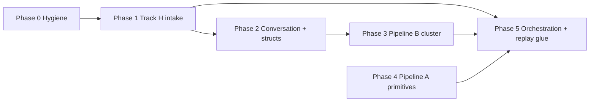

# 40.510 Playground Refactor (Track H Downstream)

**Document ID:** 40.510  
**Version:** 0.1  
**Date:** 2026-06-08  
**Status:** **Open** — program opened 2026-06-08; inventory and phase plan established; no module rows approved yet.

## Purpose

This document is the **single coordination hub** for refactoring `40_thought_simulator_playground/` to align with the closed **20-series Track H program** ([20.510](../20_requirements/20.510_refactoring_for_input_correction_track_h.md)) and the runtime-pipeline map in [20.01](../20_requirements/20.01_architecture_map.md).

**40.510 is the playground-side successor to 20.510.** Where 20.510 tracked **what changed in 20-series requirements**, 40.510 tracks **what must change in 40-series prototypes, harnesses, and evidence** so the playground reflects:

- Dual-pipeline partition ([20.500](../20_requirements/20.500_refactoring_for_dual_TS_pipeline.md) — closed)
- Track H intake correction ([20.510](../20_requirements/20.510_refactoring_for_input_correction_track_h.md) — closed)
- Runtime pipeline order (Option A blocks B0–B8 in [20.01](../20_requirements/20.01_architecture_map.md))

**This document is NOT normative TS runtime requirements.** It does not override [20.12](../20_requirements/20.12_ts_invariants.md), module HLRs, or CP-approved 20.xx documents. It tracks **what to build or redo, in what order, with what evidence, and with what reviewer sign-off** — for **40-series playground modules only**.

**Reviewers:** CuriousOne23, CP, Grok — three-way consensus required on rows marked **GATE** before status moves to `approved`.

**Owner guide:** Scheduling and capsule standards remain under [40.20_master_program_guide.md](40.20_master_program_guide.md). 40.510 does not replace 40.20; it is the **refactor program inventory** for the Track H / dual-pipeline alignment pass.

**How to use this document:**

1. Read §2 for program boundaries and naming rules.
2. Execute phases in §4 order unless a GATE row says otherwise.
3. Update the **Master tracking table** (§5) on every status change.
4. Record evidence links (`verification_capsule.md`, harness artifacts) in the Notes column.

---

## 1. Program context

### 1.1 Why 40.510 exists

[20.510](../20_requirements/20.510_refactoring_for_input_correction_track_h.md) closed 2026-06-07 with normative 20-series Track H requirements approved. Its §Scope boundary explicitly deferred playground sign-off to [40.20](40.20_master_program_guide.md). A modularity check noted that **primitive boundaries survived** the 20-series refactor, but **integration debt** in the playground clusters in three predictable seams:

| Seam | Nature | 40.510 primary phases |
|------|--------|------------------------|
| Track H intake path | `InB → IIInB → RB`; USP/UPI/CIL wiring | Phase 1–2 |
| Pipeline B cluster | Singular B pass per `commit_id`; no `lane_id` in B envelopes | Phase 3 |
| Unified replay harness | 20.36 classes 1–7; strip replay; Class 7 Track H | Phase 1, 5 |

### 1.2 Authoritative runtime order (reference)

Normative Pipeline A stage order for fixtures and orchestration glue:

```text
InB → [IIInB when profile_enabled] → RB → splitting → OB → DCB → TR → TB
  → ΔH% → merging → truth_done → mtp_update
  → Pipeline B: TrigRB → SRP → exec_plan → OuB → IMR
```

Conversation layer (durable, outside four runtime envelopes): CIL, COB, USP, UPI.

### 1.3 Predecessors and inputs

| Input | Role |
|-------|------|
| [20.510](../20_requirements/20.510_refactoring_for_input_correction_track_h.md) | **Primary trigger** — Track H requirements closed; informational handoff § suggested 40.xx priorities |
| [20.500](../20_requirements/20.500_refactoring_for_dual_TS_pipeline.md) | Dual-pipeline envelope partition; Pipeline B singular per `commit_id` |
| [20.01](../20_requirements/20.01_architecture_map.md) | Runtime block map B0–B8; reading order for cross-module edits |
| [20.38](../20_requirements/20.38_ts_implementation_guidelines.md) | Implementation bridge — envelope guards, intake path, Class 7 checklist |
| [20.39](../20_requirements/20.39_ts_core_data_structures.md) | Struct sketches — `UspSnapshot`, `ConversationLayerState`, envelope partition |
| [20.36](../20_requirements/20.36_canonical_end_to_end_trace.md) | Fixture shape; replay classes 1–7 (Class 7 = Track H) |
| [40.20](40.20_master_program_guide.md) | Playground process owner — capsule structure, P1–P3 priorities |

---

## 2. Scope boundary

| In scope | Out of scope |
|----------|--------------|
| 40.xx module create / redo / extend | 20-series HLR edits (closed programs) |
| `software_description.md`, `prototype.py`, `harness.py`, capsules, artifacts | 30-series promotion (informational follow-on) |
| Playground README / directory map hygiene | 50-series design sign-off |
| Legacy 40.xx numbering collision notes | 10-series promotion gates |

**Sign-off authority:** Rows in §5 marked **GATE** require ☑ from CuriousOne23, CP, and Grok before `Status` becomes `approved`.

**Completion criteria per module row:**

- Standard capsule files per [40.20](40.20_master_program_guide.md)
- `harness.py` PASS with JSON artifact under `artifacts/`
- `requirements_delta.md` maps to specific 20.xx HLRs
- Three-way approval recorded in §5

---

## 3. Legacy numbering collisions

The playground predates strict 20.xx number alignment. **Do not renumber existing folders in Phase 0–3** unless a GATE row approves a rename. New modules use 20-aligned IDs where free; otherwise use the **suffix convention** below.

| Existing 40 path | Conflicts with 20.xx | New-module convention |
|------------------|----------------------|------------------------|
| `40.20_tp_lifecycle/` + `40.20_master_program_guide.md` | 20.20 primitives (file vs folder) | Keep both; disambiguate in prose |
| `40.40_scheduler_prototypes/` | 20.40 OB | New OB module → `40.401_ob_prototypes/` |
| `40.50_regulator_prototypes/` | 20.50 RB | New RB module → `40.501_rb_prototypes/` |
| `40.60_tick_cycle_skeleton/` | 20.60 TB | New TB module → `40.601_tb_prototypes/` |
| `40.39_mb_prototypes/` | 20.39 core structs | New struct module → `40.392_core_data_structs_prototypes/` |

---

## 4. Phase plan (execution order)

Phases are **ordered by dependency**, not folder number. Complete earlier phases before marking downstream rows `wip` unless explicitly parallelized in Notes.



| Phase | Goal | Entry criterion | Exit criterion |
|-------|------|-----------------|----------------|
| **0** | Program hygiene | 40.510 opened | README map updated; collision table acknowledged |
| **1** | Track H intake path | Phase 0 done | 40.101 + Class 7 harness rows `approved` |
| **2** | Conversation layer + structs | Phase 1 wip or done | USP/UPI modules + CIL/COB/GB targeted redos `approved` |
| **3** | Pipeline B cluster | Phase 2 underway | B4 module set harnessed; no `lane_id` in B fixtures |
| **4** | Pipeline A primitive gaps | Phase 1 done | RB/OB/DCB/TB/MTP/split-merge/truth modules exist with evidence |
| **5** | Orchestration + replay glue | Phases 1–4 underway | Scheduler/tick/snapshot/event-log/experiment-runner redos + 40.206 sync `approved` |

---

## 5. Master tracking table

**Status legend:** `todo` = not started | `wip` = in progress | `done` = evidence complete, awaiting approval | `approved` = GATE sign-off recorded

**Approval legend:** ☐ = pending | ☑ = signed

| ID | Module / path | Action | 20 block | Phase | Status | CuriousOne23 | CP | Grok | Primary 20 inputs | Notes |
|----|---------------|--------|----------|-------|--------|--------------|----|----|-------------------|-------|
| **Phase 0 — Hygiene** |
| 40.510-000 | `README.md` directory map | Update stale map; link 40.510 | Meta | 0 | todo | ☐ | ☐ | ☐ | 40.20 | Missing 40.32–34, 37, 100, 110, 165 |
| 40.510-001 | `40.20_master_program_guide.md` | Cross-link 40.510 as refactor owner | Meta | 0 | todo | ☐ | ☐ | ☐ | 40.20, 20.510 | Informational pointer only |
| **Phase 1 — Track H intake (P1)** |
| 40.510-101 | **`40.101_iiinb_prototypes/`** *(new)* | Create — `profile_enabled` gate; `input_semantic_repair`; read-only USP; intake-bound TP writes only | B2 | 1 | todo | ☐ | ☐ | ☐ | 20.101, 20.38 §6 | **GATE** — P1 per 40.20 |
| 40.510-102 | **`40.207_replay_prototypes/`** *(new)* | Create — runnable REPLAY_CLASS_7 C7-A..E; classes 1–6; strip/diff artifacts | B5 | 1 | todo | ☐ | ☐ | ☐ | 20.36 §9, 20.207 | **GATE** — unified replay harness |
| 40.510-103 | `40.100_inb_prototypes/` | Targeted redo — handoff `InB → IIInB` (not direct RB); tick-boundary tests | B2 | 1 | todo | ☐ | ☐ | ☐ | 20.100 | Prior PASS retained; extend only |
| **Phase 2 — Conversation layer + structs (P2)** |
| 40.510-201 | **`40.102_usp_prototypes/`** *(new)* | Create — versioned shorthand rule store; read-only to IIInB | B3 | 2 | todo | ☐ | ☐ | ☐ | 20.102 | **GATE** |
| 40.510-202 | **`40.103_upi_prototypes/`** *(new)* | Create — `clarification_event` → GB gate → USP commit | B3 | 2 | todo | ☐ | ☐ | ☐ | 20.103, 20.80 §10 | **GATE** |
| 40.510-203 | **`40.392_core_data_structs_prototypes/`** *(new)* | Create — `UspSnapshot`, `InputRepairTag`, `ConversationLayerState`; envelope separation | B8 | 2 | todo | ☐ | ☐ | ☐ | 20.39 §3.1–3.2 | Suffix avoids 40.39 MB collision |
| 40.510-204 | `40.32_cob_prototypes/` | Targeted redo — USP snapshot version pins | B3 | 2 | todo | ☐ | ☐ | ☐ | 20.32 | Phase B executed 2026-06-03; extend |
| 40.510-205 | `40.33_cil_prototypes/` | Targeted redo — `clarification_event` wire to UPI | B3 | 2 | todo | ☐ | ☐ | ☐ | 20.33 | Phase B executed 2026-06-03; extend |
| 40.510-206 | `40.36_gb_prototypes/` | Targeted redo — UPI commit governance; GB veto path | B6 | 2 | todo | ☐ | ☐ | ☐ | 20.80 §10, 20.16 | 3-tier iteration 2026-06-04; extend |
| 40.510-207 | `40.101_iiinb_prototypes/` | Envelope write-guard negative tests — no `semantic_core` / `TP.TR` writes | B2/B8 | 2 | todo | ☐ | ☐ | ☐ | 20.38 §2, §8 | May land in same module as 40.510-101 |
| **Phase 3 — Pipeline B cluster** |
| 40.510-301 | `40.110_oub_prototypes/` | Implement — read-only `semantic_core`; output realization | B4 | 3 | todo | ☐ | ☐ | ☐ | 20.110, 20.58 | Scaffold only today |
| 40.510-302 | **`40.55_srp_prototypes/`** *(new)* | Create — SRP cold/hot path; epoch routing tables | B4 | 3 | todo | ☐ | ☐ | ☐ | 20.55, 20.56 | |
| 40.510-303 | **`40.57_trig_rb_prototypes/`** *(new)* | Create — TrigRB semantic trigger detection | B4 | 3 | todo | ☐ | ☐ | ☐ | 20.57 | |
| 40.510-304 | **`40.41_opbeh_prototypes/`** *(new)* | Create — OpBeh registry and planning | B4 | 3 | todo | ☐ | ☐ | ☐ | 20.41 | |
| 40.510-305 | **`40.42_obg_prototypes/`** *(new)* | Create — OBG voice identity | B4 | 3 | todo | ☐ | ☐ | ☐ | 20.42 | |
| 40.510-306 | **`40.43_xlater_prototypes/`** *(new)* | Create — XlateR expression mapping | B4 | 3 | todo | ☐ | ☐ | ☐ | 20.43 | |
| 40.510-307 | **`40.205_xp_prototypes/`** *(new)* | Create — `exec_plan` + `exec_trace` per `commit_id` | B4 | 3 | todo | ☐ | ☐ | ☐ | 20.205 | No `lane_id` / `tp_id` in fixtures |
| 40.510-308 | **`40.45_imr_prototypes/`** *(new)* | Create — IMR Types A/B/C; `CorrectionTrigger` into A only | B4/B6 | 3 | todo | ☐ | ☐ | ☐ | 20.45 | |
| **Phase 4 — Pipeline A primitive gaps** |
| 40.510-401 | **`40.115_mtp_prototypes/`** *(new)* | Create — MTP lifecycle; `commit_id`; snapshot refs | B1 | 4 | todo | ☐ | ☐ | ☐ | 20.115, 20.120 | |
| 40.510-402 | `40.20_tp_lifecycle/` | Targeted redo — intake repair fields; `commit_id` boundary | B1 | 4 | todo | ☐ | ☐ | ☐ | 20.105 | |
| 40.510-403 | **`40.130_split_merge_prototypes/`** *(new)* | Create — split/merge; `lineage_delta`; ΔH% accounting | B1 | 4 | todo | ☐ | ☐ | ☐ | 20.130 | |
| 40.510-404 | **`40.140_truth_done_prototypes/`** *(new)* | Create — truth/done terminal evaluation | B1 | 4 | todo | ☐ | ☐ | ☐ | 20.140 | |
| 40.510-405 | **`40.501_rb_prototypes/`** *(new)* | Create — RB routing; `InB → IIInB → RB` handoff | B2 | 4 | todo | ☐ | ☐ | ☐ | 20.50 | Suffix: 40.50 = regulator |
| 40.510-406 | **`40.401_ob_prototypes/`** *(new)* | Create — OB lane-local evidence extraction | B2 | 4 | todo | ☐ | ☐ | ☐ | 20.40 | Suffix: 40.40 = scheduler |
| 40.510-407 | **`40.106_dcb_prototypes/`** *(new)* | Create — DCB trajectory observation | B2 | 4 | todo | ☐ | ☐ | ☐ | 20.106 | Distinct from 40.165 stability |
| 40.510-408 | `40.165_dcb_stability_prototypes/` | Implement — qualitative stability per 20.165 | B2 | 4 | todo | ☐ | ☐ | ☐ | 20.165, 20.106 | Scaffold only today |
| 40.510-409 | **`40.601_tb_prototypes/`** *(new)* | Create — TB interpretation (pre–Truth/Done) | B2 | 4 | todo | ☐ | ☐ | ☐ | 20.60 | Suffix: 40.60 = tick skeleton |
| 40.510-410 | `40.37_tr_router_prototypes/` | Extend — DCB ephemeral TR events; `tr_needs_update` gating | B2 | 4 | todo | ☐ | ☐ | ☐ | 20.37, 20.106 | |
| 40.510-411 | `40.35_ib_prototypes/` | Extend — IIInB vs IB vs IMR escalation routing | B2/B6 | 4 | todo | ☐ | ☐ | ☐ | 20.90, 20.17 | 20.510 §15.3 seam |
| 40.510-412 | `40.30_basin_prototypes/` | Full redo — decompose or realign to normative A basins | B2 | 4 | todo | ☐ | ☐ | ☐ | 20.01 B2 | Generic pre-partition model |
| **Phase 5 — Orchestration + replay glue** |
| 40.510-501 | **`40.206_ab_sync_prototypes/`** *(new)* | Create — `mtp_update` freeze → `commit_id` → Pipeline B handoff | B5 | 5 | todo | ☐ | ☐ | ☐ | 20.206 | **GATE** — A↔B boundary |
| 40.510-502 | `40.40_scheduler_prototypes/` | Full redo — 20.36 stage order; A/B phase partition | B2 glue | 5 | todo | ☐ | ☐ | ☐ | 20.30, 20.36 | Executed 2026-06-06; wrong orchestration model |
| 40.510-503 | `40.60_tick_cycle_skeleton/` | Full redo — replace generic phases with normative A→B orchestration | B5 glue | 5 | todo | ☐ | ☐ | ☐ | 20.36 §2.1 | Executed 2026-05-28 |
| 40.510-504 | `40.70_snapshot_prototypes/` | Full redo — `commit_id` / `semantic_core` freeze snapshots | B5 | 5 | todo | ☐ | ☐ | ☐ | 20.206 | |
| 40.510-505 | `40.80_event_log_prototypes/` | Full redo — replay classes 1–7; strip-replay invariant | B5 | 5 | todo | ☐ | ☐ | ☐ | 20.36, 20.207 | |
| 40.510-506 | `40.90_experiment_runner/` | Targeted redo — unified replay orchestration host | B5 glue | 5 | todo | ☐ | ☐ | ☐ | 20.36 | May subsume parts of 40.207 |
| 40.510-507 | `40.50_regulator_prototypes/` | Targeted redo — ΔH% stage placement in A pipeline | B2/B7 | 5 | todo | ☐ | ☐ | ☐ | 20.130, 20.150 | Executed 2026-06-06 |
| **Keep / light touch** |
| 40.510-601 | `40.10_math_prototypes/` | Keep — optional 20.95 alignment when promoted | B7 | — | todo | ☐ | ☐ | ☐ | 20.35, 20.95 | README exception policy |
| 40.510-602 | `40.34_cop_prototypes/` | Keep — verify propose-only boundary | B3 | — | todo | ☐ | ☐ | ☐ | 20.34 | |
| 40.510-603 | `40.39_mb_prototypes/` | Light extend — fixture-grade basin audit traces | B6 | — | todo | ☐ | ☐ | ☐ | 20.70, 20.36 | |
| **Optional / deferred** |
| 40.510-701 | **`40.150_tcu_prototypes/`** *(new)* | Deferred — global TCU across IIInB + A + B | B7 | — | todo | ☐ | ☐ | ☐ | 20.150 | After 40.510-101, 507 |
| 40.510-702 | **`40.180_conversational_relevance_prototypes/`** *(new)* | Deferred — multi-turn relevance | B3 | — | todo | ☐ | ☐ | ☐ | 20.180 | After Phase 2 |

### 5.1 Summary counts

| Category | Count |
|----------|------:|
| New subdirectories to create | 20 |
| Existing modules — full redo | 5 |
| Existing modules — targeted redo | 8 |
| Existing modules — implement (scaffold) | 2 |
| Existing modules — extend / keep | 5 |
| Optional / deferred | 2 |
| **Total tracked rows** | **42** |

---

## 6. Module action definitions

| Action | Meaning |
|--------|---------|
| **Create** | New `40.xx_*` folder with full capsule structure per 40.20 |
| **Full redo** | Replace orchestration model; preserve prior artifacts as historical evidence only |
| **Targeted redo** | Keep core prototype; update contracts, harness, and deltas for post-20.510 requirements |
| **Implement** | Scaffold exists (`NotImplementedError` or Phase A only) — deliver Phase B |
| **Extend** | Add scenarios/fields without restructuring module purpose |
| **Keep** | No refactor required unless promotion forces alignment |

---

## 7. Approval gates

| Gate | Rows | Requirement |
|------|------|-------------|
| **GATE-A** | 40.510-101, 40.510-102 | Track H intake + Class 7 replay runnable before Phase 2 GATE rows close |
| **GATE-B** | 40.510-201, 40.510-202 | USP/UPI modules approved before CIL/COB/GB redo sign-off |
| **GATE-C** | 40.510-301–308 | Pipeline B cluster — collective sign-off that no B fixture carries `lane_id` / `tp_id` |
| **GATE-D** | 40.510-501 | A↔B sync approved before Phase 5 orchestration rows close |
| **GATE-E** | 40.510-502–506 | End-to-end replay glue — Class 1–7 harness PASS with strip diff |

---

## 8. Evidence requirements (per row)

Every row moving to `done` **SHALL** have:

1. `verification_capsule.md` — command, exit code, scenario ledger, artifact path
2. `requirements_delta.md` — HLR mapping and open gaps
3. `artifacts/*_verification_run_YYYY-MM-DD.json` — deterministic replay output
4. Flows Alignment Statement in `software_description.md` (per 40.20)

Rows moving to `approved` **SHALL additionally** have ☑ ☑ ☑ in the reviewer columns.

---

## 9. Suggested read paths

| Audience | Path |
|----------|------|
| **New contributor** | 20.01 B0 → B2 flow → this doc §4 Phase 1 → 40.101 |
| **Track H implementer** | 20.510 §1.2 → 40.510 Phase 1–2 rows → 20.38 §6 |
| **Pipeline B implementer** | 20.01 B4 → 40.510 Phase 3 → 20.206 handoff |
| **Integration / replay** | 20.36 classes → 40.510 Phase 5 → 40.207 |

---

## 10. Rules

1. **REFACTOR-40.510-001:** This document SHALL remain the authoritative inventory for the 40-series Track H / dual-pipeline alignment pass until closed.
2. **REFACTOR-40.510-002:** When modules are added, removed, or repartitioned, this table and [README.md](README.md) SHALL be updated in the same change set.
3. **REFACTOR-40.510-003:** 40.510 SHALL NOT introduce normative runtime HLRs — requirement changes flow backward through `requirements_delta.md` into 20-series via the normal three-flow process.

---

## Changelog

| Version | Date | Author | Summary |
|---------|------|--------|---------|
| 0.1 | 2026-06-08 | Grok | Initial program — inventory, phase plan, master tracking table (42 rows); opened as 20.510 downstream |

## Traceability

- [20.510_refactoring_for_input_correction_track_h.md](../20_requirements/20.510_refactoring_for_input_correction_track_h.md) (predecessor — closed 2026-06-07)
- [20.500_refactoring_for_dual_TS_pipeline.md](../20_requirements/20.500_refactoring_for_dual_TS_pipeline.md) (dual-pipeline — closed 2026-06-07)
- [20.01_architecture_map.md](../20_requirements/20.01_architecture_map.md) (runtime block map)
- [40.20_master_program_guide.md](40.20_master_program_guide.md) (playground process owner)
- [README.md](README.md) (directory map — stale; row 40.510-000)