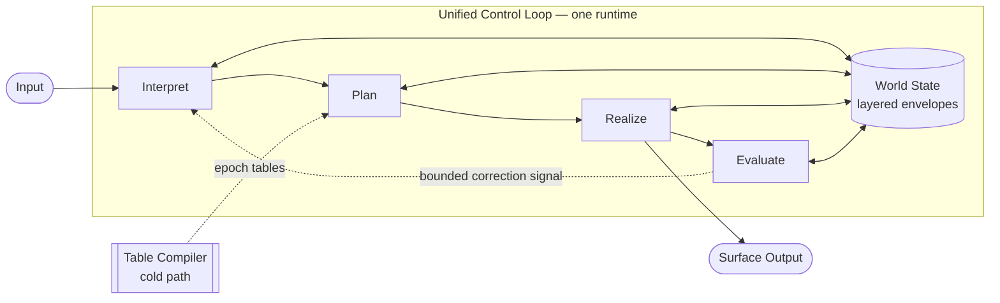

# TS Unified Architecture (Exploratory)

**Document ID:** `docs/ts_unified_architecture`  
**Version:** 0.2  
**Date:** 2026-06-06  
**Status:** Exploratory — not prescriptive  
**Author:** Grok (architectural analysis for TS research)

---

## Reader's Guide

This document intentionally uses **TS terminology** in later sections to maintain continuity with the existing 20-series and dual-pipeline PoC. **It is not a normative specification.** No HLRs are defined here; nothing in this file overrides 20-series requirements.

**How to read it:**

| If you want… | Read |
|--------------|------|
| A from-scratch mental model (no basin jargon) | §2 Pure Conceptual Overview |
| The unified architecture as one control loop | §3 Single Control Loop |
| How this maps onto today's TS modules | §17 TS Continuity Mapping |
| What must never break in any refactor | §9 Invariants |
| Whether to actually build this | **Don't** — dual-pipeline PoC is the active path (§1) |

The level of detail is deliberate: exploratory documents that under-specify invariants tend to be misread as permission to entangle meaning and expression. Detail here supports **falsifiability**, not implementation mandate.

---

## Disclaimer

This document describes a **hypothetical unified Thought Simulator (TS) architecture** — a single control loop over one layered state object, not two physically separated pipelines.

It is an **intellectual exercise** to:

- clarify the conceptual space TS occupies,
- understand what a from-scratch unified design might look like,
- identify invariants that must survive any future refactor, and
- inform long-term architectural thinking.

**This document does not change project direction.**

The active implementation path is the **dual-pipeline Execution Manifold**:

- **Pipeline A** — meaning construction
- **Pipeline B** — execution/realization (OpBeh × OBG × XlateR + SRP + TrigRB + IMR)

Readers should treat this unified sketch as a **counterfactual reference model** — useful for reasoning, not for implementation without explicit human approval and PoC validation.

---

## 1. Purpose and Scope

### 1.1 What this document is

A description of what TS **might** look like if meaning construction and execution/realization were integrated into **one orchestrated control loop**, rather than two inspectable pipelines.

### 1.2 What this document is not

- Not a proposal to implement unified architecture now
- Not a replacement for 20-series normative requirements
- Not a 40-series playground artifact
- Not an endorsement of end-to-end latent/ML training through meaning fields
- Not a collapsed dual pipeline wearing a unified label — see §3

### 1.3 Relationship to the Execution Manifold PoC

The dual-pipeline PoC is the **contract discovery phase**. A future unified refactor — if ever undertaken — would **package proven boundaries** into one runtime. It would not eliminate those boundaries.

---

## 2. Pure Conceptual Overview (From Scratch)

*This section describes the unified architecture without reference to basins, Thought Packets, or existing TS module names.*

### 2.1 Core idea

A **Cognitive Engine** maintains one **World State** and runs one **Control Loop** per interaction cycle. The World State has two logical layers that share one storage substrate:

- **Meaning Layer** — what is true, intended, uncertain, and structurally relevant
- **Expression Layer** — how that meaning is voiced, formatted, and surfaced

The engine never confuses the two layers, even though they live in one object.

### 2.2 Native control dimensions

Three explicit control axes govern expression (not meaning):

| Dimension | Question it answers |
|-----------|---------------------|
| **Behavior** | What discourse act? (explain, compare, classify, refuse, …) |
| **Identity** | In what register/voice? (scientific, casual, pedagogical, …) |
| **Mapping** | Which deterministic translation routine maps meaning → surface? |

A fourth meta-dimension binds them:

| Dimension | Question it answers |
|-----------|---------------------|
| **Epoch** | Which compiled routing-table era is authoritative? |

These are **registry IDs and table keys**, not latent embeddings.

### 2.3 One control loop, four responsibilities

Each cycle, the engine performs four responsibilities in order:

1. **Interpret** — update the Meaning Layer from input and prior state
2. **Plan** — select (Behavior, Identity, Mapping) from compiled tables + triggers
3. **Realize** — produce surface output from Meaning Layer (read-only) + plan + optional seed
4. **Evaluate** — detect mismatch; emit bounded correction signals; never silently rewrite meaning

A **Table Compiler** (offline) maintains routing tables from World State structure and policy. It does not run per cycle.

### 2.4 Central integrator: Discourse Manager

One module — the **Discourse Manager** — owns planning and discourse coordination:

- detects when expression should change or proceed,
- selects Behavior × Identity × Mapping,
- validates against policy and invalid-combination rules,
- hands off to the Realizer,
- receives evaluation feedback.

This is the conceptual heart of unification: **one planner, many facets**, table-driven, fully logged.

### 2.5 What "unified" means here

Unified means:

- one runtime,
- one World State object with layered write authority,
- one Discourse Manager coordinating expression decisions.

Unified does **not** mean:

- one undifferentiated state blob,
- free interleaving of meaning and expression writes,
- implicit feedback or silent drift.

---

## 3. Single Control Loop (Not a Collapsed Dual Pipeline)

A unified architecture is **not** "Pipeline A stacked on Pipeline B in one document." It is a **single cyclic controller** where interpretation, planning, realization, and feedback are **responsibilities of one loop**, not ownership of separate runtimes.



**Conceptual difference from dual pipeline:**

| Dual pipeline | Unified loop |
|---------------|--------------|
| Two orchestrators, two trace namespaces | One orchestrator, phase-tagged trace |
| Separation is **architectural** (visible in deployment) | Separation is **logical** (visible in envelopes + write guards) |
| Inspectability via pipeline boundary | Inspectability via replay equivalence (§9.8) |

The four phases (Interpret → Plan → Realize → Evaluate) are **responsibilities within the loop**, analogous to lexer → parser → codegen in a compiler. Compiler phases are not "dual pipelines collapsed" — they are one pass with hard internal order.

---

## 4. Design Premise: Unified but Not Entangled

```text
One runtime  +  One state object  +  Hard phase order  +  Partitioned write authority
```

Constraints (stated generically; TS-specific mapping in §17):

| Constraint | Unified interpretation |
|------------|------------------------|
| Determinism | Identical inputs, state, seed, epoch → identical outputs |
| Phase order | Phases are sequential within a cycle; unified ≠ unordered |
| Meaning/expression separation | Logical envelopes; not architectural pipeline split |
| No latent entanglement | Control dimensions are explicit IDs, not learned latent heads |
| Bounded supervision | Discourse Manager must not absorb all policy authority |
| Seed boundary | Variability confined to realization only |

---

## 5. Unified Architecture Overview (TS-Oriented)

### 5.1 Four phases per cycle

```text
┌─────────────────────────────────────────────────────────────────────────┐
│                    UNIFIED TS CYCLE N (one orchestrator)                │
├─────────────────────────────────────────────────────────────────────────┤
│  Phase 1 — INTERPRETATION                                               │
│  Phase 2 — PLANNING (UDM)                                               │
│  Phase 3 — REALIZATION (OuB)                                            │
│  Phase 4 — FEEDBACK (IMR)                                               │
└─────────────────────────────────────────────────────────────────────────┘
         ▲
         │  cold path
    SRP Compiler ──► routing tables + routing_epoch_id
```

Phase-by-phase module detail appears in §8. TS module names appear in §17.

### 5.2 Cold vs hot path

| Component | Path | Role |
|-----------|------|------|
| SRP Compiler | Cold | Compile routing tables from semantic structure + policy + registries |
| UDM Plan Resolver | Hot | O(1) lookup + deterministic trigger match |
| Interpretation phase | Hot | Meaning construction |
| OuB | Hot | Expression only |

"SRP integrated into the planner" means the hot planner **reads SRP products** — not that compilation runs per turn.

---

## 6. Single Shared State Representation

### 6.1 Layered state, one substrate

```text
World State (TP / MTP)
├── semantic_core          # Phase 1 writers only
├── exec_plan              # Phase 2 writers only
├── exec_trace             # Phase 3–4 writers only
└── supervisory            # Policy supervisor at safe boundaries only
```

See §17 for field-level mapping to TS schemas.

### 6.2 InteractionMode

```text
InteractionMode {
  semantic_mode_id,     # task/epistemic context
  obg_id,               # register / voice
  opbeh_id,             # discourse act
  xlater_id,            # mapping routine
  routing_epoch_id
}
```

`semantic_mode_id` and `obg_id` correlate but are not identical.

### 6.3 PlanningDecision

Every planning resolution produces an explicit, inspectable record:

```text
PlanningDecision {
  cycle_id,
  semantic_snapshot_ref,
  opbeh_id, obg_id, xlater_id,
  routing_epoch_id,
  trigger_id,
  rationale_codes[],
  invalid_triple_rejected
}
```

---

## 7. Module Integration and UDM

### 7.1 Collapse / merge map

| Dual-pipeline PoC module | Unified architecture home |
|--------------------------|---------------------------|
| Pipeline A orchestrator | Phase 1 (Interpretation) |
| TrigRB | UDM.trigger_detector |
| OpBeh/OBG/XlateR resolver | UDM.plan_resolver + identity_selector + realization_selector |
| Pipeline B orchestrator | Cycle orchestrator phases 2–4 |
| IMR | Phase 4 — via UDM.imr_interface |
| SRP | Cold compiler — **not** hot path |
| Separate exec metadata store | exec_plan + exec_trace envelopes |

### 7.2 What must not collapse

Meaning-layer primitives (Object Basin, Relational Basin, Thought Router, GB, ΔH%, TB, Merge) retain distinct authority. Unification merges **orchestration**, not **semantic roles**. See §17.

### 7.3 Unified Discourse Manager (UDM) — internal structure

UDM is the integration hub. Internally it decomposes into six components with **strict call order** and **separate audit records**:

```text
UDM
├── 1. trigger_detector      # Match semantic events → TriggerSet (deterministic order)
├── 2. policy_gate             # Filter triggers against GB/policy; emit reject codes
├── 3. identity_selector       # Resolve or validate obg_id (register/voice)
├── 4. plan_resolver           # Map (snapshot, trigger, epoch) → candidate triple
├── 5. realization_selector    # Materialize xlater_id + opbeh_id; validate triple matrix
└── 6. imr_interface           # Accept OuB artifact; emit CorrectionTrigger; no meaning writes
```

**Decision model (Phase 2):**

```text
1. triggers = trigger_detector(semantic_snapshot, trigger_tables[epoch])
2. triggers = policy_gate(triggers, policy)           # may drop triggers with audit
3. for t in triggers (deterministic order):
     obg_id  = identity_selector(snapshot, t, context)
     triple  = plan_resolver(snapshot, t, obg_id, SRP_tables[epoch])
     triple  = realization_selector(triple, invalid_matrix)
     commit PlanningDecision + exec_plan envelope
4. pin routing_epoch_id for remainder of cycle
```

**Relationship to semantic mode:**

- `semantic_mode_id` lives in `semantic_core` (Phase 1 product).
- `identity_selector` **reads** semantic mode; it does not write it.
- Semantic mode constrains **which OBG IDs are legal**, not which one is automatically selected.
- Selection is table-driven: `(semantic_mode, trigger, policy) → obg_id` via SRP-compiled index.

**Relationship to SRP tables:**

| Table | Produced by SRP | Consumed by |
|-------|-----------------|-------------|
| `trigger_index` | semantic structure patterns | trigger_detector |
| `plan_index` | (semantic_mode, trigger) → triple candidates | plan_resolver |
| `invalid_triple_matrix` | policy + registry | realization_selector |
| `obg_legality_index` | semantic_mode → allowed obg_ids | identity_selector |

SRP publishes all tables under one `routing_epoch_id`. UDM pins epoch at cycle start.

**UDM invariants:**

- Table-driven only; no open-ended inference on hot path
- TCU-bounded; degrades deterministically on overload
- Does not write `semantic_core`
- Does not absorb GB policy authority — `policy_gate` reads GB product, does not replace GB
- Every selection produces `PlanningDecision` with `rationale_codes`

### 7.4 Optional Thought Router extension

`TP.TR` may carry realization **hints** (not IDs) that UDM materializes in Phase 2. Hints are written in Phase 1; concrete IDs are written in Phase 2. Separate writers, one planning story.

---

## 8. Phase-by-Phase Behavior

### 8.1 Phase 1 — Interpretation

Updates `semantic_core` only. Phase 2 reads via read-only snapshot. Phase 1 completes before Phase 2 begins.

### 8.2 Phase 2 — Planning

UDM executes decision model (§7.3). Invalid triples rejected with fixed audit codes.

### 8.3 Phase 3 — Realization

OuB: `semantic_core` (read-only) + `exec_plan` + seed → surface artifact in `exec_trace`.

### 8.4 Phase 4 — Feedback

IMR via `UDM.imr_interface`: mismatch → `CorrectionTrigger` → bounded re-entry to Phase 1 next cycle. No direct `semantic_core` writes.

---

## 9. Invariants That Must Survive Any Unified Refactor

1. **Write authority partition** — semantic / exec_plan / exec_trace / supervisory writers are disjoint
2. **Phase immutability** — later phases cannot mutate same-cycle semantic_core
3. **Explicit routing artifacts** — every resolution produces PlanningDecision + rationale_codes
4. **SRP off hot path** — compilation never blocks per-turn execution
5. **Epoch coherence** — all exec fields carry routing_epoch_id; stale epoch → reject or audited fallback
6. **IMR bounded feedback** — depth limits, dedup, cooldown; no unbounded re-entry
7. **Seed boundary** — seed affects realization only
8. **Replay equivalence** — stripping exec envelopes from unified trace ≡ Pipeline A replay (dual-pipeline PoC)
9. **Namespace discipline** — meaning-layer and execution-layer symbols never alias

---

## 10. Risks and Failure Modes

| Risk | Failure mode |
|------|--------------|
| Planner monolith | UDM absorbs GB + basin routing |
| Silent semantic drift | Phase 2/3 writes meaning fields |
| False simplicity | One diagram → one writer mentally |
| Implicit feedback | Mode changes without CorrectionTrigger |
| Epoch races | Mixed-era lookups in one cycle |
| Seed leak | Seed influences interpretation or planning |
| Verification collapse | Cannot isolate phase bugs |
| Namespace regression | OB/TR/RB reused for execution primitives |

The largest risk is **authority blur**.

---

## 11. Learning and Training Implications

*Exploratory — describes design space, not TS commitment.*

A unified architecture changes **where** learning hooks attach, not whether TS permits end-to-end latent training through meaning fields.

### 11.1 TS-native learning (determinism-preserving)

| Target | Mechanism | Path |
|--------|-----------|------|
| Routing tables | SRP recompile from annotated MTP structure | Cold |
| OpBeh/OBG/XlateR registries | Split/merge/deprecate with alias maps | Cold |
| Invalid triple matrix | Policy update + verification | Cold |
| Trigger definitions | Registry evolution + golden replay | Cold |
| IMR thresholds | Supervised threshold tuning against logged triggers | Cold / offline |

TS-native learning **updates compiled artifacts and registries**, then verifies via replay. Meaning-layer determinism is preserved.

### 11.2 ML-hybrid learning (fork, not default TS)

A unified loop is *architecturally* more tempting for end-to-end training because one state object exists. That path implies:

- differentiable or RL-updated planner weights,
- joint loss over semantic correctness + voice consistency + realization quality,
- risk of violating seed boundary and write-authority partition.

**This is a different system** — call it TS-ML fork, not TS refactor. The unified document assumes **table-driven UDM**, not learned latent control heads.

### 11.3 Implication summary

| Approach | Compatible with TS invariants? |
|----------|-------------------------------|
| SRP table updates from logged traces | Yes |
| Registry evolution (OBG split/merge) | Yes |
| Behavior cloning on PlanningDecision logs | Yes, if hot path stays table lookup |
| End-to-end RL through semantic_core | No (without abandoning TS determinism claims) |

---

## 12. Concurrency and Parallelism

Unified architecture does not require serial **implementation**, only serial **phase authority** within a cycle.

### 12.1 Safe parallelism

| Parallelism | Constraint |
|-------------|------------|
| Lane-parallel interpretation (Phase 1) | Merge serializes; semantic_core commit at phase end |
| Prefetch SRP tables for epoch N+1 | While cycle runs on epoch N |
| OuB realization pipelining | Phase 3 may stream output; exec_trace append-only |
| Batch IMR evaluation | Phase 4 may evaluate multiple artifacts; triggers queued deterministically |

### 12.2 Unsafe parallelism

| Parallelism | Why unsafe |
|-------------|------------|
| Plan while interpreting same cycle | Violates phase immutability |
| Realize while planning same cycle | exec_plan not yet committed |
| IMR writes semantic_core concurrently | Violates write authority |
| Parallel UDM selections without ordering | Nondeterministic tie-break |

### 12.3 Deterministic ordering rule

Any parallel work must **reduce to a canonical serial order** in the trace. Replay must reconstruct that order from `(cycle_id, phase, seq)`.

---

## 13. Memory and Long-Term State

Unified architecture does not collapse memory tiers — it **tags** them in one World State.

### 13.1 Memory classes

| Class | Content | Writer | Persistence |
|-------|---------|--------|-------------|
| **Working semantic** | Current cycle semantic_core | Phase 1 | Per conversation session |
| **Working exec** | exec_plan, exec_trace | Phases 2–4 | Per cycle / per expression tick |
| **Episodic** | PlanningDecision log, CorrectionTrigger log | Append-only | Replay horizon |
| **Semantic memory** | Stable facts, commitments in MTP | Phase 1 via Merge | Long-term |
| **Identity persistence** | OBG registry + conversation-scoped obg_id history | Cold registry + COB/CIL context | Long-term |
| **Routing memory** | SRP tables per epoch | SRP Compiler | Versioned; epoch-addressable |

### 13.2 Unified vs dual-pipeline memory difference

In dual pipeline, exec metadata is physically separable (Pipeline B store). In unified design, exec envelopes sit beside semantic envelopes in one object — but **write authority and retention policy** remain distinct.

Compaction and replay-horizon rules apply per envelope, not per object.

### 13.3 Identity persistence

`obg_id` may persist across cycles as a **conversation preference** without becoming semantic truth. Distinction:

- "User prefers casual register" → identity persistence (exec/COB layer)
- "User believes X" → semantic memory (semantic_core)

Collapsing these is a primary long-term failure mode.

---

## 14. Comparison: Dual Pipeline vs Unified Architecture

| Dimension | Dual pipeline (PoC path) | Unified architecture |
|-----------|--------------------------|----------------------|
| Primary goal | Validate contracts; maximize inspectability | Packaging; single-loop mental model |
| Separation mechanism | Architectural (two pipelines) | Logical (envelopes + phases) |
| Failure isolation | High | Medium — needs phase tags |
| "Feels like" | Two systems cooperating | One engine, four responsibilities |
| Normative 20-series impact | Additive | Consolidation risk |
| Replay audit lens | Per-pipeline traces | Replay equivalence to Pipeline A |
| Recommended timing | **Now** | Post-PoC + verification |

---

## 15. Long-Term Evolution

**Plausible after PoC — not inevitable.** A mature TS may run one physical orchestrator while retaining dual-pipeline decomposition in verification traces permanently.

Refactor only if dual orchestration cost is painful **and** replay equivalence is proven **and** envelope discipline holds in code.

---

## 16. Refactor Gate Checklist

- [ ] Dual-pipeline PoC passes scenario classes
- [ ] Zero semantic_core writes from Pipeline B in traces
- [ ] PlanningDecision / exec_plan schema frozen
- [ ] Invalid triple matrix tested
- [ ] Epoch swap replay-tested
- [ ] IMR bounds verified
- [ ] Replay equivalence: unified semantic_core == Pipeline A
- [ ] Namespace table updated
- [ ] Explicit human approval for direction change

---

## 17. TS Continuity Mapping

*This section bridges the pure model (§2) to existing TS terminology. It is a Rosetta stone, not the architecture itself.*

| Pure concept (§2) | TS module / artifact |
|-------------------|----------------------|
| World State | TP / MTP with layered envelopes |
| Meaning Layer | semantic_core |
| Expression Layer | exec_plan + exec_trace + OuB output |
| Interpret | InB → Relational Basin → Object Basin → DCB → Thought Router → TB → Merge |
| Plan | UDM (Phase 2) |
| Realize | OuB (Phase 3) |
| Evaluate | IMR (Phase 4) |
| Table Compiler | SRP |
| Behavior | OpBeh |
| Identity | OBG |
| Mapping | XlateR |
| Policy supervisor | GB (safe boundaries) |

| Principle source | Reference |
|------------------|-----------|
| Architectural principles | 20.10 |
| Functional model | 20.30 |
| Thought Router | 20.37 |
| Object Basin | 20.40 |
| Relational Basin | 20.50 |
| OuB | 20.110 |
| Execution Manifold review | [Grok_review_in_20.md](../20_requirements/Grok_review_in_20.md) |

---

## 18. Document Placement

| Tier | Status |
|------|--------|
| 20_requirements | Not authoritative |
| 40_playground | Dual-pipeline PoC, not this document |
| 50_design | May inform post-PoC orchestrator design |
| docs/ | Correct home for exploratory architecture |

---

## 19. Summary

A unified TS architecture is **one control loop with four responsibilities**, not two pipelines folded together. The Discourse Manager (UDM) is its heart — six internal components, table-driven, fully logged. Meaning/expression separation survives as **write authority over layered envelopes**, not as a deployment boundary.

The dual-pipeline Execution Manifold remains the correct implementation path. This document maps adjacent territory: pure conceptual model (§2), integrated loop (§3), UDM detail (§7.3), and open design space for learning (§11), concurrency (§12), and memory (§13).

---

## Revision History

| Version | Date | Change |
|---------|------|--------|
| 0.1 | 2026-06-06 | Initial exploratory draft |
| 0.2 | 2026-06-06 | CP critique: pure overview (§2), control-loop diagram (§3), UDM expansion (§7.3), learning/concurrency/memory (§11–13), reader's guide, TS mapping isolated (§17) |

---

*End of exploratory document.*