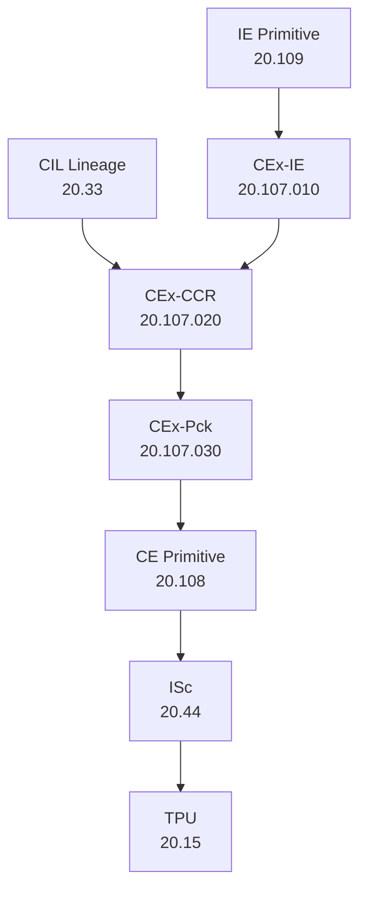

# **20.107 — CEx Extract (Version 3.0 — Informative Overview)**  
### *Top‑Level Informative Specification for the CEx Primitive Family*

---

## **1. Purpose** *(Informative)*

This document provides a **high‑level, fully informative overview** of the CEx primitive family.  
All normative requirements for CEx behavior are now defined in three subordinate primitives:

- **20.107.010 — CEx‑IE Primitive**  
- **20.107.020 — CEx‑CCR Primitive**  
- **20.107.030 — CEx‑Pck Primitive**

This document explains:

- how the three primitives relate,  
- how they form the complete CEx pipeline,  
- how IE and CIL feed into CEx,  
- how CEx produces CE for downstream primitives.

No SHALL statements appear in this document.

---

## **2. Position in Path‑A** *(Informative)*

CEx sits between IE and CE:

```
InB → IIInB → IE → CEx → CE → ISc → TPU → TP(N+1)
```

CEx is decomposed into three internal primitives:

- **CEx‑IE** — IE repackaging  
- **CEx‑CCR** — cross‑correlation with CIL  
- **CEx‑Pck** — packaging of final CE‑ready metadata

---

## **3. Relationship to Subordinate Documents** *(Informative)*

### **20.107.010 — CEx‑IE Primitive**  
Defines how CEx reads IE output and produces structural hints.  
Link: `./20.107.010_cex-ie_primitive.md`

### **20.107.020 — CEx‑CCR Primitive**  
Defines deterministic cross‑correlation between CEx‑IE output and CIL lineage.  
Link: `./20.107.020_cex-ccr_primitive.md`

### **20.107.030 — CEx‑Pck Primitive**  
Defines packaging of identity, continuity, context, clarifying fields, provenance, and audit.  
Link: `./20.107.030_cex-pck_primitive.md`

These three documents together define the complete normative behavior of CEx.

---

## **4. High‑Level Description of the Three‑Primitive Architecture** *(Informative)*

### **CEx‑IE (20.107.010)**  
- Reads IE tokens, flags, normalized text, structure, repair annotations  
- Detects structural cue‑phrases  
- Produces structural hints (topic, intent, continuity, reference, etc.)  
- Emits the `TP.cex.ie` envelope

### **CEx‑CCR (20.107.020)**  
- Reads `TP.cex.ie` and CIL lineage  
- Computes alignment across identity, clarifying, context, continuity, reference  
- Computes ambiguity, collapse, drift, stability  
- Selects conversation: new, specific, fallback  
- Emits the `TP.cex.ccr` envelope

### **CEx‑Pck (20.107.030)**  
- Reads CCR decision + selected conversation lineage  
- Packages identity, continuity, context, clarifying fields  
- Writes provenance + audit  
- Emits the `TP.cex.pck` envelope consumed by COB/CST

---

## **5. Mermaid Diagram — Full CEx Pipeline** *(Informative)*



---

## **6. Summary of Responsibilities** *(Informative)*

### **CEx‑IE**  
Transforms IE output into CEx structural hints.

### **CEx‑CCR**  
Cross‑correlates CEx‑IE output with CIL lineage to determine conversation identity.

### **CEx‑Pck**  
Packages the final identity, continuity, context, clarifying fields, provenance, and audit.

### **CEx (as a whole)**  
Produces the CE envelope consumed by downstream primitives.

---

## **7. Determinism and Replay** *(Informative)*

The three‑primitive CEx pipeline is:

- deterministic  
- bounded‑semantic  
- replay‑safe  
- lineage‑driven  
- structure‑driven  

Each subordinate document defines its own deterministic rules.

---

## **8. Error Handling** *(Informative)*

CEx never halts the pipeline.  
Malformed IE or CIL inputs still produce valid CE via:

- CEx‑IE structural extraction  
- CEx‑CCR deterministic fallback  
- CEx‑Pck packaging of valid fields only

---

## **9. Conformance** *(Informative)*

CEx conforms when:

- all three subordinate primitives conform to their own HLRs  
- CE is deterministic  
- provenance and audit are complete  
- replay produces identical CE  
- no semantic inference occurs  
- no unauthorized TP fields are accessed  

---

# **End of Document — 20.107 (Version 3.0 — Informative Overview)**

---
