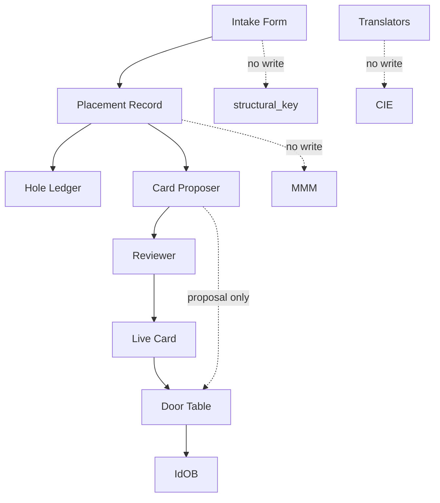

# 20.31.730 Crossing Pack Catalog + Interface (Informative)

Status: informative catalog + interface before the hop.

This document defines intake/interface objects that feed Path A without changing Path A hop behavior.
It is not a hop HLR file, not a cognition theory, and not a world-primitives claim.

References and authority boundaries:
- 20.31.700_patha_theory.md: vehicle theory.
- 20.31.710_patha_operational_note.md: instrument note and Goal v2 appendix.
- 20.40.050_idob_prim.md: hop behavior and packet authority.

## Purpose

Path A has a hop and no intake layer for world-description phrasing. This document names the interface used to translate world-facing text into Path A-ready objects without writing world words into:
- structural_key
- Door Table
- MMM
- CIE

The interface keeps two questions separate and replay-safe:
- About: what is this about? (about_id)
- Family: what kind of line is it? (family_id)

Unknowns are recorded to a Hole Ledger, not converted into a new in-line primitive.

## Boundary

730 is before six-ID assignment and before map/rank/birth.

- Families are intake labels, not the structure IDs and not meaning-axis values.
- Families are not physicality/sociality/temporality style dimensions.
- CIE remains pressure after birth: $M' = \mathrm{clip}(M + \alpha I)$.

## Two Questions and Seed Families

Two-question intake contract:
1. About (about_id): what entity/topic anchor is this line about?
2. Family (family_id): what line-kind is this line?

Seed families for this revision:
- event_talk
- state_talk
- task_talk
- claim_talk
- ask_talk
- update_talk

Omitted from Seed in this revision:
- relation_talk

## Path: World -> Intake -> Crossing

```mermaid
flowchart LR
  W[World description] --> I[Intake Form]
  I --> P[Placement Record]
  P --> H{Known placement?}
  H -- no --> L[Hole Ledger]
  H -- yes --> CP[Card Proposal (later)]
  CP --> LC[Live Card]
  LC --> DT[Door Table (existing map)]
  DT --> ID[IdOB packet]
```

Worked examples:

1. rock burst
- Intake can classify family_id as event_talk.
- Placement may resolve to an existing talk-shape card after review path.

2. Friday deadline
- Intake can classify family_id as task_talk or claim_talk depending on phrasing policy.
- Placement records about_id and family_id before any card decision.

3. U03 unknown
- Unknown mapping is recorded as a hole.
- card_id remains null.
- Example record: card_id: null with a Hole Ledger entry.

## Object Register

Named objects in this interface layer:
- Intake Form
- About Index
- Talk Family
- Card Pattern
- Placement Record
- Hole Ledger
- Card Proposal
- Live Card
- Crossing Pack Seed
- Crossing Pack Working
- Crossing Pack Field
- Door Table
- Translators
- Reviewer
- Read-only views (4):
  - View A: intake/question view
  - View B: placement/hole view
  - View C: proposal/review view
  - View D: crossing/hop handoff view

## Write-Boundary Table

| Component | May Write | Must Not Write |
|---|---|---|
| Intake Form | about_id, family_id candidates, intake notes | structural_key, map rows, CIE |
| Placement Record | placement decisions, card_id null/known state | live map edits, MMM fields |
| Hole Ledger | unknown entries and replay metadata | live cards, Door Table |
| Card Proposer | proposals/ with needs_review: true | live cards directly, Door Table |
| Reviewer | review outcomes and approval marks | hop packet internals |
| Translators | crossing_pack seed/working/field transforms | structural_key, Door Table map membership |
| Door Table (existing) | existing map authority only | second live map |

Lock:
- Card Proposer writes proposals/ with needs_review: true only after placements replay.
- Door Table here means the existing map, not a second live map.



## Pack Sizes and Planned Paths (Named Only)

Planned path family names under crossing_pack/ are listed for planning only in this revision:
- crossing_pack/seed/
- crossing_pack/working/
- crossing_pack/field/
- crossing_pack/proposals/
- crossing_pack/views/

No files or YAML are created by this document.

## Intake Four Questions

Operational intake checklist:
1. What is this about? (about_id)
2. What kind of line is it? (family_id)
3. Is placement known now, or should this go to Hole Ledger?
4. Is there enough stable evidence to propose a card, or remain unresolved?

## Views and Paper Tracks

Views are read-only projections for human and later bot/Python review.
Paper tracks may discuss:
- intake quality and replay stability
- placement drift and hole closure rate
- proposal review latency
- crossing handoff consistency

These tracks must not redefine 700, 710, or 20.40.050.

## Bot/Python Shape (Staged)

First shot scope:
- About + Family extraction
- Hole logging
- Replay consistency checks

Later scope:
- Card Proposer (proposal-only path)
- Reviewer workflow support

No direct live-card writes by bots in first shot.

## Locked Splits

Mandatory separations:
- About != Family
- Placement != Proposal

Also preserved:
- Interface != Hop
- Family labels != structure IDs
- Family labels != meaning-axis dimensions

## What 730 Does Not Claim

This document does not claim:
- world primitives
- hop behavior changes
- a new in-line primitive for unknowns
- CIE as a structure rung
- a cognition theory

It is a naming and boundary catalog for pre-hop intake/interface only.
