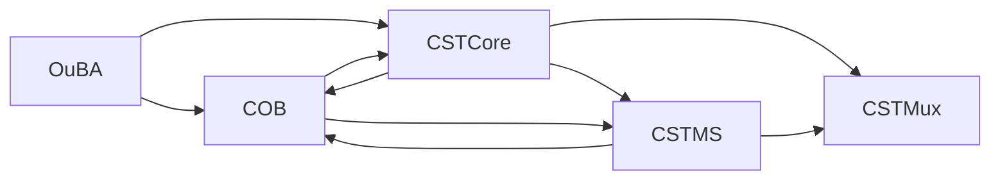

# **20.32.010.020 — CST‑MS Requirements**

**Context Stability Tracking — Metric Synthesis Module**

---

> **Field catalog authority (20.116).** Canonical paths, envelope owners, and name-separations: [`20.116_field_catalog.md`](20.116_field_catalog.md) · [`20.116.010`](20.116.010_tp_envelope_index.md) · [`20.116.020`](20.116.020_ownership_rw.md) · [`20.116.030`](20.116.030_name_separations.md). This document remains the authority for *behavior*. Collision: 20.116 wins names/paths/owners; this file wins behavior (`HLR-20.116-001`–`004`).
> CST-MS behavior and nested map stay here. Envelope root `TP.cst.ms`: `20.116.010`.
# **0. Document Purpose (Informative)**

This document defines the normative requirements for **CST‑MS**, the Metric Synthesis Module in the CST pipeline. CST‑MS receives raw stability metrics from CST‑Core — drift, oscillation, ambiguity, collapse, continuity, freeze, thaw, register stability, and field‑importance stability — and synthesizes them into deterministic, layer‑specific stability signals.

CST‑MS is the commanding authority that issues freeze, thaw, collapse‑recovery, and identity‑layer creation commands to COB. Because COB is not a state machine, CST‑MS holds decision authority for these structural control actions and issues the corresponding commands to COB.

CST‑MS is a pure functional module with respect to metric synthesis:

- no randomness
- no external state
- no wall‑clock time
- deterministic replay
- monotonic threshold behavior
- identical outputs under replay

Its outputs form the stability packet consumed by CST‑Mux, COB, and CIL. The command interface to COB is a distinct normative responsibility of CST‑MS.

## 0.1 Block Diagram of OuBA, COB, CST-Core, CST-MS and CST-Mux

---

# **1. Inputs and Outputs**

## **1.1 Inputs (Informative)**

CST‑MS receives raw CST‑Core metrics for each identity layer *L* at turn *t*, along with layer‑specific thresholds, metric histories, freeze/thaw events, and continuity restoration signals.

## **1.2 Input Requirements (Normative)**

**HLR‑20.32.010.020‑001**

CST‑MS SHALL accept raw CST‑Core metrics for drift, oscillation, ambiguity, collapse, continuity, freeze, thaw, register stability, and field‑importance stability.

**HLR‑20.32.010.020‑002**

CST‑MS SHALL accept layer‑specific thresholds for all metrics.

**HLR‑20.32.010.020‑003**

CST‑MS SHALL accept metric histories for all raw CST‑Core metrics.

**HLR‑20.32.010.020‑004**

CST‑MS SHALL accept freeze, thaw, and continuity restoration signals from CST‑Core.

**HLR‑20.32.010.020‑044**  
CST‑MS SHALL accept committed identity‑layer snapshots from OuBA (TPSnS) as a stable, replay‑safe reference for identity‑layer topology, freeze/thaw state, and continuity status.

---

## **1.3 Outputs (Informative)**

CST‑MS produces synthesized signals:

- stability summary
- instability summary
- collapse risk
- freeze risk
- thaw readiness
- ambiguity summary
- drift summary
- oscillation summary

In addition, CST‑MS issues structural control commands to COB.

## **1.4 Output Requirements (Normative)**

**HLR‑20.32.010.020‑005**

CST‑MS SHALL produce a deterministic stability summary for each identity layer.

**HLR‑20.32.010.020‑006**

CST‑MS SHALL produce a deterministic instability summary for each identity layer.

**HLR‑20.32.010.020‑007**

CST‑MS SHALL produce collapse‑risk values for each identity layer.

**HLR‑20.32.010.020‑008**

CST‑MS SHALL produce freeze‑risk values for each identity layer.

**HLR‑20.32.010.020‑009**

CST‑MS SHALL produce thaw‑readiness values for each identity layer.

**HLR‑20.32.010.020‑010**

CST‑MS SHALL produce ambiguity, drift, and oscillation summaries for each identity layer.

## **1.5 Diagnostic Inputs (Informative)**  
CST‑MS may consume a restricted diagnostic view of COB identity‑layer state for the sole purpose of detecting synchronization mismatches between commanded identity‑layer transitions and COB’s realized identity topology.

### **Diagnostic Input Requirements (Normative)**

**HLR‑20.32.010.020‑045**  
CST‑MS MAY read a restricted diagnostic subset of COB identity‑layer state exclusively for synchronization‑mismatch detection.

**HLR‑20.32.010.020‑046**  
CST‑MS SHALL NOT derive freeze, thaw, collapse‑recovery, create‑identity‑layer, split, or merge commands from COB internal state. All structural commands SHALL be driven exclusively by CST‑Core metrics, thresholds, and OuBA snapshots.

---

# **2. Metric Normalization**

## **2.1 Normalization (Informative)**

Raw CST‑Core metrics may have different ranges. CST‑MS normalizes each metric to ([0, 1]) using deterministic layer‑specific maxima.

## **2.2 Normalization Requirements (Normative)**

**HLR‑20.32.010.020‑011**

CST‑MS SHALL normalize each raw metric to the range ([0, 1]).

**HLR‑20.32.010.020‑012**

CST‑MS SHALL use deterministic layer‑specific maxima for normalization.

**HLR‑20.32.010.020‑013**

CST‑MS SHALL ensure normalization is replay‑safe and free of randomness.

---

# **3. Metric Weighting**

## **3.1 Weighting (Informative)**

Different identity layers have different stability sensitivities. CST‑MS applies deterministic layer‑specific weights to normalized metrics.

## **3.2 Weighting Requirements (Normative)**

**HLR‑20.32.010.020‑014**

CST‑MS SHALL apply deterministic layer‑specific weights to normalized metrics.

**HLR‑20.32.010.020‑015**

CST‑MS SHALL ensure all weights are monotonic and replay‑safe.

**HLR‑20.32.010.020‑016**

CST‑MS SHALL compute weighted metrics as pure functions of normalized metrics and layer‑specific weights.

---

# **4. Stability Synthesis**

## **4.1 Stability Score (Informative)**

CST‑MS synthesizes normalized, weighted metrics into a unified stability score using deterministic synthesis weights. Stability is clipped to ([0, 1]).

## **4.2 Stability Requirements (Normative)**

**HLR‑20.32.010.020‑017**

CST‑MS SHALL compute stability as a deterministic function of weighted drift, oscillation, ambiguity, collapse, and continuity.

**HLR‑20.32.010.020‑018**

CST‑MS SHALL apply deterministic synthesis weights for each identity layer.

**HLR‑20.32.010.020‑019**

CST‑MS SHALL clip stability values to the range ([0, 1]).

---

# **5. Instability Synthesis**

## **5.1 Instability (Informative)**

Instability is the complement of stability and is used for collapse risk, freeze risk, thaw readiness, and continuity restoration.

## **5.2 Instability Requirements (Normative)**

**HLR‑20.32.010.020‑020**

CST‑MS SHALL compute instability as the complement of stability.

**HLR‑20.32.010.020‑021**

CST‑MS SHALL ensure instability is clipped to ([0, 1]).

---

# **6. Collapse Risk**

## **6.1 Collapse Risk (Informative)**

Collapse risk is synthesized from instability and weighted collapse metrics.

## **6.2 Collapse Risk Requirements (Normative)**

**HLR‑20.32.010.020‑022**

CST‑MS SHALL compute collapse risk as a deterministic function of instability and weighted collapse metrics.

**HLR‑20.32.010.020‑023**

CST‑MS SHALL clip collapse risk to ([0, 1]).

---

# **7. Freeze Risk**

## **7.1 Freeze Risk (Informative)**

Freeze risk is synthesized from collapse risk and weighted ambiguity metrics.

## **7.2 Freeze Risk Requirements (Normative)**

**HLR‑20.32.010.020‑024**

CST‑MS SHALL compute freeze risk as a deterministic function of collapse risk and weighted ambiguity.

**HLR‑20.32.010.020‑025**

CST‑MS SHALL clip freeze risk to ([0, 1]).

---

# **8. Thaw Readiness**

## **8.1 Thaw Readiness (Informative)**

Thaw readiness is synthesized from stability and weighted continuity metrics.

## **8.2 Thaw Readiness Requirements (Normative)**

**HLR‑20.32.010.020‑026**

CST‑MS SHALL compute thaw readiness as a deterministic function of stability and weighted continuity.

**HLR‑20.32.010.020‑027**

CST‑MS SHALL clip thaw readiness to ([0, 1]).

---

# **9. Ambiguity, Drift, and Oscillation Summaries**

## **9.1 Summaries (Informative)**

CST‑MS produces deterministic summaries for ambiguity, drift, and oscillation, used by COB, CIL, and CEx.

## **9.2 Summary Requirements (Normative)**

**HLR‑20.32.010.020‑028**

CST‑MS SHALL compute ambiguity summaries as deterministic functions of weighted ambiguity.

**HLR‑20.32.010.020‑029**

CST‑MS SHALL compute drift summaries as deterministic functions of weighted drift.

**HLR‑20.32.010.020‑030**

CST‑MS SHALL compute oscillation summaries as deterministic functions of weighted oscillation.

---

# **10. Command Authority over COB**

## **10.1 Command Role (Informative)**

Because COB is not a state machine, CST‑MS holds decision authority for structural control actions and issues the corresponding commands to COB. These commands cover freeze, thaw, collapse recovery, creation of new identity layers, split, and merge. These six commands constitute the complete set of identity‑layer structural transitions that CST‑MS may issue to COB.

## **10.2 Command Requirements (Normative)**

**HLR‑20.32.010.020‑035**

CST‑MS SHALL be the sole module authorized to issue freeze, thaw, collapse‑recovery, create‑identity‑layer, split, and merge commands to COB.

**HLR‑20.32.010.020‑036**

CST‑MS SHALL issue a freeze command to COB for an identity layer when the freeze risk for that layer exceeds the layer‑specific freeze threshold.

**HLR‑20.32.010.020‑037**

CST‑MS SHALL issue a thaw command to COB for an identity layer when the thaw readiness for that layer exceeds the layer‑specific thaw threshold.

**HLR‑20.32.010.020‑038**

CST‑MS SHALL issue collapse‑recovery commands to COB when collapse risk exceeds the layer‑specific collapse threshold.

**HLR‑20.32.010.020‑039**

CST‑MS SHALL issue a create‑identity‑layer command to COB when deterministic creation conditions for a new identity context channel are met.

**HLR‑20.32.010.020‑040**

CST‑MS SHALL issue a split command to COB when deterministic split conditions for an identity layer are met.

**HLR‑20.32.010.020‑041**

CST‑MS SHALL issue a merge command to COB when deterministic merge conditions for two or more identity layers are met.

**HLR‑20.32.010.020‑042**

CST‑MS SHALL ensure all commands issued to COB are deterministic, replay‑safe, and free of randomness.

**HLR‑20.32.010.020‑043**

CST‑MS SHALL log every command issued to COB with sufficient information to support full replay.

## **10.3 Synchronization Diagnostics (Informative)**  
CST‑MS reports synchronization mismatches to CST‑Mux so that TP reflects identity‑layer health without creating a feedback loop between COB and CST‑MS.

### **Synchronization Diagnostic Requirements (Normative)**

**HLR‑20.32.010.020‑047**  
If CST‑MS detects a synchronization mismatch between commanded identity‑layer transitions and COB’s realized identity topology, CST‑MS SHALL report this mismatch to CST‑Mux as a deterministic diagnostic signal.

**HLR‑20.32.010.020‑048**  
CST‑MS SHALL NOT issue additional structural commands to COB in response to a synchronization mismatch. The mismatch SHALL be reported diagnostically only.

---

# **11. Determinism and Replay**

## **11.1 Determinism (Informative)**

CST‑MS is fully deterministic: pure functional synthesis, no randomness, no external state, no wall‑clock time, monotonic thresholds, replay‑safe behavior. Commands issued to COB are likewise deterministic and replay‑safe.

## **11.2 Determinism Requirements (Normative)**

**HLR‑20.32.010.020‑031**

CST‑MS SHALL compute all outputs as pure functions of normalized metrics, weighted metrics, synthesis weights, and raw CST‑Core inputs.

**HLR‑20.32.010.020‑032**

CST‑MS SHALL ensure all threshold updates are deterministic and monotonic.

**HLR‑20.32.010.020‑033**

CST‑MS SHALL guarantee replay‑safe behavior for all synthesized outputs.

**HLR‑20.32.010.020‑034**

CST‑MS SHALL ensure identical outputs under replay for identical inputs.

---

# **End of Document**

