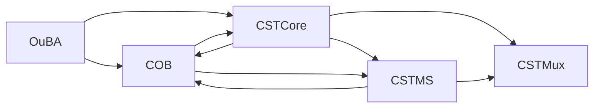

# **20.32 — COB Requirements (Updated for Path‑A Cognitive‑Field Model)**  
**Conversation Object Basin (COB)**  
**Document ID:** 20.32_cob_requirements  
**Version:** 0.7 (Cognitive‑Field Update)  
**Status:** Normative — Requirements (COB)  

---

# **1. Purpose (Updated for CST‑Core / CST‑MS Split)**

COB is the **long‑horizon identity substrate** of Path‑A.  
It maintains:

- identity layers  
- referent maps  
- temporal anchors  
- discourse anchors  
- clarifying fields  
- field‑importance maps  
- identity‑importance  
- semantic‑adjacent importance  
- identity‑layer lineage  

COB integrates:

- **CST‑Core correction signals** (Freeze, Thaw, Continuity‑restoration)  
- **CST‑MS structural commands** (Freeze, Thaw, Collapse‑recovery, Create, Split, Merge, Register‑strengthen/weaken)  
- IdOB identity‑importance  
- SmOB semantic‑adjacent importance  
- next‑turn context (via TP.next_context{} written by MCB)  
- CEx selection lineage  

COB produces the **stabilized identity‑layer snapshot** consumed by CIL.

COB does **not** ingest TP/IE structural cues; only CIL consumes TP/IE cues.

---

# **2. Position in Architecture (Corrected for CST Split)**

### **(Path‑A):**  
```
CST‑Core → COB
CST‑MS   → COB
CST‑Mux  → CIL → CEx → CE → TS → OuBA → COB
```

### **COB receives:**

- meaning‑layer output from TS (via OuBA)  
- identity‑importance from IdOB (indirect via TP → OuBA)  
- semantic‑adjacent importance from SmOB (indirect via TP → OuBA)  
- next‑turn context from MCB (via TP.next_context{})  
- **correction signals from CST‑Core**  
- **structural commands from CST‑MS**

### **COB does NOT receive:**

- any signals from CST‑Mux  
- any direct signals from IdOB, SmOB, or MCB  
- any data from OB, IB, RB, TB, InB, or OuB

---

# **2.1 COB Input/Output Summary (New)**

## **Inputs → COB**

### **From CST‑Core**
- Freeze  
- Thaw  
- Continuity‑restoration  
- stability‑correction signals  

### **From CST‑MS**
- freeze command  
- thaw command  
- collapse‑recovery  
- create‑identity‑layer  
- split  
- merge  
- strengthen_register  
- weaken_register  
- synthesized stability summaries  

### **From OuBA**
- meaning packets  
- strength updates  
- ambiguity/confidence  
- lineage continuity  
- register updates  

### **From IdOB (indirect via TP → OuBA)**
- identity‑importance  

### **From SmOB (indirect via TP → OuBA)**
- semantic‑adjacent importance  

### **From MCB (via TP.next_context{})**
- next‑turn context fields  

---

## **Outputs ← COB**

### **To CIL**
- stabilized identity‑layer snapshot  
  - identity layers  
  - referent maps  
  - clarifying fields  
  - importance maps  
  - identity‑importance  
  - semantic‑adjacent importance  
  - next‑turn context  
  - ordering metrics  
  - register continuity  
  - conversation_count  
  - initial_state_complete  
  - importance continuity  

### **To CST‑Core / CST‑MS**
- structural event information  
  - MERGE markers  
  - SPLIT markers  
  - lineage continuity markers  
  - before/after continuity information  

### **COB outputs NOTHING to:**
- CST‑Mux  
- OB‑Set  
- IB  
- RB / RBU / RTU  
- TB  
- InB  
- OuB  
- CEx‑IE  
- CEx‑CCR  
- CEx‑Pck  
- CE  
- TPU  
- TR  
- ISc  
- SSRGn  

---
### 2.1.1 Diagram of COB Inputs & Outputs




## **3.1 Core Identity‑Layer Responsibilities**

**HLR‑20.32‑001**  
COB SHALL maintain identity layers, referent maps, temporal anchors, discourse anchors, field‑importance maps, and identity‑layer lineage.

**HLR‑20.32‑002 (Updated)**  
COB SHALL apply **CST‑Core correction signals** (Freeze, Thaw, Continuity‑restoration) and **CST‑MS structural commands** (Freeze, Thaw, Collapse‑recovery, Create, Split, Merge, Register‑strengthen/weaken) to identity‑layer structures deterministically.

**HLR‑20.32‑003**  
COB SHALL produce the stabilized identity‑layer snapshot consumed by CIL.

**HLR‑20.32‑004**  
COB SHALL NOT interact with OB, IB, RB, TB, InB, or OuB.

**HLR‑20.32‑005**  
COB SHALL NOT perform placeholder promotion, replay/export, compaction, or redaction.

**HLR‑20.32‑006**  
Reserved.

**HLR‑20.32‑007**  
COB SHALL maintain determinism and replay equivalence for all identity‑layer operations.

**HLR‑20.32‑008**  
COB SHALL NOT perform semantic interpretation or canonical semantics derivation.

**HLR‑20.32‑009 (Updated)**  
COB outputs SHALL be consumed exclusively by **CIL** for intake packet formation.  
COB SHALL provide structural event information (MERGE/SPLIT markers, continuity information) to **CST‑Core and CST‑MS**.

**HLR‑20.32‑010**  
COB SHALL NOT read or mutate OB, RB, TB, IB, InB, OuB, or MTP internal state.

**HLR‑20.32‑011**  
COB lifecycle transitions SHALL occur only at deterministic safe boundaries.

**HLR‑20.32‑012**  
COB SHALL maintain versioning and schema stability for all identity‑layer structures.

**HLR‑20.32‑013**  
COB SHALL maintain a maximum of 20 identity layers.

---

## **3.2 Identity‑Layer Schema**

**HLR‑20.32‑014**  
Each identity layer SHALL conform to:

```json
IdentityLayer {
    layer_id: StableID,
    referent_map: ReferentMap,
    lineage: LineageStructure,
    strength: float,
    importance: float,
    ambiguity: float,
    decay_state: float,
    register: string,
    timestamps: {
        created: TurnID,
        updated: TurnID
    }
}
```

---

## **3.3 Referent Map Schema**

**HLR‑20.32‑015**  
Each referent entry SHALL conform to:

```json
ReferentEntry {
    referent_id: StableID,
    surface_forms: [string],
    attributes: { key: value },
    strength: float,
    confidence: float,
    ambiguity: float,
    lineage_pointer: StableID,
    register: string,
    timestamps: {
        created: TurnID,
        updated: TurnID
    }
}
```

---

# **4. Clarifying Metadata Requirements (Consolidated)**

**HLR‑20.32‑069**  
COB SHALL maintain a bounded set of clarifying fields per identity layer (maximum 10).

**HLR‑20.32‑070**  
Each clarifying field SHALL contain a bounded set of subfields (maximum 100 total, maximum 4 hierarchical levels).

**HLR‑20.32‑071**  
Each clarifying field and subfield SHALL store an importance score.

**HLR‑20.32‑072**  
COB SHALL expose clarifying fields, subfields, and importance scores in the stabilized snapshot consumed by CIL.

**HLR‑20.32‑073**  
COB SHALL refine clarifying‑importance using long‑horizon continuity metrics.

**HLR‑20.32‑074**  
COB SHALL compress clarifying fields and subfields deterministically.

**HLR‑20.32‑075**  
COB SHALL prune clarifying fields and subfields when capacity limits are exceeded.

**HLR‑20.32‑076**  
COB SHALL include clarifying metadata in the stabilized snapshot.

**HLR‑20.32‑077**  
COB SHALL guarantee deterministic replay of clarifying metadata.

**HLR‑20.32‑078**  
COB SHALL maintain clarifying metadata across freeze/thaw cycles.

---

# **5. Meaning Ingestion & Merge Logic**

**HLR‑20.32‑016**  
COB SHALL ingest new meaning exclusively through OuBA packets.

**HLR‑20.32‑017**  
Strength averaging SHALL follow:

$$
new_{strength} = \alpha \cdot old_{strength} + (1 - \alpha) \cdot incoming_{strength}
$$

**HLR‑20.32‑018**  
COB SHALL resolve conflicts using confidence weighting, ambiguity penalties, lineage continuity, and CST override signals.

---

# **6. Identity‑Layer Lifecycle Rules**

**HLR‑20.32‑019**  
COB SHALL create a new identity layer only when creation conditions are met.

**HLR‑20.32‑020**  
COB SHALL split an identity layer when split conditions are met.

**HLR‑20.32‑021**  
COB SHALL merge identity layers when merge conditions are met.

**HLR‑20.32‑022**  
Eviction score SHALL follow:

$$
eviction_{score} =
w_1(\text{low strength}) +
w_2(\text{low importance}) +
w_3(\text{high decay}) +
w_4(\text{low recency}) +
w_5(\text{high ambiguity})
$$

**HLR‑20.32‑023**  
Decay SHALL follow:

$$
decay_{state} = decay_{state} + \beta \cdot time_{since\_{update}}
$$

$$
strength = strength \cdot (1 - \gamma \cdot decay_{state})
$$

$$
importance = importance \cdot (1 - \gamma \cdot decay_{state})
$$

**HLR‑20.32‑024**  
COB SHALL prune referents, compress attributes, and summarize lineage when limits are exceeded.

**HLR‑20.32‑025**  
COB SHALL retire a layer only when retirement conditions are met.

**HLR‑20.32‑026**  
COB SHALL respond to CST signals deterministically.

**HLR‑20.32‑027**  
While frozen, COB SHALL halt lifecycle operations and queue updates.

**HLR‑20.32‑028**  
COB SHALL detect collapse and enter recovery mode.

**HLR‑20.32‑029**  
COB SHALL guarantee deterministic replay of identity‑layer state.

**HLR‑20.32‑030**  
COB SHALL NOT allow spontaneous identity‑layer mutation.

**HLR‑20.32‑031**  
COB SHALL archive lineage upon eviction or retirement.

**HLR‑20.32‑032**  
COB SHALL enforce deterministic ordering of identity layers and referent entries.

**HLR‑20.32‑033**  
COB SHALL bound referent count, lineage depth, and ambiguity entries.

**HLR‑20.32‑034**  
COB SHALL produce a stabilized identity‑layer snapshot after each update cycle.

---

# **7. Register Continuity**

**HLR‑20.32‑035**  
COB SHALL maintain a register field in every identity layer and referent entry.

**HLR‑20.32‑036**  
Register SHALL be updated deterministically from OuBA packets and CST signals.

**HLR‑20.32‑037**  
CIL SHALL include a register_hint derived from COB.

**HLR‑20.32‑038**  
CST SHALL issue strengthen_register and weaken_register signals.

---

# **8. Recency, Frequency, Density, Ordering**

**HLR‑20.32‑039**  
COB SHALL maintain `last_referred`.

**HLR‑20.32‑040**  
COB SHALL maintain `total_referrals`.

**HLR‑20.32‑041**  
COB SHALL maintain `recent_referrals`.

**HLR‑20.32‑042**  
COB SHALL update `recent_referrals` using a sliding window.

**HLR‑20.32‑043**  
COB SHALL expose referral counters in the snapshot.

**HLR‑20.32‑044**  
COB SHALL incorporate recency, frequency, and density into ordering.

**HLR‑20.32‑045**  
Recency score:

$$
recency_{score} = \frac{1}{1 + (current\_{turn} - last\_{referred})}
$$

**HLR‑20.32‑046**  
Frequency score:

$$
frequency_{score} = \log(1 + total\_{referrals})
$$

**HLR‑20.32‑047**  
Density score:

$$
density_{score} = recent\_{referrals}
$$

**HLR‑20.32‑048**  
Ordering score:

$$
ordering_{score} =
u_1 \cdot recency_{score} +
u_2 \cdot frequency_{score} +
u_3 \cdot density_{score}
$$

**HLR‑20.32‑049**  
COB SHALL maintain deterministic ordering using ordering_score.

**HLR‑20.32‑050**  
COB SHALL update ordering each turn.

**HLR‑20.32‑051**  
COB SHALL guarantee deterministic replay of ordering metrics.

**HLR‑20.32‑052**  
COB SHALL include ordering metrics in the snapshot.

**HLR‑20.32‑053**  
Identity‑layer schema SHALL include referral counters.

**HLR‑20.32‑054**  
Referral counters SHALL update only when CEx selects the layer.

**HLR‑20.32‑055**  
Referral counters SHALL NOT be modified by OuBA or CST.

**HLR‑20.32‑056**  
Referral counters SHALL persist across freeze/thaw.

**HLR‑20.32‑057**  
Referral counters SHALL be unaffected by pruning or compaction.

**HLR‑20.32‑058**  
Referral counters SHALL be archived upon eviction or retirement.

---

# **9. Next‑Turn Context Integration (HLR‑20.32‑079 through HLR‑20.32‑110)**  
### *All HLRs preserved exactly, rewritten for clarity, grouped logically.*

**HLR‑20.32‑079**  
COB SHALL ingest next‑turn clarifying/context fields exclusively from `TP.next_context{}`.

**HLR‑20.32‑080**  
COB SHALL validate next‑turn clarifying/context fields using coherence, referent continuity, lineage continuity, and register consistency.

**HLR‑20.32‑081**  
COB SHALL determine whether next‑turn context indicates continuation or shift.

**HLR‑20.32‑082**  
When context shift occurs, COB SHALL update importance, ambiguity, and lineage continuity.

**HLR‑20.32‑083**  
COB SHALL merge validated next‑turn clarifying/context fields into identity layers using long‑horizon continuity rules.

**HLR‑20.32‑084**  
COB SHALL update clarifying‑field importance using next‑turn context importance and continuity metrics.

**HLR‑20.32‑085**  
COB SHALL expose merged next‑turn clarifying/context fields in the stabilized snapshot.

**HLR‑20.32‑086**  
COB SHALL guarantee deterministic replay of next‑turn clarifying/context fields.

**HLR‑20.32‑087**  
COB SHALL maintain next‑turn clarifying/context fields across freeze/thaw cycles.

**HLR‑20.32‑088**  
COB SHALL adjust identity‑layer selection probabilities using next‑turn context.

**HLR‑20.32‑089**  
COB SHALL append lineage continuity markers when context shift occurs.

**HLR‑20.32‑090**  
COB SHALL compress next‑turn clarifying/context fields deterministically.

**HLR‑20.32‑091**  
COB SHALL prune next‑turn clarifying/context fields when capacity limits are exceeded.

**HLR‑20.32‑092**  
COB SHALL update register fields when next‑turn context indicates register shifts.

**HLR‑20.32‑093**  
COB SHALL include next‑turn context fields and refined importance scores in the stabilized snapshot.

**HLR‑20.32‑094**  
COB SHALL ingest next‑turn context exclusively from `TP.next_context{}`.

**HLR‑20.32‑095**  
COB SHALL treat next‑turn context fields as read‑only.

**HLR‑20.32‑096**  
COB SHALL validate next‑turn context fields using coherence and continuity metrics.

**HLR‑20.32‑097**  
COB SHALL merge validated next‑turn context fields into clarifying structures.

**HLR‑20.32‑098**  
COB SHALL update clarifying importance using next‑turn context importance.

**HLR‑20.32‑099**  
COB SHALL incorporate next‑turn context into identity‑layer selection probabilities.

**HLR‑20.32‑100**  
COB SHALL reflect next‑turn context fields in the stabilized snapshot without modification.

**HLR‑20.32‑101**  
COB SHALL guarantee deterministic replay of next‑turn context ingestion.

**HLR‑20.32‑102**  
COB SHALL preserve next‑turn context continuity across freeze/thaw cycles.

**HLR‑20.32‑103**  
COB SHALL NOT write next‑turn context fields into current‑turn clarifying fields.

**HLR‑20.32‑104**  
COB SHALL append lineage continuity markers when next‑turn context indicates shift.

**HLR‑20.32‑105**  
COB SHALL compress next‑turn context fields deterministically.

**HLR‑20.32‑106**  
COB SHALL prune next‑turn context fields when capacity limits are exceeded.

**HLR‑20.32‑107**  
COB SHALL update register fields using next‑turn context register values.

**HLR‑20.32‑108**  
COB SHALL expose next‑turn context fields and coherence indicators in the stabilized snapshot.

**HLR‑20.32‑109**  
COB SHALL NOT derive next‑turn context fields from clarifying fields or referent maps.

**HLR‑20.32‑110**  
COB SHALL NOT interact with truth/done fields, routing fields, structural geometry, ΔH%, lineage, or Path‑B semantics when processing next‑turn context.

---

# **10. Split/Merge Structural Events (HLR‑20.32‑059 through HLR‑20.32‑068)**  
### *All HLRs preserved, rewritten for clarity.*

**HLR‑20.32‑059**  
COB SHALL provide structural continuity information for CST after split/merge operations.

**HLR‑20.32‑060**  
COB SHALL produce structural event information for CST after split/merge.

**HLR‑20.32‑061**  
COB SHALL ensure the stabilized snapshot reflects post‑operation state.

**HLR‑20.32‑062**  
COB SHALL append structural event entries to `TP.lineage_log[]`.

**HLR‑20.32‑063**  
COB SHALL provide before/after continuity information for CST.

**HLR‑20.32‑064**  
COB SHALL ensure lineage_log entries are deterministic and replay‑safe.

**HLR‑20.32‑065**  
CST SHALL interpret MERGE markers as legitimate consolidation.

**HLR‑20.32‑066**  
CST SHALL interpret SPLIT markers as legitimate divergence.

**HLR‑20.32‑067**  
CST SHALL read specific TP fields after split/merge for continuity.

**HLR‑20.32‑068**  
CST SHALL treat MERGE/SPLIT markers as structural invariants during replay.

---

# **11. New Requirements — Importance Integration (Semantic‑Adjacent + Identity‑Importance)**

### **HLR‑20.32‑111**  
COB SHALL ingest semantic‑adjacent importance cues emitted by SmOB and integrate them into identity‑layer importance, referent importance, and clarifying‑importance maps.

### **HLR‑20.32‑112**  
COB SHALL ingest identity‑importance cues emitted by IdOB and integrate them into identity‑layer importance, referent importance, and clarifying‑importance maps.

### **HLR‑20.32‑113**  
COB SHALL compute long‑horizon importance using deterministic rules combining:  
- semantic‑adjacent importance (SmOB),  
- identity‑importance (IdOB),  
- clarifying‑importance,  
- continuity metrics,  
- lineage continuity,  
- CST correction signals.

### **HLR‑20.32‑114**  
COB SHALL maintain monotonic importance updates: importance MAY increase or decrease deterministically, but SHALL NOT oscillate nondeterministically.

### **HLR‑20.32‑115**  
COB SHALL expose long‑horizon importance values in the stabilized snapshot consumed by CIL.

### **HLR‑20.32‑116**  
COB SHALL guarantee deterministic replay of importance integration across freeze/thaw cycles.

---

# **12. New Requirements — Conversation‑Count Completeness Signaling**

### **HLR‑20.32‑117**  
COB SHALL maintain `TP.cob.conversation_count` representing the number of conversations available for CEx selection.

### **HLR‑20.32‑118**  
COB SHALL set `TP.cob.conversation_count_complete = true` only when at least 10 conversations exist.

### **HLR‑20.32‑119**  
COB SHALL set `TP.cob.conversation_count_complete = false` when fewer than 10 conversations exist.

### **HLR‑20.32‑120**  
COB SHALL expose `conversation_count` and `conversation_count_complete` in the stabilized snapshot consumed by CIL and CEx.

---

# **13. New Requirements — Initial‑State Incompleteness Signaling**

### **HLR‑20.32‑121**  
COB SHALL maintain `TP.cob.initial_state_complete` indicating whether all identity‑layer fields have been populated at least once.

### **HLR‑20.32‑122**  
COB SHALL set `TP.cob.initial_state_complete = false` until:  
- at least one identity layer exists,  
- referent maps contain at least one referent,  
- clarifying fields contain at least one field,  
- importance maps contain at least one importance value,  
- next‑turn context has been ingested at least once.

### **HLR‑20.32‑123**  
COB SHALL set `TP.cob.initial_state_complete = true` only when all required identity‑layer fields have been populated.

### **HLR‑20.32‑124**  
COB SHALL expose `initial_state_complete` in the stabilized snapshot consumed by CIL and CEx.

### **HLR‑20.32‑125**  
COB SHALL guarantee deterministic replay of initial‑state completeness signaling.

---

# **14. New Requirements — Importance Continuity Across Layers**

### **HLR‑20.32‑126**  
COB SHALL propagate importance continuity across identity layers using lineage continuity, referent continuity, and clarifying continuity.

### **HLR‑20.32‑127**  
COB SHALL update importance continuity deterministically each turn using:  
- recency,  
- frequency,  
- density,  
- lineage continuity,  
- next‑turn context,  
- CST correction signals.

### **HLR‑20.32‑128**  
COB SHALL expose importance continuity metrics in the stabilized snapshot.

### **HLR‑20.32‑129**  
COB SHALL NOT derive importance continuity from TP structural cues or OB‑family residue.

---

# **15. Informative Sections (No SHALL)**

- Example stabilized snapshot  
- Split/Merge explanation  
- CST interpretation rules  
- Historical replay explanation  

All SHALL removed from informative text.

---

# **End of Document — 20.32 (Updated)**

---
