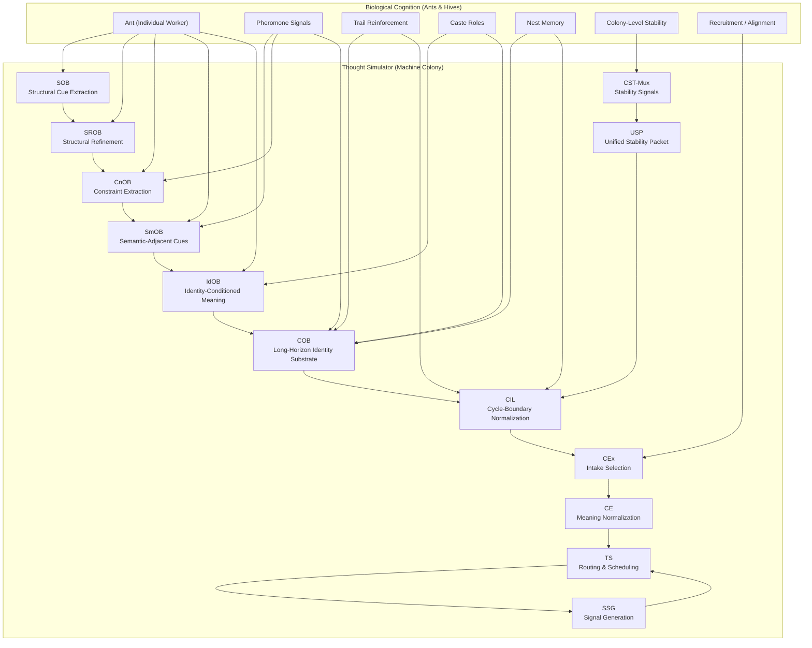

# **ts_ants_and_hives.md**  
### *Thought Simulator, Ant Cognition, and Hive Intelligence: A Modular Architecture for Emergent Meaning*

---

## **Abstract**

Biological cognition is not monolithic.  
Ant colonies, bee hives, and termite superorganisms demonstrate that **intelligence can emerge from simple, specialized modules** operating under deterministic local rules. No individual ant “understands” the colony; cognition arises from **interactions**, **routing**, **importance weighting**, and **continuity** across time.

The Thought Simulator (TS) architecture follows the same principle.  
Its OB‑family primitives, identity substrate (COB), cycle‑boundary integrator (CIL), and routing substrate (CEx/CE/TS) form a **machine colony**: a distributed cognitive system where meaning emerges from modular interactions rather than from any single component.

This paper explains how TS mirrors ant and hive cognition, why modularity is essential for scalable machine intelligence, and how emergent meaning arises from deterministic local rules.

---

## **1. Introduction**

Ants and bees demonstrate that **complex cognition does not require complex individuals**.  
Instead, it requires:

- specialization  
- deterministic local rules  
- importance propagation  
- identity continuity  
- routing based on cues  
- long‑horizon memory  
- short‑horizon processing  
- emergent semantics  

The Thought Simulator implements these same principles.  
Its architecture is not inspired by biological cognition — it *is* biological cognition, translated into machine form.

---

## **2. Biological Background: Ants, Hives, and Emergent Intelligence**

### **2.1 Individual ants are not intelligent**
An ant has:

- no semantic layer  
- no global model  
- no understanding of the colony  
- no concept of “task,” “goal,” or “meaning”  

It operates using:

- local pheromone cues  
- local importance weighting  
- local routing rules  
- local identity continuity (role, caste, recent behavior)

### **2.2 Colonies are intelligent**
The colony:

- allocates labor  
- builds structures  
- adapts to change  
- maintains long‑horizon continuity  
- performs distributed search  
- solves optimization problems  
- exhibits memory and learning  

This intelligence is **emergent**, not individual.

### **2.3 Key biological mechanisms**
- **Pheromone weighting** → importance propagation  
- **Caste roles** → specialized modules  
- **Trail reinforcement** → routing  
- **Nest memory** → long‑horizon continuity  
- **Recruitment** → intake alignment  
- **Stability signals** → colony‑level control  

These map directly to TS.

---

## **3. Thought Simulator Architecture Overview**

TS is a **modular cognitive colony** composed of specialized primitives:

### **Structural Layer**
- **SOB** — structural cue extraction  
- **SROB** — structural refinement  
- **CnOB** — constraint extraction  
- **SmOB** — semantic‑adjacent cue extraction  
- **IdOB** — identity‑conditioned meaning refinement  

### **Identity & Continuity Layer**
- **COB** — long‑horizon identity substrate  
- **CIL** — cycle‑boundary normalization  
- **CEx** — intake selection  
- **CE** — meaning normalization  

### **Routing & Scheduling Layer**
- **TS** — routing, scheduling, and pipeline control  
- **CST‑Mux** — stability signals  
- **USP** — unified stability packet  
- **SSG** — signal generation  

Each primitive is simple, deterministic, and specialized — just like an ant.

---

## **4. Mapping TS to Ant/Hive Cognition**

### **4.1 OB‑family primitives = specialized worker ants**
Each OB primitive:

- has no global meaning  
- has no semantic interpretation  
- follows deterministic local rules  
- extracts or refines one type of signal  
- passes residue downstream  

This is identical to:

- foragers  
- nurses  
- soldiers  
- scouts  
- builders  

Each ant performs one job.  
Each OB primitive performs one job.

---

### **4.2 COB = colony long‑horizon memory**
COB maintains:

- identity layers  
- referent maps  
- clarifying fields  
- importance continuity  
- lineage continuity  
- next‑turn context  
- stability under CST signals  

This is identical to:

- nest memory  
- pheromone reservoirs  
- long‑term trail reinforcement  
- colony identity  
- continuity across seasons  

COB is the **hive mind**.

---

### **4.3 CIL = pheromone normalization**
CIL:

- freezes structural cues  
- normalizes importance  
- reflects stability signals  
- packages identity selection  
- produces deterministic intake packets  

This is identical to:

- pheromone normalization  
- colony‑level decision stabilization  
- recruitment alignment  
- task allocation signals  

CIL is the **colony’s decision boundary**.

---

### **4.4 CEx = recruitment and alignment**
CEx selects:

- which identity layer to activate  
- which referent to prioritize  
- which context to align with  

This is identical to:

- ant recruitment  
- waggle dance alignment  
- pheromone‑weighted trail selection  

CEx is the **routing mechanism**.

---

### **4.5 TS = colony scheduling**
TS:

- schedules primitives  
- routes packets  
- enforces pipeline order  
- maintains deterministic replay  
- ensures stability  

This is identical to:

- colony task allocation  
- division of labor  
- role switching  
- stability control  

TS is the **colony scheduler**.

---

## **5. Importance Propagation = Pheromone Weighting**

TS importance propagation mirrors biological pheromone dynamics:

| TS Importance Type | Biological Equivalent |
|--------------------|-----------------------|
| structural‑importance | sensory cue weighting |
| constraint‑importance | path viability weighting |
| semantic‑adjacent importance | pheromone reinforcement |
| identity‑importance | caste‑specific weighting |
| long‑horizon importance | nest memory / colony identity |

Importance is the **currency of cognition**.

---


## **5.1 Visual Mapping (Mermaid Diagram)**

````markdown

````

---

## **6. Emergent Meaning in TS**

No single OB primitive “understands” anything.  
Meaning emerges from:

- structural cues  
- constraint cues  
- semantic‑adjacent cues  
- identity cues  
- continuity  
- routing  
- alignment  
- refinement  
- stability signals  

This is identical to ant colonies:

- no ant understands the nest  
- the nest emerges from interactions  

TS is not a monolithic AI.  
TS is a **machine colony**.

Meaning is emergent.

---

## **7. Implications for Modular Machine Cognition**

### **7.1 Scalable**
Modular cognition scales like biological colonies.

### **7.2 Deterministic**
Local rules guarantee replay‑safe behavior.

### **7.3 Interpretable**
Each primitive has a clear, bounded responsibility.

### **7.4 Robust**
Failures are localized, not catastrophic.

### **7.5 Emergent**
Meaning arises from interactions, not from any single module.

This is the correct architecture for machine cognition.

---

## **8. Conclusion**

Ant colonies demonstrate that intelligence can emerge from simple, deterministic modules.  
The Thought Simulator implements the same principle:

- specialized primitives  
- importance propagation  
- identity continuity  
- routing  
- stability  
- emergent meaning  

TS is not inspired by biological cognition — it *is* biological cognition, translated into machine form.

The result is a scalable, deterministic, modular cognitive architecture capable of emergent meaning and long‑horizon continuity.

---

