# ⭐ **tp_overview.md (Draft)**  
### *High‑level master overview of the Thought Simulator TP architecture*

---

# **TP Architecture Overview (Path‑A)**  
The **Thought Packet (TP)** is the canonical, replay‑safe record of a single turn in Path‑A.  
It is the final product of a deterministic upstream pipeline that integrates:

- stability signals  
- identity‑layer continuity  
- semantic alignment  
- routing and structural geometry  
- provenance and commit lineage  

The TP is committed atomically by **TPU** and consumed by downstream primitives to maintain long‑horizon coherence, continuity, and deterministic replay.

This document provides a **high‑level architectural overview** of the TP, its envelopes, and the upstream pipeline that produces it.  
Detailed explanations of each envelope appear in the companion papers:

- `tp_context_layer.md`  
- `tp_semantic_layer.md`  
- `tp_alignment_layer.md`  
- `tp_structural_routing_layer.md`  
- `tp_commit_layer.md`

---

# **1. Purpose of the TP**

The TP exists to:

- capture the **canonical state** of a turn  
- provide a **replay‑safe record** of context, meaning, continuity, and structural geometry  
- enforce the **semantic firewall** between upstream extraction and downstream commitment  
- maintain **long‑horizon identity continuity**  
- provide deterministic inputs to downstream primitives (OuBA, COB, CEx, CE, TPU)

The TP is the **single source of truth** for:

- context metadata  
- meaning signals  
- continuity markers  
- importance maps  
- structural geometry  
- routing metadata  
- provenance  
- entropy  
- freeze signatures  

Every downstream primitive reads the TP; none modify it.

---

# **2. Upstream Pipeline (Path‑A)**  
The TP is produced by a deterministic upstream pipeline.  
This diagram reflects the corrected CST‑Core / CST‑MS / CST‑Mux split and the bidirectional COB ↔ CST connections.

```mermaid
flowchart TD

%% ===== Row 0: Stability & Identity Substrate =====
    Z1[OuBA] --> Z2[CST‑Core]
    Z2 --> Z5[COB]
    Z2 --> Z3[CST‑MS]
    Z2 --> Z4[CST‑Mux]
    Z3 --> Z5[COB]
    Z5 --> Z3[CST-MS]
    Z5 --> Z2[CST-Core]
    Z3 --> Z4[CST-Mux]
    Z6 --> A1[CEx‑IE]
    Z4 --> Z6[CIL]
    Z5 --> Z6

%% ===== Row 1: Intake & Extraction =====
    A0[InB] --> A11[IIInB]
    A11 --> A12[IE]
    A12 --> A1[CEx-IE]
    Z6 --> A2[CEx-CCR]
    A1 --> A2[CEx‑CCR]
    A2 --> A3[CEx‑Pck]
    A3 --> A4[CE]
    A4 --> A5[TPU]

%% ===== Row 2: Structural Geometry (OB‑Set) =====
    A5 --> B1[SOB]
    B1 --> B2[SROB]
    B2 --> B3[CnOB]
    B3 --> B4[SmOB]
    B4 --> B5[ISc]

%% ===== Row 3: Semantic Layer & Routing =====
    B5 --> C1[SSG]
    C1 --> C2[STPX]
    C2 --> C3[RBU]
    C3 --> C4[RB]
    C4 --> C5[TR]
    C5 --> C6[CTP]
    C6 --> C7[ISc]

%% ===== Row 4: Refinement Loop =====
    C7 --> D1[RTU]
    D1 --> D2[RB]
    D2 --> D3[IdOB]
    D3 --> D4[MCB]
    D4 --> D5[RBU]
    D5 --> D6[DCB]
    D6 --> D7[RB]
    D7 --> D8[TR]
    D8 --> D9[CTP]
    D9 --> D10[ISc]
    D10 --> D11[RTU]
    D11 --> D12[RB]

%% ===== Row 5: Termination =====
    D12 --> E1[OuBA]
```

---

# **3. The CE → TPU Semantic Firewall**

The semantic firewall is the architectural boundary between:

- **raw, volatile, upstream‑dependent context data**  
- **canonical, bounded, replay‑safe context metadata**

### **CEx‑Pck produces Context Data**  
Raw fields from:

- IE structural hints  
- CCR alignment  
- CIL substrate  
- COB clarifying fields  
- next‑turn context  
- stability indicators  
- importance signals  

These fields are **not canonical**, **not bounded**, and **not replay‑safe**.

### **CE produces Context Metadata**  
CE rewrites raw context into:

- bounded clarifying fields (10/100/4)  
- canonical topic / intent / stance / continuity  
- canonical importance  
- deterministic ordering  
- provenance  
- replay‑safe structure  

This process is called **normalization**, meaning **semantic canonicalization**, not statistical scaling.

### **TPU commits Context Metadata**  
TPU performs:

- atomic commit  
- provenance stamping  
- replay lineage  
- freeze integration  
- entropy integration  

The result is the immutable **TP**.

---

# **4. TP Envelope Overview**

The TP is composed of multiple envelopes.  
Each envelope is produced by a specific primitive and consumed by specific downstream primitives.

Below is the high‑level overview.  
Deep explanations appear in the companion papers.

---

## **4.1 Context Layer (tp_context_layer.md)**  
### **Context Data (CEx‑Pck)**  
Raw, unbounded, volatile fields extracted from upstream signals.

### **Context Metadata (CE → TPU)**  
Canonical, bounded, replay‑safe representation of context.

---

## **4.2 Semantic Layer (tp_semantic_layer.md)**  
### **Semantic Envelope (IE, OB‑Set)**  
Propositions, truth evidence, semantic residues.

### **MSL Metadata (CEx‑Pck)**  
Stance, shading, qualifiers, direction, coherence.

### **Semantic‑Importance (OB‑Set, IdOB, SmOB)**  
Identity‑importance, semantic‑adjacent importance.

---

## **4.3 Alignment Layer (tp_alignment_layer.md)**  
### **CCR Output (CEx‑CCR)**  
Alignment, scores, decision, selected conversation.

### **CIL Metadata (CEx‑Pck)**  
Substrate reference, structural hints, stability indicators.

---

## **4.4 Structural + Routing Layer (tp_structural_routing_layer.md)**  
### **Structural Envelope (SOB, SROB, CnOB, SmOB)**  
Semantic geometry, structural roles.

### **Routing Metadata (RB, RBU, RTU)**  
Routing pathways, arbitration, routing confidence.

---

## **4.5 Commit Layer (tp_commit_layer.md)**  
### **Provenance Metadata (TPU)**  
Commit lineage, primitive origin, replay determinism.

### **Entropy Metadata (TR, OuBA)**  
ΔH%, entropy trace, entropy_commit_map.

### **Freeze Metadata (SSRGn)**  
Freeze signatures, rrw binding, policy signatures.

---

# **5. Producer / Consumer Table**

| Envelope | Producer | Consumer |
|----------|----------|----------|
| Context Data | CEx‑Pck | CE |
| Context Metadata | CE → TPU | All downstream primitives |
| Semantic Envelope | IE, OB‑Set | CEx, CE |
| MSL Metadata | CEx‑Pck | CE |
| Semantic‑Importance | OB‑Set, IdOB, SmOB | COB, CEx |
| CCR Output | CEx‑CCR | CEx‑Pck, CE |
| CIL Metadata | CEx‑Pck | CEx‑CCR, CE |
| Structural Envelope | SOB, SROB, CnOB, SmOB | ISc, CE |
| Routing Metadata | RB, RBU, RTU | CE |
| Provenance | TPU | Replay system |
| Entropy | TR, OuBA | CE, TPU |
| Freeze | SSRGn | TPU |

---

# **6. How the TP Enables Path‑A**

The TP provides:

### **Deterministic Replay**  
Every turn is reconstructible from:

- canonical context  
- continuity markers  
- provenance  
- freeze signatures  
- entropy trace  

### **Long‑Horizon Identity Continuity**  
COB uses TP metadata to maintain:

- identity layers  
- referent maps  
- clarifying fields  
- importance continuity  
- lineage continuity  

### **Semantic Stability**  
CEx and CE use TP metadata to maintain:

- alignment  
- coherence  
- stance  
- structural geometry  
- routing pathways  

### **Replay‑Safe Commitment**  
TPU ensures:

- atomic commit  
- deterministic ordering  
- provenance correctness  
- freeze integration  

---

# **7. Companion Papers**

This overview is intentionally high‑level.  
Detailed explanations appear in:

- `tp_context_layer.md`  
- `tp_semantic_layer.md`  
- `tp_alignment_layer.md`  
- `tp_structural_routing_layer.md`  
- `tp_commit_layer.md`

Each paper provides:

- definitions  
- motivations  
- architectural roles  
- examples  
- producer/consumer details  

---

# **End of tp_overview.md**

---
