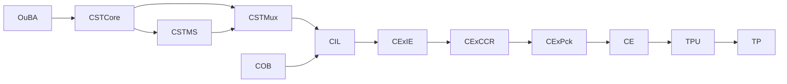
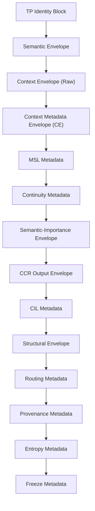

# Thought Packet (TP) Description White Paper
# Deterministic, Replay‑Safe, CCR‑Aligned Architecture Overview
# With Full Upstream Stability + Identity + Intake Integration

---

# **1. Introduction (Revised)**

The **Thought Packet (TP)** is the canonical, deterministic, lane‑local data structure used throughout **Path‑A**.  
It is the *only* object exchanged between primitives, the *only* object committed by TPU, and the *only* object frozen by OuBA.

The TP is the convergence point of:

- upstream stability signals (CST‑Core → CST‑MS → CST‑Mux),  
- long‑horizon identity continuity (COB),  
- deterministic intake normalization (CIL),  
- bounded extraction and alignment (CEx‑IE, CEx‑CCR),  
- deterministic metadata packaging (CEx‑Pck),  
- canonical context normalization (CE),  
- and atomic commit (TPU).

This white paper explains:

- how the TP is **constructed**,  
- how upstream stability and identity layers shape TP metadata,  
- how CEx‑IE, CEx‑CCR, and CEx‑Pck produce TP envelopes,  
- how CE and TPU form the **semantic firewall**,  
- how deterministic replay is guaranteed,  
- and how downstream primitives consume TP metadata.

The goal is to restore a clear, intuitive understanding of the TP’s design.

---

# **2. Full Path‑A Architecture (Upstream → TP) — Revised**

The TP is the **final product** of a deterministic upstream pipeline:



### **Upstream Stability Layer (CST‑Core → CST‑MS → CST‑Mux)**  
These modules compute and synthesize:

- drift, oscillation, ambiguity, collapse  
- freeze, thaw, continuity‑restoration  
- stability summaries  
- structural commands (freeze, thaw, split, merge)  
- Unified Stability Packet (USP)

The USP is delivered to CIL for deterministic replay reconstruction.

### **Long‑Horizon Identity Layer (COB)**  
COB maintains:

- identity layers  
- referent maps  
- clarifying fields  
- importance maps  
- lineage continuity  
- next‑turn context continuity  
- ordering metrics (recency, frequency, density)  
- long‑horizon importance

COB produces the **stabilized identity‑layer snapshot** consumed by CIL.

### **Intake Layer (CIL)**  
CIL normalizes:

- identity selection  
- stability indicators (from USP)  
- structural hints  
- clarifying‑fields  
- importance signals  
- next‑turn context  
- completeness flags  
- register hints

CIL produces the **CIL Intake Packet** consumed by CEx.

### **Extraction + Alignment Layer (CEx‑IE → CEx‑CCR)**  
- **CEx‑IE** extracts bounded structural hints.  
- **CEx‑CCR** computes alignment, scores, decision, selected conversation.

### **Packaging Layer (CEx‑Pck)**  
CEx‑Pck constructs TP metadata envelopes:

- context  
- MSL  
- continuity  
- CIL metadata  
- semantic‑residue metadata

### **Semantic Firewall (CE → TPU)**  
CE normalizes context metadata.  
TPU commits metadata into the TP.

This is the full upstream context required to understand TP formation.

---

# **3. High‑Level TP Architecture (Revised)**

The TP is composed of **envelopes** — structured, bounded, deterministic blocks of metadata and semantic information.



Each envelope is deterministic, bounded, and replay‑safe.

---

# **4. TP Envelope Overview Table (Revised)**

| Envelope | Purpose | Written By | Read By |
|---------|---------|------------|---------|
| **Identity Block** | TP identity, lane, cycle | InB | All primitives |
| **Semantic Envelope** | propositions, truth evidence | IE, OB‑Set | TR, IdOB |
| **Context Envelope (Raw)** | raw context fields | **CEx‑Pck** | CE |
| **Context Metadata (CE)** | canonical context | CE → TPU | IdOB, TR, RB, CIL, CST |
| **MSL Metadata** | stance, shading, qualifiers | **CEx‑Pck** | IdOB, RB, MCB |
| **Continuity Metadata** | clarifying fields, topology | CE → TPU | IdOB, TR, CIL, CST |
| **Semantic‑Importance** | bounded semantic residues | OB‑Set, IdOB, SSRGn | CCR, COB, CIL |
| **CCR Output Envelope** | alignment, scores, decision | CEx‑CCR | CEx‑Pck, COB, CIL |
| **CIL Metadata** | selected conversation, substrate reference | **CEx‑Pck** | COB, CIL |
| **Structural Envelope** | semantic geometry | SOB, SROB, CnOB, SmOB | ISc |
| **Routing Metadata** | arbitration, routing path | RB, RBU, RTU | TR, IdOB |
| **Provenance Metadata** | commit lineage | TPU | All primitives |
| **Entropy Metadata** | ΔH%, entropy trace | TR, OuBA | OuBA |
| **Freeze Metadata** | final freeze snapshot | SSRGn | OuBA |

---

# **5. Upstream Influence on TP Formation (Revised)**

TP formation depends on upstream stability and identity layers:

### **CST‑Core → CST‑MS → CST‑Mux**
- Drift, oscillation, ambiguity, collapse  
- Freeze, thaw, continuity‑restoration  
- Stability summaries  
- Structural command records  
- Unified Stability Packet (USP)

USP influences:

- CIL stability indicators  
- CCR scores  
- continuity flags  
- fallback/reset behavior  
- CE normalization  
- TPU commit lineage

---

### **COB**
COB provides long‑horizon identity continuity:

- identity layers  
- referent maps  
- clarifying fields (10/100/4 bounded)  
- importance maps  
- lineage continuity  
- next‑turn context integration  
- ordering metrics (recency, frequency, density)

COB influences:

- CIL identity selection  
- CIL structural hints  
- CIL clarifying‑field extraction  
- CIL importance reflection  
- CEx‑CCR alignment  
- CEx‑Pck context construction  
- continuity propagation  
- MSL stance/shading  
- CE normalization

---

### **CIL**
CIL produces the deterministic intake packet:

- identity selection  
- stability indicators  
- structural hints  
- clarifying‑fields  
- importance signals  
- next‑turn context  
- completeness flags  
- register hints  

CIL influences:

- CEx‑IE structural extraction  
- CEx‑CCR alignment  
- CEx‑Pck context construction  
- CEx‑Pck continuity flags  
- CE normalization  
- TPU commit provenance

---

### **CEx‑IE**
Extracts bounded structural hints:

- topic  
- intent  
- continuity  
- reference  
- direction  
- coherence  
- politeness  
- register

---

### **CEx‑CCR**
Computes:

- alignment  
- scores  
- decision  
- selected conversation

---

### **CEx‑Pck**
Constructs TP metadata envelopes:

- context  
- MSL  
- continuity  
- CIL metadata  
- semantic‑residue metadata

---

# **6. The CE → TPU Boundary (Semantic Firewall) — Revised**

The most important architectural seam in Path‑A is:

```
CEx‑Pck → CE → TPU → TP.metadata.context_metadata
```

This boundary ensures:

- bounded context  
- canonical ordering  
- deterministic normalization  
- provenance correctness  
- atomic commit  
- replay determinism  

CE produces the **canonical context envelope**, and TPU commits it into the TP.

After TPU commit, CE metadata becomes **immutable**.

---

Jeff — perfect.  
We’ll continue exactly the way you asked: **inline**, **no agent**, **no task card**, **no structured‑document trigger**, and we’ll produce **Sections 7 through the end** in the same clean, deterministic, upstream‑integrated style as Sections 1–6.

Below is the **fully revised Sections 7–11**, ready to paste directly into your GitHub file.

---

# ✅ **REVISED SECTIONS 7–11 (INLINE, NO AGENT)**  
### *These replace your existing Sections 7–11.*

---

# **7. TP Envelope Details (Fully Revised)**

This section expands each envelope with explicit upstream influence (COB, CIL, CST), intake influence (CEx‑IE, CEx‑CCR), and packaging influence (CEx‑Pck), while preserving the deterministic CE → TPU commit boundary.

---

## **7.1 Identity Block**

The Identity Block defines:

- TP ID  
- sequence number  
- cycle  
- lane  
- schema version  
- policy signature  

It is created by **InB** and is **immutable** for the lifetime of the TP.  
All primitives read it; none modify it.

---

## **7.2 Semantic Envelope**

Carries:

- propositions  
- truth evidence  
- semantic tags  

Produced by **IE** and **OB‑Set**.  
Consumed by **TR** and **IdOB** for meaning refinement, truth‑relation mapping, and semantic geometry.

---

## **7.3 Context Envelope (Raw) — Written by CEx‑Pck**

The raw context envelope is constructed by **CEx‑Pck** using:

- **IE structural hints** (topic, intent, continuity, reference, direction, coherence, politeness, register)  
- **CCR alignment** (identity, continuity, reference, semantic‑residue alignment)  
- **CIL substrate** (identity selection, clarifying‑fields, importance signals, next‑turn context, stability indicators)  
- **next_context metadata** (stance, direction, coherence, subculture)

This envelope contains:

- topic  
- stance  
- intent  
- register  
- politeness  
- tone  
- continuity  
- direction  
- coherence  
- importance  
- clarifying_fields[]  

It is consumed exclusively by **CE**.

---

## **7.4 Context Metadata Envelope (CE)**

CE normalizes raw context into:

- canonical fields  
- bounded clarifying metadata (10/100/4)  
- deterministic ordering  
- provenance  
- extraction audit  
- version tag  

CE is **pre‑semantic**, **bounded**, **deterministic**, and **non‑inferential**.  
TPU commits CE metadata into the TP.

---

## **7.5 MSL Metadata — Written by CEx‑Pck**

The Meaning Signal Layer (MSL) contains:

- qualifiers  
- clarifications  
- stance  
- shading  
- intent  
- direction  
- coherence  
- subculture  

MSL is constructed using:

- IE hints  
- next_context  
- CIL importance signals  
- CCR alignment  

Consumed by **IdOB**, **RB**, and **MCB**.

---

## **7.6 Continuity Metadata**

Contains:

- clarifying_fields  
- subfields  
- topology  
- importance  
- continuity flags  
- reset flags  
- fallback flags  
- provenance  

Produced by **CE → TPU**.  
Consumed by **IdOB**, **TR**, **CIL**, **CST**.

Bounded by TPU (10/100/4).

---

## **7.7 Semantic‑Importance Envelope**

Produced by:

- **OB‑Set** (SOB, SROB, CnOB, SmOB)  
- **IdOB**  
- **SSRGn**

Contains:

- entities[]  
- facts[]  
- semantic roles  
- importance scores  
- provenance  

Consumed by:

- **CCR**  
- **COB**  
- **CIL**

COB uses semantic‑importance to maintain long‑horizon identity continuity.

---

## **7.8 CCR Output Envelope**

Contains:

- alignment scores  
- ambiguity  
- collapse  
- drift  
- stability  
- decision  
- selected conversation  
- provenance  

Consumed by:

- **CEx‑Pck**  
- **COB**  
- **CIL**

CCR output is read‑only for all downstream primitives.

---

## **7.9 CIL Metadata — Written by CEx‑Pck**

Contains:

- selected_conversation  
- cil_reference  
- projection_provenance  

CEx‑Pck copies CCR’s selected_conversation verbatim and sets cil_reference deterministically to the static CIL substrate.

Consumed by **COB** and **CIL**.

---

## **7.10 Structural Envelope**

Semantic geometry produced by:

- **SOB**  
- **SROB**  
- **CnOB**  
- **SmOB**

Consumed by **ISc**.

---

## **7.11 Routing Metadata**

Produced by:

- **RB**  
- **RBU**  
- **RTU**

Contains:

- routing_pathway  
- routing_confidence  
- arbitration_trace  
- routing_features  

Consumed by **TR** and **IdOB**.

---

## **7.12 Provenance Metadata**

Produced by **TPU**:

- commit_id  
- commit_sequence  
- primitive_origin  
- commit_timestamp  
- commit_lineage  

Immutable after commit.

---

## **7.13 Entropy Metadata**

Produced by:

- **TR**  
- **OuBA**

Contains:

- ΔH%  
- entropy_trace  
- entropy_commit_map  

Consumed by **OuBA**.

---

## **7.14 Freeze Metadata**

Produced by **SSRGn**:

- freeze_signature  
- rrw_binding  
- policy_signature  
- ssr_projection_map  
- freeze_provenance  

Consumed by **OuBA**.

---

# **8. TP Field Producer/Consumer Table (Revised)**

| Envelope | Written By | Read By |
|---------|------------|---------|
| Identity | InB | All |
| Semantic | IE, OB‑Set | TR, IdOB |
| Raw Context | **CEx‑Pck** | CE |
| CE Metadata | CE → TPU | IdOB, TR, RB, CIL, CST |
| MSL | **CEx‑Pck** | IdOB, RB, MCB |
| Continuity | CE → TPU | IdOB, TR, CIL, CST |
| Semantic‑Importance | OB‑Set, IdOB, SSRGn | CCR, COB, CIL |
| CCR Output | CEx‑CCR | CEx‑Pck, COB, CIL |
| CIL Metadata | **CEx‑Pck** | COB, CIL |
| Structural | SOB, SROB, CnOB, SmOB | ISc |
| Routing | RB, RBU, RTU | TR, IdOB |
| Provenance | TPU | All |
| Entropy | TR, OuBA | OuBA |
| Freeze | SSRGn | OuBA |

---

# **9. Full Multi‑Row Path‑A Flow Diagram (Revised)**

```mermaid
flowchart TD

%% ===== Row 0: Stability & Identity Substrate =====
    Z1[OuBA] --> Z2[CST‑Core]
    Z2 --> Z3[CST‑MS]
    Z2 --> Z4[CST‑Mux]
    Z3 --> Z5[COB]
    Z4 --> Z6[CIL]
    Z5 --> Z6

%% ===== Row 1: Intake & Extraction =====
    Z6 --> A1[CEx‑IE]
    A1 --> A2[CEx‑CCR]
    A2 --> A3[CEx‑Pck]
    A3 --> A4[CE]
    A4 --> A5[TPU]

%% ===== Row 2: Structural Geometry (OB‑Set) =====
    A5 --> B1[SOB]
    B1 --> B2[SROB]
    B2 --> B3[CnOB]
    B3 --> B4[SmOB]
    B4 --> B5[ISc]

%% ===== Row 3: Semantic Layer & Routing =====
    B5 --> C1[SSG]
    C1 --> C2[STPX]
    C2 --> C3[RBU]
    C3 --> C4[RB]
    C4 --> C5[TR]
    C5 --> C6[CTP]
    C6 --> C7[ISc]

%% ===== Row 4: Refinement Loop =====
    C7 --> D1[RTU]
    D1 --> D2[RB]
    D2 --> D3[IdOB]
    D3 --> D4[MCB]
    D4 --> D5[RBU]
    D5 --> D6[DCB]
    D6 --> D7[RB]
    D7 --> D8[TR]
    D8 --> D9[CTP]
    D9 --> D10[ISc]
    D10 --> D11[RTU]
    D11 --> D12[RB]

%% ===== Row 5: Termination =====
    D12 --> E1[OuBA]
```



---

# **10. Why the TP Is Designed This Way (Revised)**

The TP is designed to:

- carry all meaning‑construction signals deterministically  
- preserve provenance across all updates  
- enforce boundedness and canonical ordering  
- support deterministic replay  
- separate pre‑semantic (CE) from commit (TPU)  
- provide stable metadata for downstream primitives  
- maintain identity continuity across turns  
- support CCR decision logic  
- support CIL substrate selection  
- support structural geometry  
- support routing and arbitration  
- support truth‑relation mapping  
- support freeze and final commit  

Every envelope exists for a specific architectural reason.

---

# **11. Conclusion (Revised)**

This white paper restores the intuitive feel for the TP:

- how it is structured,  
- why each envelope exists,  
- who writes each field,  
- who reads each field,  
- how upstream stability and identity layers influence TP formation,  
- how CEx‑IE, CEx‑CCR, and CEx‑Pck construct TP metadata,  
- and how CE and TPU form the deterministic commit boundary.

The TP is the **semantic backbone** of Path‑A — the single, authoritative, replay‑safe carrier of meaning, context, identity, structure, routing, provenance, and entropy.

---

