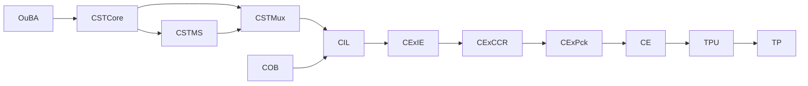

```mermaid
flowchart TD

%% ===== Row 0: Stability & Identity Substrate =====
    Z1[OuBA] --> Z2[CST‑Core]
    Z2 --> Z3[CST‑MS]
    Z2 --> Z4[CST‑Mux]
    Z3 --> Z5[COB]
    Z4 --> Z6[CIL]
    Z5 --> Z6

%% ===== Row 1: Intake & Extraction =====
    Z6 --> A1[CEx‑IE]
    A1 --> A2[CEx‑CCR]
    A2 --> A3[CEx‑Pck]
    A3 --> A4[CE]
    A4 --> A5[TPU]

%% ===== Row 2: Structural Geometry (OB‑Set) =====
    A5 --> B1[SOB]
    B1 --> B2[SROB]
    B2 --> B3[CnOB]
    B3 --> B4[SmOB]
    B4 --> B5[ISc]

%% ===== Row 3: Semantic Layer & Routing =====
    B5 --> C1[SSG]
    C1 --> C2[STPX]
    C2 --> C3[RBU]
    C3 --> C4[RB]
    C4 --> C5[TR]
    C5 --> C6[CTP]
    C6 --> C7[ISc]

%% ===== Row 4: Refinement Loop =====
    C7 --> D1[RTU]
    D1 --> D2[RB]
    D2 --> D3[IdOB]
    D3 --> D4[MCB]
    D4 --> D5[RBU]
    D5 --> D6[DCB]
    D6 --> D7[RB]
    D7 --> D8[TR]
    D8 --> D9[CTP]
    D9 --> D10[ISc]
    D10 --> D11[RTU]
    D11 --> D12[RB]

%% ===== Row 5: Termination =====
    D12 --> E1[OuBA]
```

# `tp_description.md`  
### **Thought Packet (TP) Description White Paper**  
### *Deterministic, Replay‑Safe, CCR‑Aligned Architecture Overview*  
### *With Full Upstream Stability + Identity + Intake Integration*

---

# **1. Introduction**

The **Thought Packet (TP)** is the canonical, deterministic, lane‑local data structure used throughout **Path‑A**.  
It is the *only* object exchanged between primitives, and the *only* object committed by TPU and frozen by OuBA.

This white paper explains:

- how the TP is **constructed**,  
- how upstream stability and identity layers influence TP formation,  
- how CEx‑IE, CEx‑CCR, and CEx‑Pck produce TP metadata,  
- how CE and TPU form the **semantic firewall**,  
- how deterministic replay is guaranteed,  
- and how downstream primitives consume TP metadata.

The goal is to restore a clear, intuitive understanding of the TP’s design.

---

# **2. Full Path‑A Architecture (Upstream → TP)**

The TP is not created in isolation.  
It is the **final product** of a long deterministic pipeline:



### **Upstream Stability Layer**
- **CST‑Core** computes drift, oscillation, ambiguity, collapse, continuity.  
- **CST‑MS** synthesizes stability metrics and issues structural commands (freeze, thaw, split, merge).  
- **CST‑Mux** packages all stability signals into the **Unified Stability Packet (USP)**.

### **Long‑Horizon Identity Layer**
- **COB** maintains identity layers, referent maps, clarifying fields, importance maps, lineage continuity.  
- COB produces the **stabilized identity‑layer snapshot** consumed by CIL.

### **Intake Layer**
- **CIL** normalizes structural cues, importance signals, clarifying fields, next‑turn context, and stability indicators into the **CIL Intake Packet**.

### **Extraction + Alignment Layer**
- **CEx‑IE** extracts bounded structural hints.  
- **CEx‑CCR** computes alignment, scores, decision, selected conversation.

### **Packaging Layer**
- **CEx‑Pck** constructs TP metadata envelopes (context, MSL, continuity, CIL metadata, semantic‑residue metadata).

### **Semantic Firewall**
- **CE** normalizes context metadata.  
- **TPU** commits metadata into the TP.

This is the full upstream context required to understand TP formation.

---

# **3. High‑Level TP Architecture**

The TP is composed of **envelopes** — structured, bounded, deterministic blocks of metadata and semantic information.

```mermaid
flowchart TD
    A[TP Identity Block] --> B[Semantic Envelope]
    B --> C[Context Envelope (Raw)]
    C --> D[Context Metadata Envelope (CE)]
    D --> E[MSL Metadata]
    E --> F[Continuity Metadata]
    F --> G[Semantic-Importance Envelope]
    G --> H[CCR Output Envelope]
    H --> I[CIL Metadata]
    I --> J[Structural Envelope]
    J --> K[Routing Metadata]
    K --> L[Provenance Metadata]
    L --> M[Entropy Metadata]
    M --> N[Freeze Metadata]
```

Each envelope is deterministic, bounded, and replay‑safe.

---

# **4. TP Envelope Overview Table (Updated)**

| Envelope | Purpose | Written By | Read By |
|---------|---------|------------|---------|
| **Identity Block** | TP identity, lane, cycle | InB | All primitives |
| **Semantic Envelope** | propositions, truth evidence | IE, OB‑Set | TR, IdOB |
| **Context Envelope (Raw)** | raw context fields | **CEx‑Pck** | CE |
| **Context Metadata (CE)** | canonical context | CE → TPU | IdOB, TR, RB, CIL, CST |
| **MSL Metadata** | stance, shading, qualifiers | **CEx‑Pck** | IdOB, RB, MCB |
| **Continuity Metadata** | clarifying fields, topology | CE → TPU | IdOB, TR, CIL, CST |
| **Semantic‑Importance** | bounded semantic residues | OB‑Set, IdOB, SSRGn | CCR, COB, CIL |
| **CCR Output Envelope** | alignment, scores, decision | CEx‑CCR | CEx‑Pck, COB, CIL |
| **CIL Metadata** | selected conversation, substrate reference | **CEx‑Pck** | COB, CIL |
| **Structural Envelope** | semantic geometry | SOB, SROB, CnOB, SmOB | ISc |
| **Routing Metadata** | arbitration, routing path | RB, RBU, RTU | TR, IdOB |
| **Provenance Metadata** | commit lineage | TPU | All primitives |
| **Entropy Metadata** | ΔH%, entropy trace | TR, OuBA | OuBA |
| **Freeze Metadata** | final freeze snapshot | SSRGn | OuBA |

---

# **5. Upstream Influence on TP Formation**

TP formation depends on upstream stability and identity layers:

### **CST‑Core → CST‑MS → CST‑Mux**
- Drift, oscillation, ambiguity, collapse  
- Freeze, thaw, continuity‑restoration  
- Stability summaries  
- Structural command records  
- Unified Stability Packet (USP)

### **COB**
- identity layers  
- referent maps  
- clarifying fields  
- importance maps  
- lineage continuity  
- next‑turn context integration  
- ordering metrics (recency, frequency, density)

### **CIL**
- identity selection  
- stability indicators  
- structural hints  
- clarifying‑fields  
- importance signals  
- next‑turn context  
- completeness flags  
- register hints  

### **CEx‑IE**
- structural hints (topic, intent, continuity, reference, direction, coherence, politeness, register)

### **CEx‑CCR**
- alignment  
- scores  
- decision  
- selected conversation  

### **CEx‑Pck**
- constructs TP metadata envelopes

This upstream pipeline must be reflected in the TP description.

---

# **6. The CE → TPU Boundary (Semantic Firewall)**

The most important architectural seam in Path‑A is:

```
CEx‑Pck → CE → TPU → TP.metadata.context_metadata
```

This boundary ensures:

- bounded context  
- canonical ordering  
- deterministic normalization  
- provenance correctness  
- atomic commit  
- replay determinism  

CE produces the **canonical context envelope**, and TPU commits it into the TP.

---

# **7. TP Envelope Details (Updated)**

## **7.1 Identity Block**
Immutable identifiers for TP lifecycle.

## **7.2 Semantic Envelope**
Propositions and truth evidence.

## **7.3 Context Envelope (Raw) — Written by CEx‑Pck**
Derived from:
- IE hints  
- CCR alignment  
- next_context  
- CIL substrate  

## **7.4 Context Metadata Envelope (CE)**
Canonical context, bounded clarifying fields, provenance.

## **7.5 MSL Metadata — Written by CEx‑Pck**
Meaning Signal Layer tokens.

## **7.6 Continuity Metadata**
Clarifying fields, topology, importance.

## **7.7 Semantic‑Importance Envelope**
Bounded semantic residues.

## **7.8 CCR Output Envelope**
Alignment, scores, decision.

## **7.9 CIL Metadata — Written by CEx‑Pck**
selected_conversation, cil_reference.

## **7.10 Structural Envelope**
Semantic geometry.

## **7.11 Routing Metadata**
Arbitration and routing path.

## **7.12 Provenance Metadata**
Commit lineage.

## **7.13 Entropy Metadata**
ΔH%, entropy trace.

## **7.14 Freeze Metadata**
Final freeze snapshot.

---

# **8. TP Field Producer/Consumer Table (Updated)**

| Envelope | Written By | Read By |
|---------|------------|---------|
| Identity | InB | All |
| Semantic | IE, OB‑Set | TR, IdOB |
| Raw Context | **CEx‑Pck** | CE |
| CE Metadata | CE → TPU | IdOB, TR, RB, CIL, CST |
| MSL | **CEx‑Pck** | IdOB, RB, MCB |
| Continuity | CE → TPU | IdOB, TR, CIL, CST |
| Semantic‑Importance | OB‑Set, IdOB, SSRGn | CCR, COB, CIL |
| CCR Output | CEx‑CCR | CEx‑Pck, COB, CIL |
| CIL Metadata | **CEx‑Pck** | COB, CIL |
| Structural | SOB, SROB, CnOB, SmOB | ISc |
| Routing | RB, RBU, RTU | TR, IdOB |
| Provenance | TPU | All |
| Entropy | TR, OuBA | OuBA |
| Freeze | SSRGn | OuBA |

---

# **9. Full Multi‑Row Path‑A Flow Diagram (Updated)**



---

# **10. Why the TP Is Designed This Way**

The TP is designed to:

- carry all meaning‑construction signals deterministically  
- preserve provenance across all updates  
- enforce boundedness and canonical ordering  
- support deterministic replay  
- separate pre‑semantic (CE) from commit (TPU)  
- provide stable metadata for downstream primitives  
- maintain identity continuity  
- support CCR decision logic  
- support CIL substrate selection  
- support structural geometry  
- support routing and arbitration  
- support truth‑relation mapping  
- support freeze and final commit  

Every envelope exists for a specific architectural reason.

---

# **11. Conclusion**

This white paper restores the intuitive feel for the TP:

- how it is structured,  
- why each envelope exists,  
- who writes each field,  
- who reads each field,  
- how upstream stability and identity layers influence TP formation,  
- and how CE and TPU form the deterministic commit boundary.

The TP is the **semantic backbone** of Path‑A — the single, authoritative, replay‑safe carrier of meaning, context, identity, structure, routing, provenance, and entropy.

---
