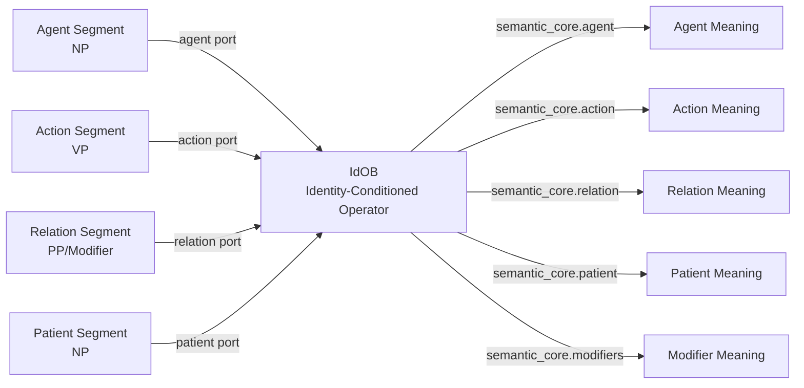

# **notes/pathA_relational_geometry.md**

# Path‑A Relational Geometry  
### *The Foundational Principle Behind Meaning in TS*

---

## 1. Introduction

Path‑A is not an object‑centric system.  
Path‑A is a **relation‑centric cognitive architecture**.

This single insight explains:

- why Path‑A works  
- why Path‑A scales  
- why Path‑A produces emergent meaning  
- why Path‑A does not require predefined concepts  
- why Path‑A can interpret novel expressions naturally  
- why Path‑A avoids the brittleness of symbolic AI  

In Path‑A, **objects exist**, but they are **only described relationally**.  
Objects are **anchors**.  
Relations are **the substance**.

Meaning is not in objects.  
Meaning is in **the geometry of relations**.

This paper records the conceptual foundation of Path‑A’s relational approach.

---

## 2. Objects as Relational Anchors

Traditional object‑thinking systems (ontologies, taxonomies, symbolic AI) attempt to define objects *objectively*:

- “A cat is a small furry animal.”  
- “A burglar is a person who steals.”  

These definitions are static, brittle, and unscalable.  
They require enumerating every concept a priori.

Path‑A rejects this.

In Path‑A:

- “cat” is not defined by its biological description  
- “burglar” is not defined by its legal description  

Instead, each object is defined **relationally**:

- **cat → nimble**  
- **cat → agile**  
- **cat → quick**  
- **burglar → steals**  
- **burglar → silent**  
- **burglar → underhanded**

Objects are **placeholders** for relational properties.

Meaning emerges from **relational recombination**, not from object definitions.

---

## 3. Meaning as Relational Geometry

Meaning is not in the nodes.  
Meaning is in the **edges**.

Path‑A primitives extract relational geometry:

- **SOB** — structural adjacency  
- **SROB** — identity roles  
- **CnOB** — constraint relations  
- **SmOB** — semantic‑adjacent relations  
- **SSG** — structural geometry  

These primitives do not define objects.  
They define **relations**.

IdOB selection logic then chooses identity‑conditioned operators based on this relational geometry.

Meaning emerges from the geometry formed by these relations.

---

## 4. Example 1: “cat burglar”

### Objects:
- cat  
- burglar  

### Relational properties:
- cat → nimble  
- cat → agile  
- cat → quick  
- burglar → steals  
- burglar → silent  
- burglar → underhanded  

### Emergent meaning:
Combine relational properties:

> **nimble + silent + quick + thief = cat burglar**

This meaning:

- is not predefined  
- is not stored  
- is not engineered  
- is not in a dictionary  
- is not in an ontology  

It **emerges** from relational geometry.

This is the power of Path‑A.

---

## 5. Example 2: “paper tiger”

### Objects:
- paper  
- tiger  

### Relational properties:
- paper → fragile  
- paper → thin  
- paper → weak  
- tiger → powerful  
- tiger → dangerous  
- tiger → fierce  

### Emergent meaning:
Combine relational properties:

> **something that appears powerful but is actually weak = paper tiger**

Again:

- no predefined concept  
- no engineered category  
- no static definition  

Meaning emerges from **relational recombination**.

---

## 6. Why Relational Systems Are Powerful

Object‑thinking scales **linearly**:

> Add 1 new object → add 1 new concept.

Relational systems scale **combinatorially**:

> Add 1 new relational property →  
> it recombines with *all existing relational properties* →  
> produces *many* new emergent meanings.

This is why:

- “cat burglar”  
- “paper tiger”  
- “dark horse”  
- “silver bullet”  
- “snowball effect”  
- “straw man”  
- “white elephant”  

all emerge naturally from relational geometry.

Path‑A does not need predefined concepts.  
It needs relational structure.

---

## 7. Machine Cognition: Why Path‑A Works

Path‑A’s relational geometry is not just a linguistic theory.  
It is a **machine cognition architecture**.

### Why relational geometry is computationally tractable:
- relations are finite  
- relations are structured  
- relations form stable geometries  
- relations can be validated deterministically  
- relations avoid combinatorial explosion  

### Why object‑thinking is brittle:
- requires enumerating every concept  
- cannot generalize to novel expressions  
- collapses under combinatorial load  
- forces static ontologies  

### Why Path‑A generalizes:
- meaning emerges from relations  
- relations recombine dynamically  
- new expressions require no engineering  
- relational geometry is stable under replay  

### Why TS can interpret novel expressions:
Because meaning is not stored.  
Meaning is **constructed**.

---

## 8. The Role of IdOB

IdOB does not choose object meanings.  
IdOB chooses **identity relations**.

IdOB selection logic = f(SOB, SROB, CnOB, SmOB)

Where:

- SOB → structural adjacency  
- SROB → identity roles  
- CnOB → constraint coherence  
- SmOB → semantic adjacency  

Together, these determine:

> **Which identity‑conditioned semantic operator is correct.**

This is how emergent meaning is realized.

---

## **8.1 IdOB as a Relational Operator Object**

Path‑A treats IdOB not as a classical “object with fields,” but as a **relational operator object**.  
This distinction is essential for understanding how identity‑conditioned meaning emerges.

### **Ports vs. Fields**

IdOB has **ports**, which are *relational inputs*, and **fields**, which are *semantic outputs*.

- **Ports** receive relational geometry.  
  They are attachment points for segments and roles:
  - agent port  
  - action port  
  - relation port  
  - patient port  

- **Fields** express identity‑conditioned meaning.  
  They are produced after IdOB selects the correct operator(s):
  - selected_ops  
  - semantic_core.agent  
  - semantic_core.action  
  - semantic_core.relation  
  - semantic_core.patient  
  - semantic_core.modifiers  

Meaning flows **through** IdOB:

> **ports → operator selection → fields**

Ports do not store meaning.  
Fields do not receive meaning.  
IdOB is a *relational processor*, not a static object.

### **Mermaid Diagram: IdOB Ports and Fields**



This diagram shows IdOB as a **relational operator** with:

- relational inputs (ports)  
- semantic outputs (fields)  

The operator in the middle is the identity‑conditioned selection logic.

---

## 8.2 Example: IdOB Ports, Relational Geometry, Operators, and Fields

Consider the sentence:

> “The quick brown fox jumps over the lazy dog.”

This example shows the full identity‑conditioned meaning pipeline in Path‑A.

---

### **1. Ports (IdOB Inputs)**

These come directly from SROB role segmentation:

- **agent port** → “the quick brown fox”
- **action port** → “jumps”
- **relation port** → “over”
- **patient port** → “the lazy dog”

Ports are *structural inputs*.  
They do not contain meaning; they receive relational structure.

---

### **2. Relational Geometry (CnOB + SmOB)**

CnOB computes constraint relations:

- **agent‑action**
- **action‑relation**
- **relation‑patient**

SmOB computes semantic adjacency:

- **semantic_adjacent_cues** → [“over”]

These relations are *not ports*.  
They are **computed relational geometry** that IdOB consumes.

---

### **3. IdOB Operator Selection**

Based on the relational geometry above, IdOB activates:

- **agent_action → semantic_core.agent**
- **action_patient → semantic_core.patient**
- **relation_modifier → semantic_core.relation**
- **modifier_resolution → semantic_core.modifiers**

These operators are identity‑conditioned relational functions.

---

### **4. Fields (IdOB Semantic Outputs)**

IdOB produces identity‑conditioned semantic meaning:

```
semantic_core = {
    selected_ops: [
        "agent_action",
        "action_patient",
        "relation_modifier",
        "modifier_resolution"
    ],
    agent: "the quick brown fox",
    action: "jumps",
    relation: "over",
    patient: "the lazy dog",
    modifiers: ["over"]
}
```

These are **IdOB’s fields** — the semantic outputs that feed MCB and provenance envelopes.

They express meaning after IdOB processes relational geometry.

---

### **5. Flow Summary**

> **Ports → Relational Geometry → IdOB Operators → Fields**

This is the complete identity‑conditioned meaning pipeline in Path‑A.
```

---

## 9. Conclusion

Path‑A’s power comes from a single principle:

# **Objects are relational anchors.  
Meaning is relational geometry.**

This principle explains:

- why Path‑A works  
- why Path‑A scales  
- why Path‑A produces emergent meaning  
- why Path‑A does not require predefined concepts  
- why Path‑A can interpret novel expressions  
- why TS is a viable machine cognition architecture  

This document records the conceptual foundation of Path‑A’s relational approach.

---

## Simulator Implementation Note
The current simulator implements only the minimal relational geometry needed
for IdOB selection:
- agent_action
- action_patient
- relation_modifier
- modifier_resolution

This is intentional: it demonstrates how relational geometry drives meaning
without requiring the full Path-A implementation.
